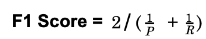
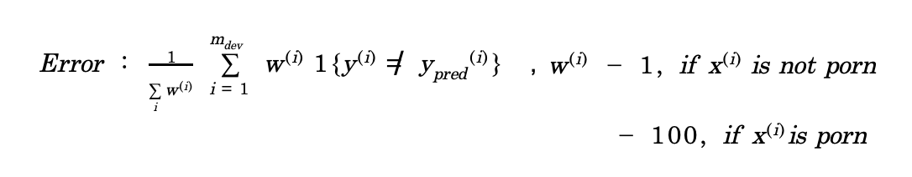

Coursera : Structuring Machine Learning Projects (Lecturer : Andrew Ng 🥇 )

### 1. ML Model의 예측 정확도를 더 높이고 싶은 경우의 선택지

1. Collect more data
2. Collect more diverse training set
3. Train algorithm longer with gradient descent
4. Try Adam instead of gradient descent
5. Try bigger network
6. Try smaller network
7. Try dropout
8. Add L_2 regularization
9. Change Network Architecture
10. Change Activation Func.
11. Change # of hidden units

### 2. 이 중 무엇이 맞는 approach인지, 빠르게 알 수는 없을까??

- ML 시스템 구축 시의 Challenge : 시도할 수 있는 방법, 바꿀 수 있는 Hyperparam. 등이 무수히 많다.
- ML의 대가들은,,, A를 변화시키기 위해 B를 Tune 시켜야 하는 것을 안다!

### 3. Orthogonalization (Matrix Theory에서의 Orthogonalization과는 다름)

- 직관적 예시 : TV화면을 조정하기 위한 여러개의 노브들이 각각의 고유한 하나의 기능만을 수행하도록 하는 것.
- 하나의 손잡이가 여러 측도를 한꺼번에 변화시키는 것이 아니라, 가로길이만을 변화시키는 등,,,

### 4. Chain of Assumptions in ML

1. Fit training set well on cost function (특정 분야에서는, 인간과 유사한 수준을 의미함)

##### 만약 Learning Alg. Train 과정에서 metric (accuracy, F1-score 등)이 잘 안 나온다면 쓰는 방법론

      - Train Bigger Network
      - Adam Optimizer

2. Fit Dev set well on cost function

cf. (Dev set = Holdout Cross Validation Set, Hyperparam. Tuning을 위해 사용하는 Sets)

###### Validation 과정에서 metric이 잘 안나온다면 쓰는 방법론

      - Regularization
      - Bigger Training Set

3. Fit test set well on cost function

##### Test Set에서 Alg.이 잘 Work 하지 않는다면?

      - Bigger Dev. Set. (∵Dev. set 에서 Overtraining 이 이루어졌을 수 있기 때문.)

4. Fit well real word

###### 실제 dataset에서의 inference 정확도가 좋지 않다면?

      - Change Dev. set (Dev./Test set distribution이 제대로 되지 않은 경우)
      - Change Cost func. (Cost func. isn’t measuring the right thing)

### 5. Single number evaluation metrics (to choose hyperparams.)

1.  Precision : 정답을 실제로 맞춘 개수 / 정답으로 찍은 개수
    => A라고 Guess 했을 때, 실제로 A일 확률 = Precision
2.  Recall : 정답을 실제로 맞춘 개수 / 실제 정답 개수
    => 실제 정답 중 몇 %가 정답으로 분류되었는가?
    cf. Precision & Recall 은 일반적으로 TradeOff 관계
    => Classifer A는 Precision에서 더 높고, Classifer B는 Recall에서 더 높다면,, 애매한 상황이 됨.
    => 이 두개만으로는, 어떤 hyperparam으로 빠르게 선택해서 loop 돌려야할지 알 수 없다.
3.  P와 R의 조화평균

    - Reasonable way to combine R and P
    - 잘 정의된 Dev. Set 도 중요, (P and R을 측정하기 위해 Dev. Set을 사용)

### 6. Optimizing metric (to combine F1 Score & Running time)

1. E.G.> Wants to Choose a classifier that maximizes Accuracy (F1 Score), but subject to running time <= 100 ms
2. 여기서 Optimizing metric = Accuracy, Satisficing metric = Running time

### 7. Train / Dev / Test Distribution

- Choose a Dev set and Test set that reflect data that you expect to get in future
- Dev Set과 Test Set이 동일한 Distribution을 가지도록

1. Old way (Data less than 10,000 rows)
   | Train | Test |
   | -------------- |------|
   | -------70%------- | ---30%---|

   | Train           | Val     | Test    |
   | --------------- | ------- | ------- |
   | ------60%------ | --20%-- | --20%-- |

2. Contemporary way (Data about 1,000,000 rows)

   | Train                                                                              | Val  | Test |
   | ---------------------------------------------------------------------------------- | ---- | ---- |
   | ------------------------------------------98%------------------------------------- | -1%- | -1%- |

3. When to change Dev/Test set and metric

- 현재의 Evaluation Metric이 사용자 Preference를 제대로 반영하지 못하고 있는 경우

### 8. Error

1. e.g. Alg A 의 Error는 3%, Alg B의 Error는 5% 지만 A의 Error가 중대한 실수(pornographic image를 cat으로 분류)를 저지르는 경우에는 어떻게 해결할 수 있을까?
   => 가중치로 해결

- 원래 분모는 dev의 개수이지만 가중치가 추가되면서 normalizing constant가 바뀜.
- Defining Evaluation metric (Target을 place 시키는 것) 과 Do well on some metric (Target에 잘 맞추는 것) 은 별개의 문제임.
  - Orthogonalization의 Concept,,, 두 개의 별도 nobs를 가지고 working

1. Bayes Optimal Error : Best possible error

### 9. ML Alg가 Human level보다 못하고 있는 경우 쓸 수 있는 technics

1. Get labeled data from humans
2. Gain insights from manual error analysis : 사람은 어떻게 맞출 수 있는가?
3. Better analysis of bias / variance

- Human level과 Train set에서의 Alg performance를 비교하는 것은 중요.
- Why? Alg.을 어떻게 개선해야 할 지 힌트를 얻을 수 있음.
  => 'Human Error은 Bayes Error에 대한 Proxy(대리인)' 이라는 표현을 씀.

### 10. Bias vs Variance 예제

- bias-variance tradeoff (Link : https://ko.wikipedia.org/wiki/%ED%8E%B8%ED%96%A5-%EB%B6%84%EC%82%B0_%ED%8A%B8%EB%A0%88%EC%9D%B4%EB%93%9C%EC%98%A4%ED%94%84)
- 예제
  | Error 유형 | 예제1 | 예제2 |
  | -----|------|-----|
  | Human Error | 1% | 7.5% |
  | Train Error | 8% | 8% |
  | Dev Error | 10% | 10% |

- 예제 1 Solution : Bias에 집중
  - Alg이 Train set에 Fit 잘 되지 X
  - Bigger NN
  - Train longer
  - Use better optimization alg (RMS Prop, Adam, …)
  - Find better NN architecture, hyperparam (Change activation fuc/ # of layers / # of hidden units,,, / RNN이나 CNN등 사용 /....)
- 예제 2 Solution : Variance에 집중

  - Regularization (L_2 Regularization / Dropout / Data Augmentation)
  - Getting more training data
  - Find better NN architecture, hyperparam

- Avoidable Bias = Gap between Bayes Error & Train Error
  - Bayes Error 보다 잘한다면? Overfitting 예상.
- Variance = Gap between Train Error & Dev Error

### 11. ML 이 사람보다 잘 하고 있는 분야들

1. Online Advertising
2. Product Recommendations
3. Logistics (물류, transit time 예측)
4. Loan approvals

- 위 분야들 공통점
  1.  Structured Data 존재
  2.  Natural perception (image recognition 등,,,) 등 의 사람이 잘 하는 분야가 아님.
  3.  Data량 많음.
