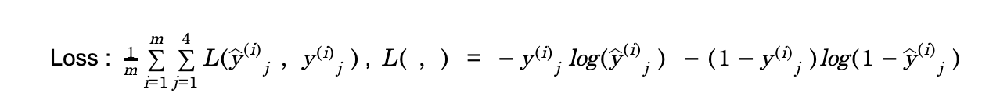

Coursera : Structuring Machine Learning Projects, Part2 
(Lecturer : Andrew Ng 🥇 )

### 1. Supervised Learning에서의 기본적인 사항
- Able to Fit the training set pretty well = Able to Achieve low Avoidable bias
  - achieve by Using bigger NN / Train longer ,,,
- Training set performance generalizes pretty well on dev/test sets = Variance O.K.
  - achieve by Regularization / Get more train data

### 2. Error analysis : Alg이 사람보다 못하고 있을 때, Error를 분석하는 것
- 여기서 사람이 비교 기준이 된 이유는, Bayes Error에 대한 Proxy 이기 때문.
- 주로 Dev. Set에 대해 mislabeled된 case들을 확인한다.
- e.g.> Cat classifier, Accuracy 90%가 나옴. 10%를 구성하는 Error들을 직접 봤더니 강아지를 고양이로 잘못 분류하는 경우가 확인되었다면,
  - Q. 강아지에 대해 Alg.를 강화해야 할까? 이러한 노력이 가치가 있을까? 
    - sol#1. 강아지에 특화된 features 들을 만들 수 있다.
    - sol#2. 강아지 사진을 더 모을 수 있다.
  - A. Error Analysis
    - 대략 100개의 mislabeled 된 샘플을 가지고 와서 수동으로 검사한다.(강아지 사진이 몇 개나 있는지)
    - 강아지 사진의 비율이 5% 에 불과하다면, 제일 잘해봐야 0.5% Accuracy를 올릴 수 있는 것이다.
    - 이는 강아지 문제에 대해 Alg.를 강화했을 때, Accuracy가 상승할 수 있는 ceiling을 의미한다. (Ceiling on performance)
    - 만약 강아지 사진 비율이 50%라면? 훨씬 할만 한 것이 된다.

아래와 같은 표를 작성하여, 어느 문제를 해결하는 데 집중할 지 선택한다.

  | Image Index  | Dogs | Great Cats | Blurry Images | Comment              |
  | ------------- | ---- | ---------- | ------------- | -------------------- |
  | 1             | V    |            |               | Pitbull              |
  | 2             |      |            | V             |                      |
  | ...           |      | V          | V             | Rainy day at the Zoo |
  | 100           |      |            |               |                      |
  | % of Total    | 8%   | 43%        | 61%           |                      |

### 3. Cleaning up incorrectly labeled data (사람 실수, 전송 중 에러 등,,,)
- Train set
  - 딥러닝 Algs. 는 Random error에 대해 robust 하다는 것이 증명되었다.
    - 논문 링크 : https://arxiv.org/pdf/1705.10694.pdf
  - 일일이 label을 바꿔도 좋지만, 안바꿔도 큰 문제는 없을 것임. (표본 수(n)가 크다면)
  - but 딥러닝 Alg. 는 systematic error에 대해서는 상대적으로 취약하다.
    - e.g.> labeling 하는 사람이 흰 개들을 주로 잘못 label한 경우,,,
- Dev/Test set
  - 하나의 방법 : Error 분석 table에서 Column 추가

  | Image Index  | Dogs | Great Cats | Blurry Images | Incorrectly labeled | Comment              |
  | ------------- | ---- | ---------- | ------------- | ------------------- | -------------------- |
  | 1             | V    |            |               |                     | Pitbull              |
  | 2             |      |            |               | V                   | 배경의 고양이를 못 봄         |
  | ...           |      | V          | V             |                     | Rainy day at the Zoo |
  | 100           |      |            |               | V                   | 고양이 그림               |
  | % of Total    | 8%   | 43%        | 61%           | 6%                  |                      |

##### Incorrectly Labeled 된 case들을 일일이 수정할 것이냐? 를 결정하기 위해 확인해야 할 수치들
  | Error 유형                         | 분류기 A | 분류기 B |
  | --------------------------------- | ----- | ----- |
  | 1. Overall Dev. set error         | 10%   | 2%    |
  | 2. Errors due to incorrect labels | 0.6%  | 0.6%  |
  | 3. Errors due to other causes     | 9.4%  | 1.4%  |

 
 Dev set에서의 Error가 classifier A와 B 중 무엇이 더 좋은선택인지의 기준이 되는데, 만약 실제 A의 error는 2%이고 B의 error는 1.9%라면, incorrect label 비중이 0.6%일 때, 위 수치만을 보고서는 A와 B 중 무엇이 더 잘하는지를 판단할 수 없게 됨. 이 경우는 label들을 일일이 올바르게 바꿔 주고, 다시 판단해야 할 필요가 있음.

### 4. Correcting incorrect dev/test set examples 시에는
- dev/test set의 distribution이 동일하게 유지되도록, 둘 모두에게 동일한 fix process를 적용해야 한다.
- Alg. 가 맞춘 것들도 한번 봐야 함.
- 이 때, dev/test의 label들을 수정하면서 Train and dev/test set data는 약간 다른 distribution을 가지게 된다. 
  - (train set은 보통 크기가 크기 때문에 일일이 수정하기가 쉽지 않음..)
  - 이런 경우 어떻게 fix 하는지는 추후 다룰 예정 (part2, 6번 항목 참조)

### 5. Build first system quickly, and iterate
  1. Set up dev/test set and metric
  2. Build initial system quickly
  3. Use Bias & Variance analysis to prioritize next steps
  4. Use Error analysis to prioritize next steps

### 6. Training and testing on different distributions
- Cat classifier 예제 : App에서 수집한 저해상도 이미지를 분류하는 cat classifier을 만들고 싶다. 
- 학습 데이터 : Web에서 수집한 고해상도 이미지 200,000개 + App에서 수집한 저해상도 이미지 10,000개
- Option 1. 총 210,000 개를 random하게 섞어서 Train/ Dev/ Test 로 분류
  - 치명적인 단점 : 이렇게 train/ Dev/ Test 시키면,,, Target을 다른 곳에 위치시키는 것이 된다. 주로 Web에서 수집한 고해상도 이미지가 target이 되는 것임
  - 따라서, 비추
- Option 2. 200,000개의 Web 데이터를 전부 Train에 넣는다. + 5,000개 App.을 Train에.
Dev/ Test Set을 모두 App. 이미지로 구성
  - 이 경우, Target을 정확하게 위치시킬 수 있다.
  - 정리 : Train과 Dev/test 가 달라지더라도, 중요한 것은 Dev/Test를 내가 원하는 Target으로 정확하게 구성하는 것임.

### 7. Mismatched data distribution (Train vs Dev/Test sets) 상황에서의 Bias and Variance
- Train과 Dev set의 분포가 다르다면, Train error보다 Dev set Error 가 현저하게 높다고 하여도, 단순히 Variance 문제라고 생각할 수 없다.
- Train 에서 Dev로 넘어갈 때, 두 가지 이슈가 있는 것임.
  - Alg.는 Dev set의 데이터를 보지 못했음. (Variance)
  - Train set과 Dev set의 분포가 다름.
    - 이 경우 해결책 : Training-dev set을 새로 정의 (Train set과 동일한 분포를 갖지만, train에 사용되지 않는 녀석)
  - ex1. Train error : 1%, Training-dev error : 9%, Dev-error : 10%
    - Variance Problem이 있는 것임.
  - ex2. Train error : 1%, Training-dev error : 1.5%, Dev-error : 10%
    - Data mismatch problem이 발생한 것으로, Variance 문제는 X

##### 정리
  | Error 유형              | Error 비율 |
  | ---------------------- | -------- |
  | Human Level Error      | 0%       |
  | Avoidable Bias         |          |
  | Training set Error     | 7%       |
  | Variance               |          |
  | Training-dev set Error | 10%      |
  | Data Mismatch          |          |
  | Dev Error              | 12%      |
  | Degree of Overfitting  |          |
  | Test Error             | 12%      |

### 8. Data mismatch 다루기
1. Carry out manual error analysis, to understand difference between training set and dev/test set 
  - Dev set만 확인해야 함,,, Test set까지 확인하면 Overfitting 우려
2. Train data를 Dev/Test와 더 비슷하게 바꾸거나, Dev/Test와 유사한 데이터를 더 모을 수 있다.
  - Train Data를 바꾸는 방법론 예제 : Artificial data synthesis
  - e.g.> Dev set 데이터는 소음이 더 많이 들리는 경우,,, 소음을 Train data에 추가해 줄 수 있다.)
  - cf. 기존 학습 data는 1만시간 짜리이고, 합성할 소음은 1시간 짜리라면 ‘소음’에 대해 Overfitting이 일어날 수 있다.
  - 실제 차 안에서 생겨날 수 있는 전체집합 안에서 일부만을 수집한 것이 1시간짜리일 수 있다는 것임. 사람 귀에 똑같이 들린다고 알고리즘이 똑같이 인식할 것이라는건 모르는 것이기 때문. 특정 1시간짜리 소음에 대해 overfitting이 일어나지 않도록 주의.

### 9. Transfer Learning
- How ? 마지막 판정 node를 제거하고, 그 앞의 layer와 마지막 판정 node로 이어지는 Weights 들을 random하게 초기화한다. 그 이전 layer weights 들은 그대로 두고(새로운 data가 얼마 없는 경우에 그렇고, 만약 새로운 data도 많다면 모든 weights들을 재학습시켜도 됨.), 학습시킨다.
  - pre-training : 이미지 인식, 보다 일반적인 training
  - fine-tuning : 엑스레이 사진을 이용한 학습, 목적에 특화된 학습
- cf. multiple layers를 추가해도 됨.
- 언제 Transfer Learning이 유효한가?
  1. Task A and B 가 동일한 형태의 input x를 가질 때
  2. Task A에 대한 data를 훨씬 많이 가지고 있을 때
  3. Low level features of Task A could be helpful for Task B

### 10. Multitask learning
- Transfer learning이 실제로는 더 많이 쓰이기는 하지만,,,
ex> 자율주행 자동차 예시,,, 행인/신호등/교통표지판/차량 네 가지를 한번에 인식하고자 할 때, y햇의 형태는 (4,1) 벡터가 된다. (Softmax Reg.와는 다른 것이, one-hot vec형태로 나오는 것이 아님. 즉, 한 이미지에 네 가지 모두가 있을 수도 있음.)

만약, Train 에 사용되는 이미지들의 label이 완전하지 않다면? (ex. (1, ?, ?, 1) 이런 식으로)
- Subset of labels만 있어도 Train이 가능하다!
- How? 위 Loss fuc.에서, inner Sigma에 대해, j의 값들 중 0/1의 값이 있는 것들에 대해서만 sum을 진행하면 됨. 즉, ? 는 그냥 건너뛰면 되는 것임.

##### Multitask learning이 make sense 하는 경우
1. set of Tasks that could benefit from having shared lower-level features
2. (항상 그런 것은 X) 각 Task에 대해 가지고 있는 데이터량이 유사한 경우
3. 모든 tasks에 대해 잘 할 수 있는 big NN을 train할 수 있을 때
   - cf. 관련 논문 : Rich Carona => NN이 충분히 크지 않을때, task에 대해 각각 train시키는 것보다 multitask learning이 performance 나쁘다.

### 11. Softmax vs Sigmoid

  | Softmax                                           | Sigmoid                                       |
  | -------------------------------------------------- | --------------------------------------------- |
  | Logistic Reg.에서, Multi-class classification 문제에 사용 | Logistic Reg.에서, Binary classification 문제에 사용 |
  | 확률의 총합 = 1                                         | 확률의 총합은 1이 X                                  |
  | 출력층에서 사용됨 (확률 표현)                                  | Activation 함수로 사용 가능                          |
  | 큰 출력값은 그 class에 해당할 확률이 높다는 의미, 실제 확률을 나타냄.        | 큰 출력값은 그 class에 해당할 확률이 높다는 의미이지만 실제 확률은 아님   |

### 12. End-to-End Deep Learning
잘 되려면,,, Training data set이 매우 커야 한다. 

- Face recognition 예제 
- end-to-end 보다 쪼개서 하는 multi-step approach가 효과적
  - step1. 전체 이미지 중, 얼굴이 위치하는 곳을 찾아서 box침. (이게 하나의 SW)
  - step2. box를 잘라서, 찾은 얼굴 이미지를 정 가운데로 위치시킴
  - step3. step2에서 만든 이미지로 training을 함.
- 왜 이게 End-to-End보다 더 효과적인가?
  - End-to-End의 경우, input : 전체 이미지, output : 출입허용 여부
  - 이에 해당하는 data는 많지 x
- 쪼개는 경우
  1. 얼굴위치찾기 : input : 전체 이미지, output : 얼굴 좌표
  2. 얼굴대조기 : input : Box된 얼굴이미지, output : 출입허용 여부
- 쪼개는 경우의 data가 훨씬 많기 때문에 더 효율적인 것임. 

- End-to-End Deep learning을 사용할지 말지
- pros : 
  - Let the Data Speak
  - Less hand-designing of components needed
- cons :
  - Data가 많이 필요
  - Excludes useful hand-designed components (data 적은 경우에 이런 components들이 필요할 수 있다.)

- Key Question : x to y를 mapping하기 위해 필요한 복잡한 함수를 learn 하기에 충분한 data가 있는가?

- cf. motion planning 
자율주행 자동차 예시에서, object detection 에는 보통 DL을 사용하지만, 차가 어떤 길로 갈지 찾는데는 motion planning을 많이 사용한다.
