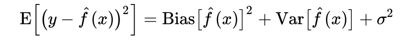
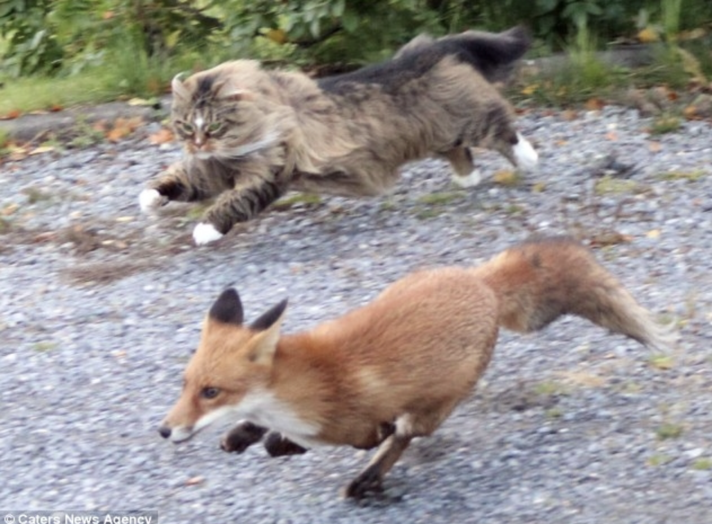
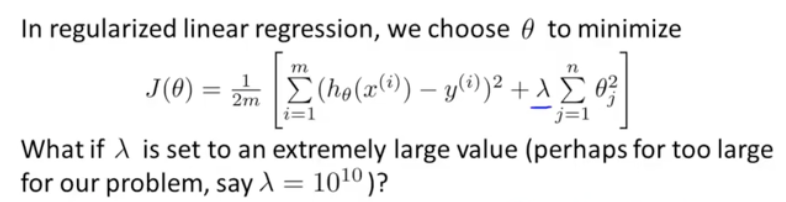

### Bias-Variance Tradeoff
  1. 자료 Link : https://bywords.tistory.com/entry/번역-유치원생도-이해할-수-있는-biasvariance-tradeoff
  2. Error(f(x)) = noise + bias + variance
   
     1. 위 수식에서 'f(x)햇' 은 분류기 혹은 모델을 의미한다.
     2. 여기서 noise (sigma^2) 는 irreducible Error를 의미한다.
     3. 고양이 분류기를 예제로 들어 본다면,,
        1.  강아지나 코알라도 고양이로 분류하는 것 : 너무 적은 수의 feature 사용, high Bias (Underfitting)
        2.  코숏 고양이만 고양이로 분류하고, 노르웨이 숲 고양이는 고양이가 아닌 것으로 분류 : 너무 많은 수의 feature 사용, high Variance (Overfitting)
   
   사진출처 : https://mdngsh0621.tistory.com/3
   
   사진출처 : http://www.petzzi.com/bbs/board.php?bo_table=news&wr_id=2500

### Overfitting / Underfitting 이해 및 극복
 1. 자료 Link : https://ko.d2l.ai/chapter_deep-learning-basics/underfit-overfit.html
 2. Underfitting 극복은 how?
    1. 고양이 분류기인데 강아지나 코알라도 고양이로 분류한다면,,
       1. input feature를 늘린다.
       2. Variance가 애초에 높은 알고리즘 사용 : Decision Tree 계열 (ex.XGBoost, LightGBM)
 3. Overfitting 극복은 how?
    1. 고양이 분류기인데 뚱뚱한 고양이나 외국 고양이를 고양이가 아니라고 분류한다면,,
       1. Train Data가 많으면 좋다. : Augmentation 기법을 활용해 데이터를 임의로 늘리기도 함. (명화공업 모델 개선을 위해 CoE에서 활용했던 방법론.)
       2. input feature를 줄인다.
       3. Validation set 사용 / K-fold cross validation
          1. 관련 링크 : https://rfriend.tistory.com/188
          2. 관련 링크 2 (sung kim) : https://pythonkim.tistory.com/23
       4. Regularization
          1. Cost function에 penalty항 추가 (아래 수식은 Regression에서의 Cost function)
          
          1. 관련 링크 : http://www.incodom.kr/기계학습/정규화
       5. Early Stopping : Validation set에 대한 모델의 Loss가 줄어드는 정도를 매 학습 Epoch마다 확인하여, 성능이 더 이상 증가하지 않을 때 학습을 중단시키는 것.
          1. 관련 링크 : https://rfriend.tistory.com/188
       6. Dropout : 임의로 일부 뉴런들을 학습에서 제외하는 방법론.
          1. 관련 링크 : https://m.blog.naver.com/PostView.nhn?blogId=laonple&logNo=220542170499&proxyReferer=https%3A%2F%2Fwww.google.com%2F

   