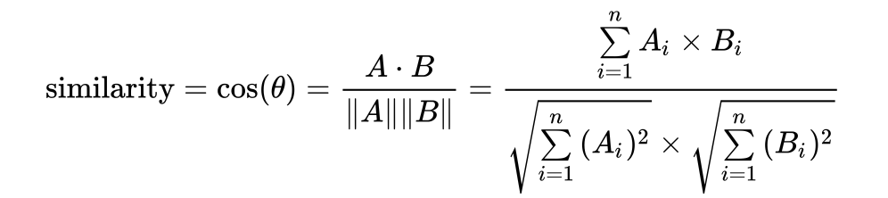
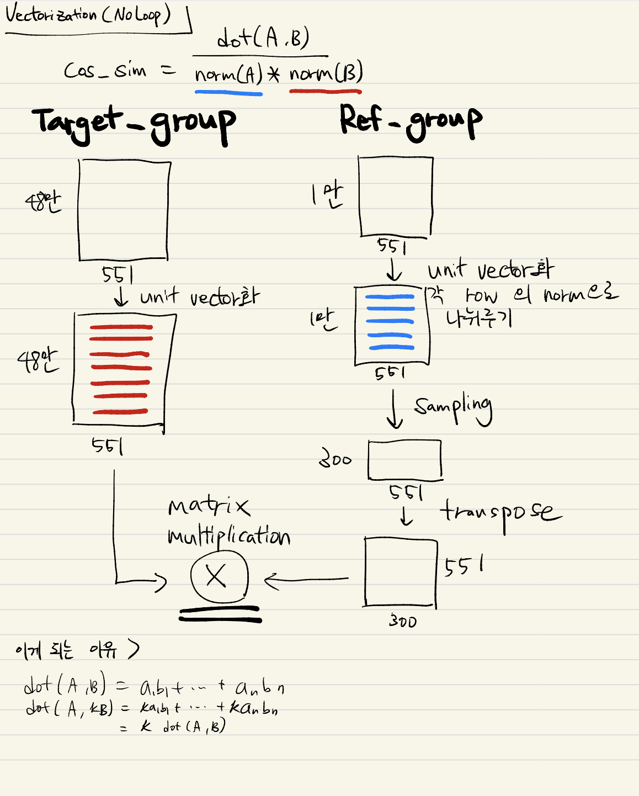

## Lookalike Model

- S사 합작, D 서비스 (20년 3월 캠페인 진행) 에 활용한 Look-alike model

### 1. 준거 집단
- Lookalike model의 기준이 되는 준거 집단 설정
- D 서비스의 경우, D서비스를 사전예약한 사람 중 자사 고객 & 정보활용동의한 1만명을 준거 집단으로 설정

### 2. 타겟 집단
- 성별/연령대를 기준으로 나눠진 타겟 집단 설정
- ex. 17-22세 여성, 23-30세 남성 등과 같이 general한 집단에서 준거 집단과 유사한 일부 고객을 찾아 내기 위함.

### 3. 유사도 
- Topic Score가 이미 관심사에 대한 예측값이므로, 이를 활용하여 사용자 간 거리 계산
- 한 사람의 고유한 특징을 나타내는 벡터 구성 (1*552)
  - Topic Browser에서 활용되고 있는 551개 columns 이용
  - 서비스관리번호 + 551개 topics
- 벡터 간 거리(유사도) 계산 기준 : 코사인 유사도
  - 
  (출처 : 위키백과)

### 4. metric
- Mean vs Max
- 가정 1 : 준거 집단 내에서도 개인 간 편차가 존재할 것임.
- 가정 2 : 타겟 집단에서 찾고 싶은 사람들은, 준거 집단에 속한 사람들이 공통적으로 갖고 있는 특징임.
- '준거 집단 내 특정한 사람과 유사한 사람' (max)이 아닌, '준거 집단에 속한 사람들이 전반적으로 갖고 있는 속성을 가진 사람' (mean)을 찾고 싶은 것.
- 따라서, mean을 비교 metric으로 설정.

### 5. Topic Score 적재 시간
- Topic score 적재는 아래와 같은 형태로 이루어 지고 있음
  | 서비스관리번호  | Topic번호 | Weight |
  | --------- | ------- | ------ |
  | 1         | T001    | 0.005  |

- 이를 아래와 같은 형태로 변환해야 함.
  | 서비스관리번호 (unique) | T001 | T002 | ... | T551  |
  | ---------------- | ---- | ---- | --- | ----- |
  | 1                | 0.03 | 0.04 | ... | 0.001 |
  | 2                | 0    | 0.05 | ... | 0.03  |
  | 3                | 0    | 0    | ... | 0.08  |

- Topic Score의 4주치 평균을 구하여 적재
- 50만 명 (unique) 기준, 약 2시간 소요

### 6. Computation
- 준거 집단 (1만 명)과 타겟 집단 (50만 명)의 거리 계산을 위해, 1만 * 50만 matrix가 필요.
- (1만 * 551) X (551 * 50만) 연산은 서버 리소스 상 불가.
  - step 1 : 준거 집단에서 300명을 sampling하여 50만명과 거리 계산
  - step 2 : 해당 거리의 평균을 저장 (결과 vector : 50만 *1)
  - 위 step을 35차례 반복 (10500/300 = 35)
- double loop (소요 시간이 어마무시) -> single loop (50만명 기준, 도커 2개로 20시간) -> No loop (50만명 기준, 3분)
- cosine 유사도 계산을 위해 matrix multiplication 이용 (No Loop)
- 계산 원리는 아래 이미지 참고 

