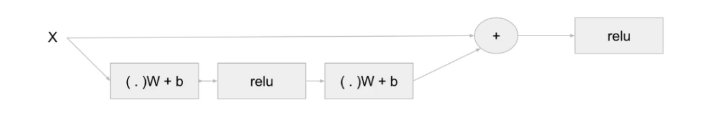
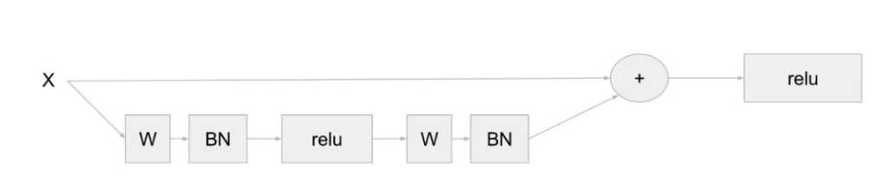
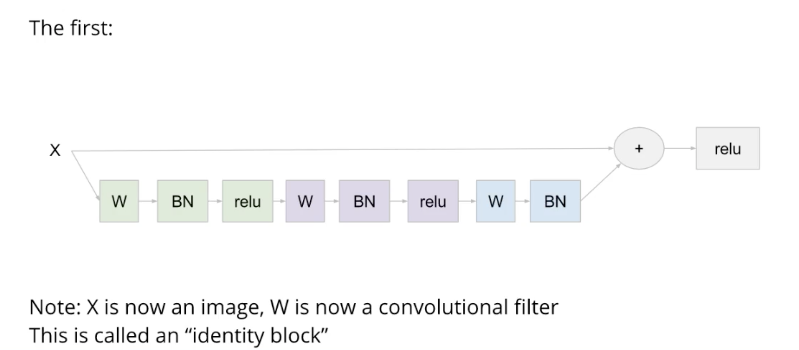
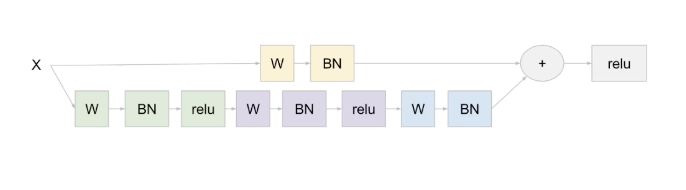

Resnet

1. Concept 이해
- Very Good NN이 하나 있다면, 그 NN는 identity function도 잘 approximate 할 것이다.
- Very Good NN에 Identity NN (f(x) = x)를 붙인다면? 논리적으로는 Very Good NN와 동일한 performance를 보여 주어야 겠지?
- 왜냐하면 identity part는 아무것도 안하고, input을 output으로 그대로 넘겨 주기만 하기 때문에

=> 위 논리에 따르면, Deep NN는 무조건 좋다! 왜냐하면, identity function도 학습할 수 있다는 가정 하에,
Performance는 Deep NN >= Small NN 일 것이기 때문이다.

But, NN를 학습하려고 할 때 문제가 발생한다.
- 왜? Identity Network를 Very good NN에 붙였을 때, 보통 performance는 약간 더 안좋게 나온다. 
(왜? Identity 추가한 경우 모든 weights들을 동시에 다시 train시켜야 하기 때문에.)
- 그렇다면? Small NN가 identity function을 학습할 수 있도록 할 수는 없을까??

2. How?
- input에서 output으로 더해지는 bypass line을 하나 만든다.
- X를 넣으면, H(X) = F(X)+X 가 나오게 된다.
- 이 경우, identity function을 학습하기 위해서는,, F(X)=0 이 되도록 하면 되는 것이다!
- H(X) - X = F(X) 를 0으로 만들게 학습을 시키면 됨.
- F(X)는 residuals (Desired mapping - identity)만 학습하면 되는 것임.

=> 최소한 identity 이상은 할 수 있도록 만들 수 있게 됨.

3. The Residual Block
- Main branch (일반적인 NN) + Shortcut brach (direct path from input to output, 'skip connection' 이라 불리기도 함.)

4. Details and Convention
- Final activation function은 addition (Main + Shortcut) 이후에 실행된다.

- Batchnorm을 weight 직후, relu 이전에 추가하는 경향성이 있음.
- 참고 : Batchnorm을 쓰면, bias term를 쓸 필요가 없다!

- CNN에 적용하는 Resnet, type #1. Identity Block

- F(X) + X를 수행하기 위해서는, F(X)과 X와 동일한 size여야하지않는가? Yes!
- But 예외도 있음. F(X) + W_s X 로 수행하기도 함. W_s 는 trainable parameters로 구성할 수도 있고, 
  identity matrix w/zero padding으로 구성할 수도 있음.
  
- Type #2. Conv Block
  shortcut branch에 대해, 1개의 W와 BN을 거쳐서 더함.

  
  
  
  
