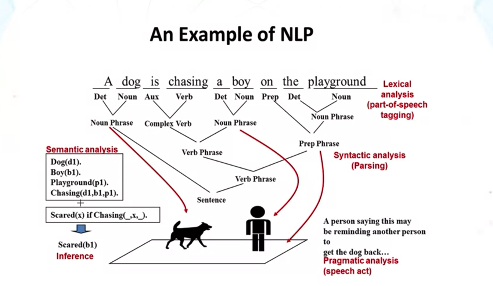
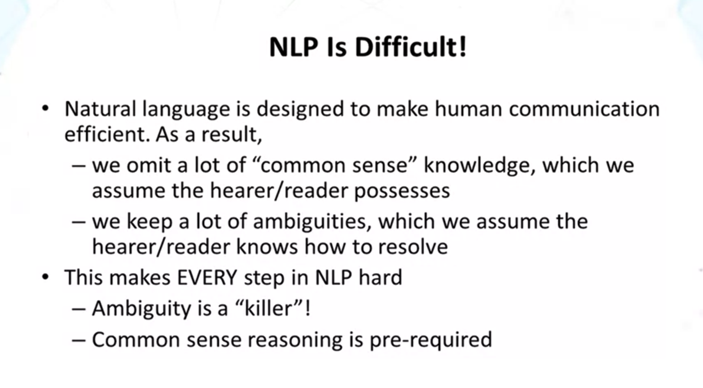
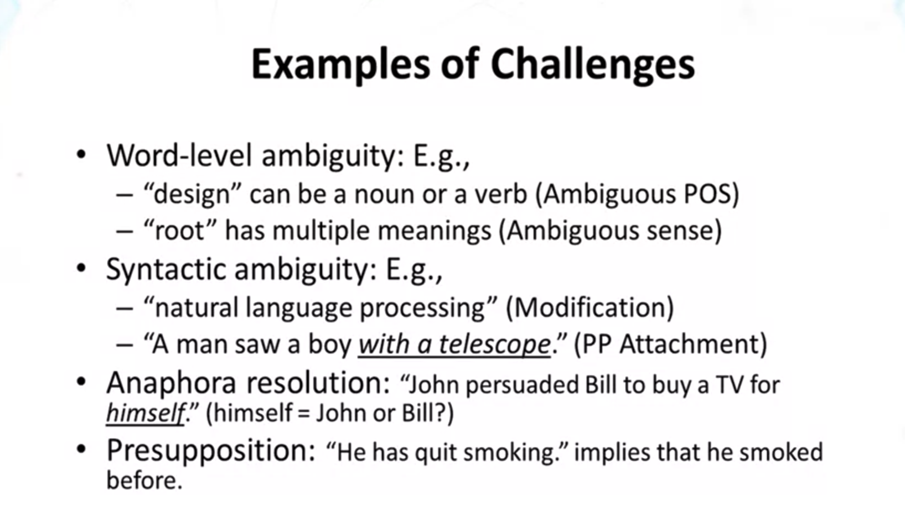
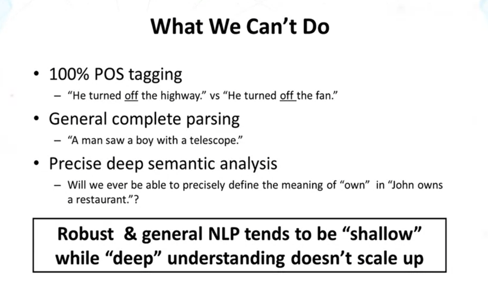
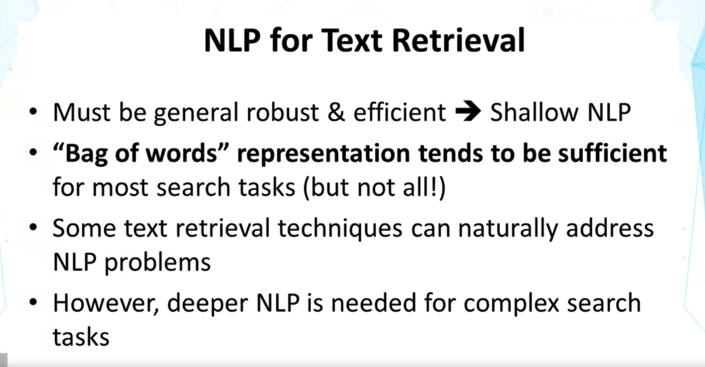

## Lesson 1.1

1. Lexical analysis (part-of-speech tagging)
2. Synctatic Analysis (Parsing) : parser(프로그램)를 사용할 수 있음, 문장 구조를 알 수 있음, but meaning은 여전히 모름
3. Semantic analysis : 의미를 알기 위한 작업 
4. Pragmatic analysis : 화자의 의도를 알기 위한 작업 (intent of the speech)

- "A man saw a boy with a telescope" -> 망원경을 누가 가지고 있는가?

#### Semantic Analysis

1. Semantic analysis의 경우, 완전한 의미 이해에는 한계가 많음
2. 하지만 partial understanding을 위한 technics는 쓸만함.
   1. Entity Extraction : people, location, organization 등의 관계를 파악해 낼 수 있음
      1. 어떤 사람이 누굴 만났고,,, 어떤 사람이 어딜 방문했고,,
   2. Word sense disintegration : 이 문장의 이 단어가 어떤 의미인지,,
   3. Sentiment analysis : 긍/부정 분석 --> review analysis 에 활용 가능
3. Speech act analysis : 여전히 갈 길이 멀다,, 매우 special case에 대해서만 할 수 있음.

- bag of words : 단어의 순서는 무시, Duplicated occurence 는 keep함
  - 순서를 고려하지 않기 때문에, 다량의 valid information을 lost
  - 하지만 이정도로만 해도,, 검색 정도에는 대부분의 잘 working함
  - 하지만 더 어려운 문제들은 못 푸는 경우도 많음!
- Context (문장)가 주어지면, 특정 단어의 뜻을 이해하기가 더 쉬워지기도 한다.
  - EX> 'Java'는 applet 과 같이 쓰인다면 프로그래밍 언어라는 것을 유추할 수 있음
- Feedback : allow us to add additional words to the query, addtional words가 matching documents에 쓰일 수 있음!
  - 태그 다는것과 같은 것인듯

<Additional Reading>

Chris Manning and Hinrich Schutze, Foundations of Statistical Natural Language Processing, MIT Press. Cambridge, MA: May 1999

