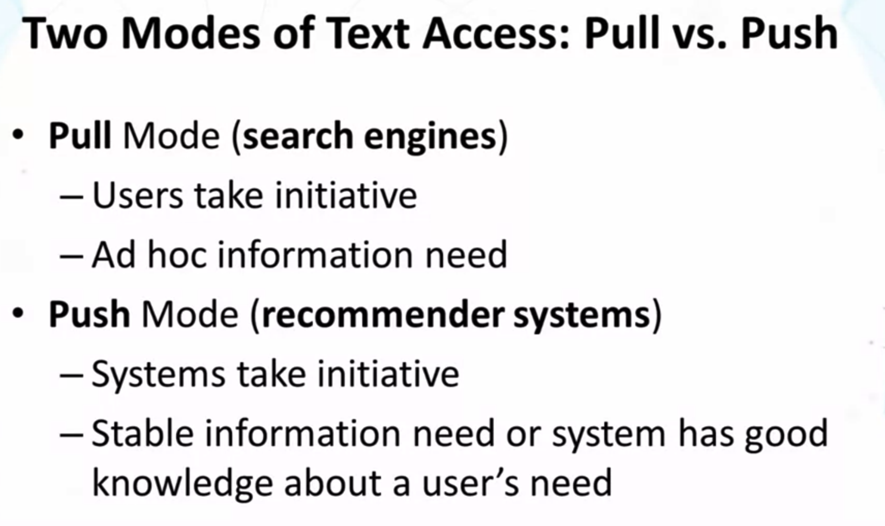
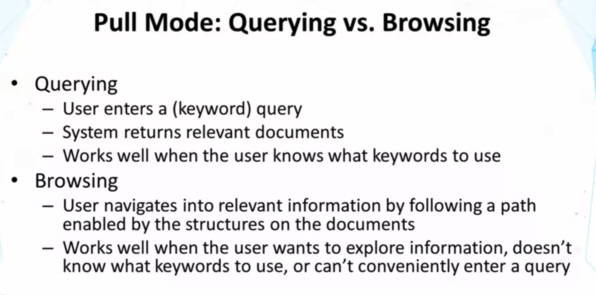
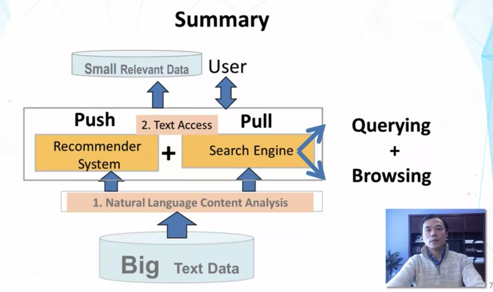

## Lesson 1.2

- Additional Reading : N.J. Belkin and W.B. Croft. 1992. Information filtering and information retrieval : two sides of the same coin?. Commun. ACM 35, 12 (Dec.1992), 29-38.
  - information filtering = Push = Recommendation