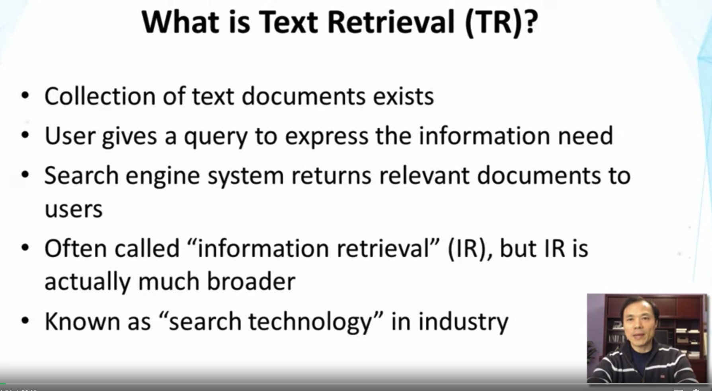
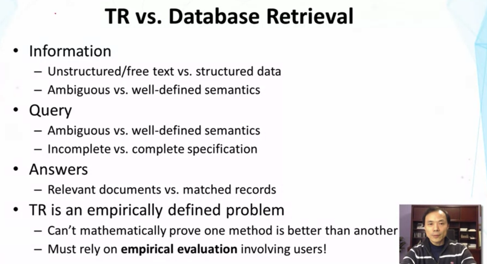
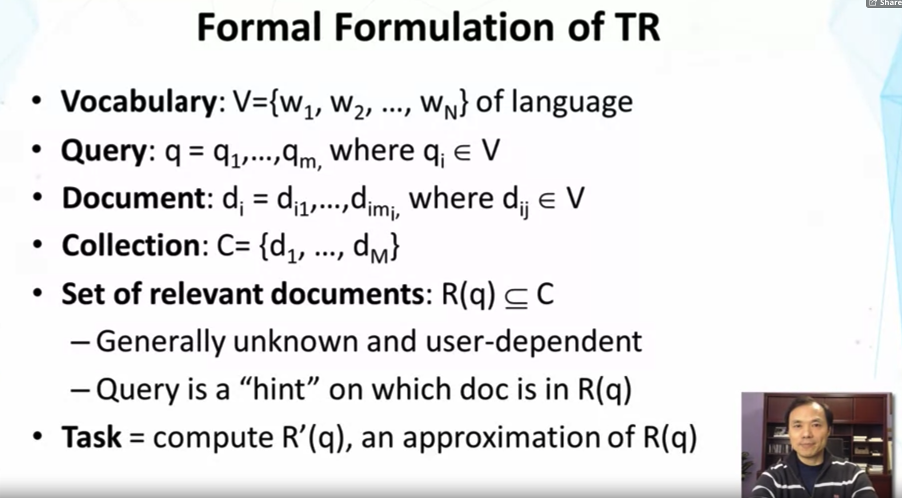
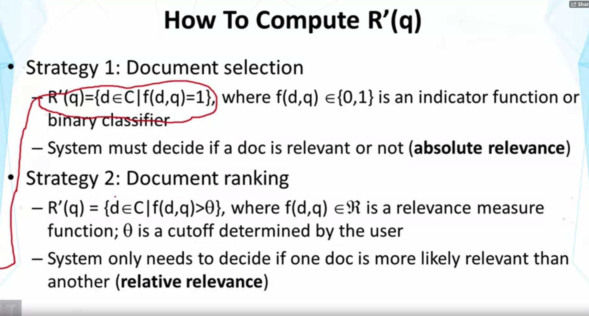
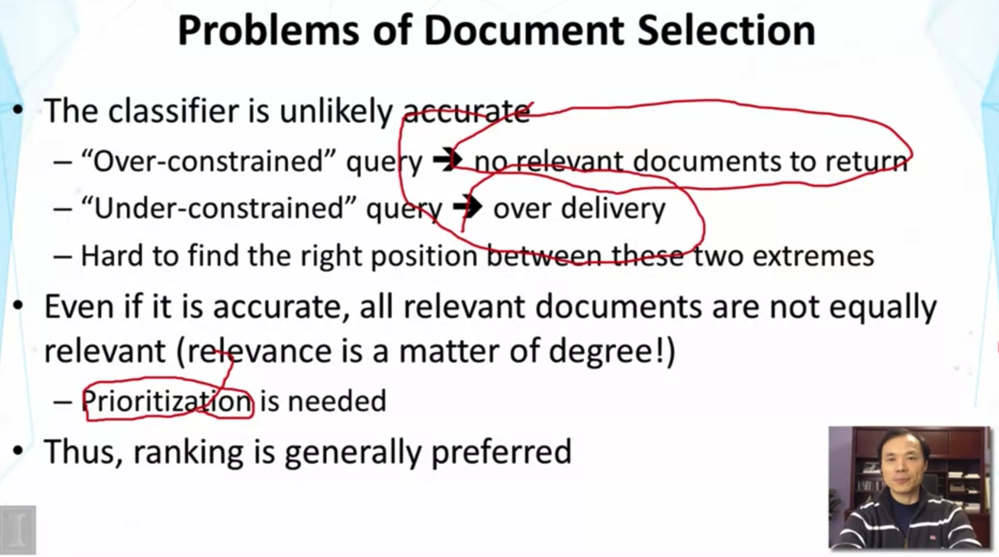
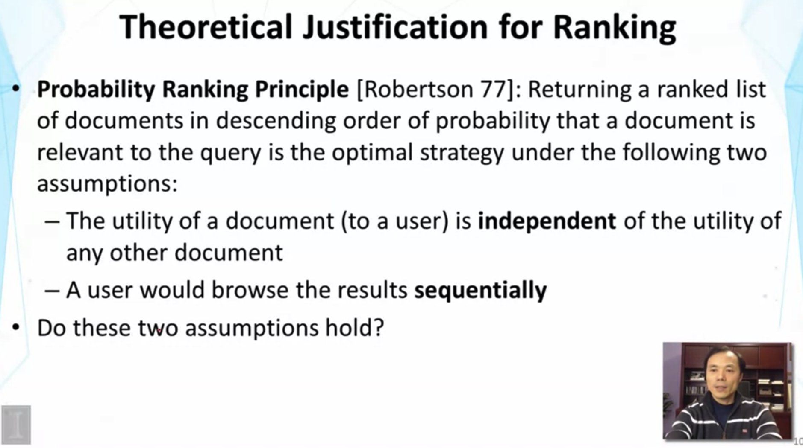
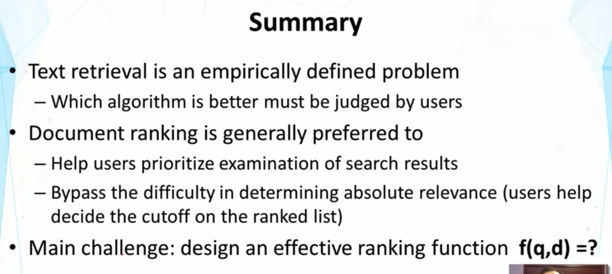

## Lesson 1.3 : Text Retrieval Problem

- 다양한 분야에서 Information Retrieval 이 가능하지만, (ex>audio, video, ...) Text retrieval이 핵심임.
  - 왜? video나 image의 companion text data를 활용하여 해당 retrieval 문제를 풀 수 있는 경우도 많음.

- 그래서 더더욱 evaluation methodology를 잘 알아야 한다! 발전했는지, 아닌지 알아야 방향을 잡을 수 있기 때문에

- vocabulary : set of words (하나의 언어라고 가정한다. 현실 세계에서는 언어가 여러 개 이므로,, 이 경우 다른 접근이 필요함)
- query : sequence of words, q_i 는 단어
- document : 일반적으로는 query보다 길지만, 때로는 document가 매우 짧을 수도 있음. 예시 : Twitter의 twits
- Collection : 매우 클 수 있음, ex> Web
- R(q)는 일반적으로 unknown이고, user-dependent 이다. (동일한 query라도, 다른 user라면,, 'relevant document'의 기준이 다를 수 있음)
  - user 에 의한 query는 어떤 document들이 R(q)에 들어갈지에 대한 hint일 뿐이다.
- R'(q)를 구하고 싶다!

1. Document selection : binary classification 함수 f(d,q)
   1. d(doc.) 와 q(query)를 input으로 받아 0 혹은 1을 return
   2. Approximate Relevant Document set : R'(q)  
2. Document ranking : real value func. f를 활용
   1. f(d,q) 는 실숫값을 내뱉고, 해당 값은 어떤 document가 더 relevant 한지를 가리키는 숫자이다.
   2. document selection 처럼 relevant 인지 아닌지를 판단하는 게 아니라, 어떤 doc.이 더 relevant 한지 판단
   3. threshold 는 user가 정함
3. 2번 방식이 더 쉽고, 일반적으로 선호되는 방식임

- Two extremes 사이에서 right position을 찾기가 왜 어려운가?
  - User가 검색을 할 때, 해당 토픽에 대해 잘 알고 있는 경우가 별로 없음. 잘 모르니까 검색을 하는 것임.
  - 어떤 vocabulary로 찾아야 할지 모름. User에게는 right level of constraints를 pre-specify 하는 것이 매우 어렵다.  
- Prioritization이 매우 중요함.. 왜? user은 각 document를 sequential 하게 봐야 하기 때문에, 모든 걸 다 볼수가 없음. 

- 사실상 두 가정은 모두 현실에서 옳지 않음.
  - Independence
    - 유사하거나 동일한 내용의 documents가 있음. User가 이미 그 중 하나를 봤다면, 두 번째로 보는 doc은 활용도가 떨어짐
      - 따라서, utility of document는 User가 본 other documents에 dependent 하다
    - Collective Relevance : 또한, 하나의 doc으로는 큰 의미가 없을 수 있지만 서너 개를 조합하여 user의 질문에 답할 수 있을수도 있음.
      - 마찬가지로, value of document may depend on other docs.
  - Relevance score 순으로 정렬된 list가 user에게 주어진다고 하더라도, 항상 user가 sequential 하게 읽어 가지는 않는다.
    - skip할 수도 있고, 밑에 껄 먼저 읽을 수도 있고, 읽어 가며 모르는 내용에 대한 additional 한 자료를 같이 읽을 수도 있음.
  - 그럼에도 불구하고, Ranking based로 문제를 풀어 나가는 것은 가치가 있고, 수많은 방법론의 기반임.

- 이후 강의들은 f(q,d)를 어떻게 정의하느냐에 대한 내용일 것.

- Additional Readings
  - S.E. Robertson, The probability ranking principle in IR. Journal of Documentation 33, 294-304, 1977
  - C.J. van Rijsbergen, Information Retrieval, 2nd Edition, Butterworth-Heinemann, Newton, MA, USA, 1979
    - MUST READ for anyone doing research in information retrieval. Chapter 6 has an in-depth discussion of PRP (Probability Ranking Principle)