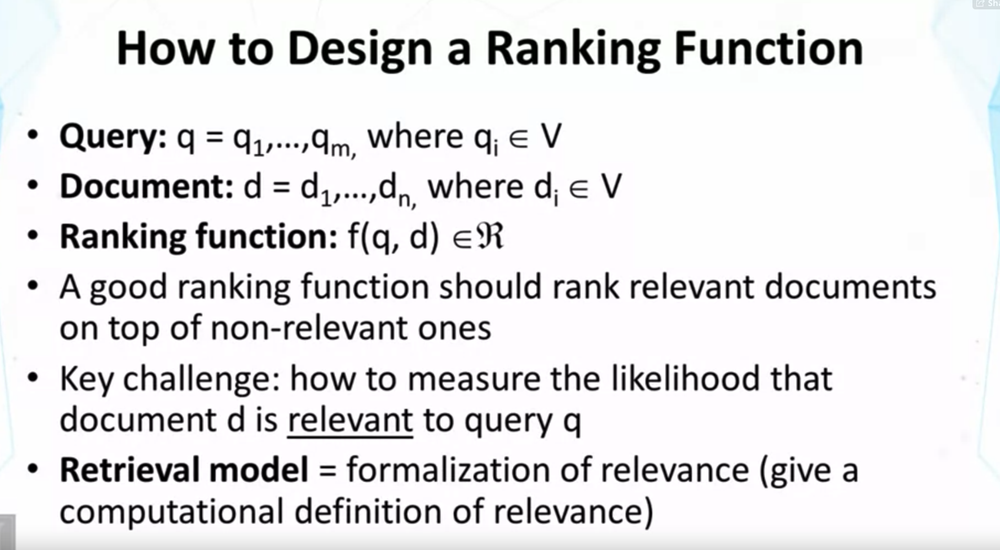
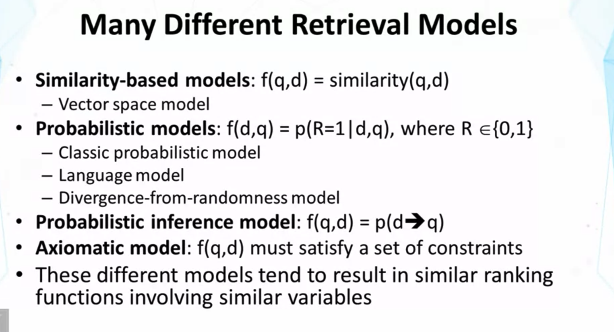
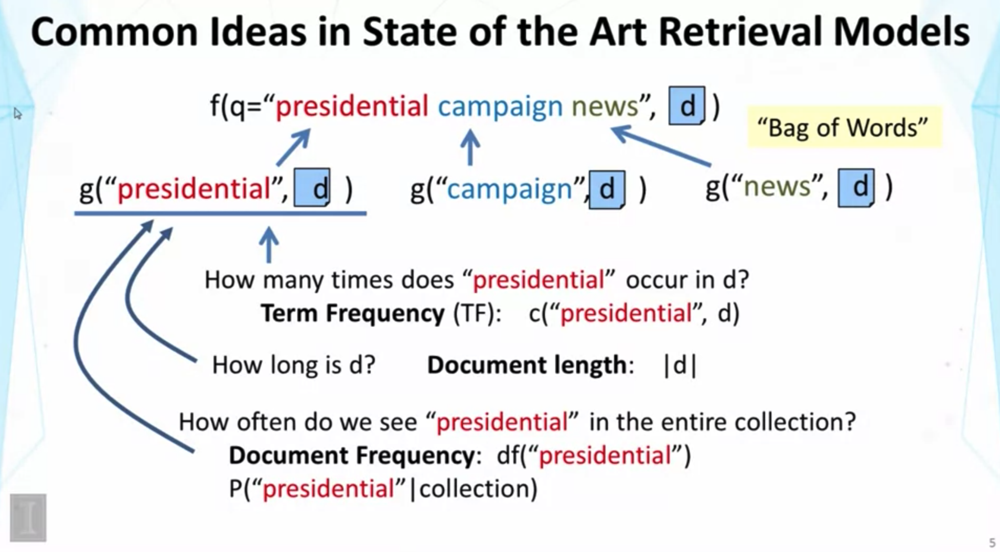
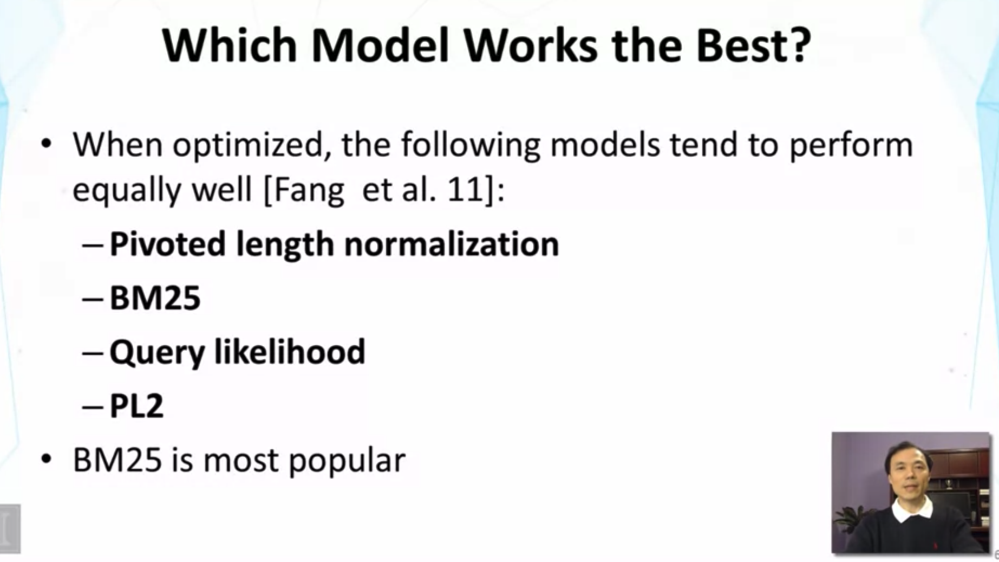
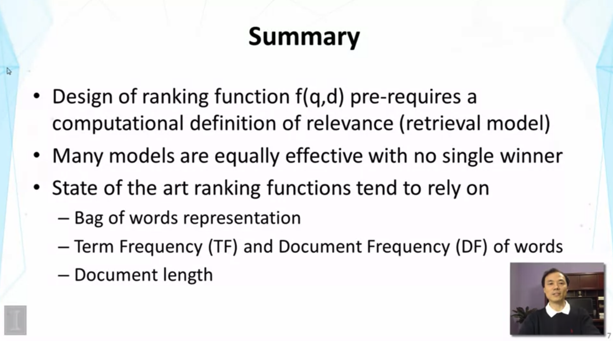

## Lesson 1.4 : Text Retrieval Methods

- Probabilistic model : query와 document들이 모두 observations from random variables 라고 가정.
  - R은 binary 확률 변수 (d가 q에 relevant 한지 여부)
- Probabilistic inference model : uncertainty를 inference rule과 연관짓는 방식
- Axiomatic model : 좋은 ranking function (모든 desired constraints 를 만족하는) 을 찾는 것이 핵심 문제

- Common Ideas
  - Common Assumption : using bag of word, to represent test 
    - 주어진 예제에서, query에 대한 score는 각 단어의 score에 depend함.
  - df : document frequency, df 대신에 확률(P)를 쓰는 경우도 있음.

- Additional Readings
  - Detailed discussion & Compasrison of state of the art models
    - Hui Fang, Tao Tao, and Chengxiang Zhai. 2011. diagnostic Evaluation of Information Retrieval Models. ACM Trans. Inf. Syst. 29, 2, Article 7 (April 2011)
  - Broad review of different retrieval models
    - ChengXiang Zhai, Statistical Language Models for Information Retrieval, Morgan & Claypool Publishers, 2008. (Chapter 2)