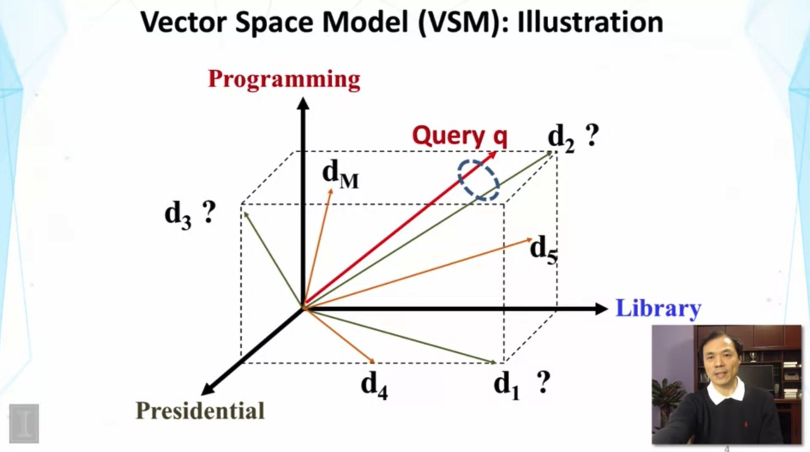
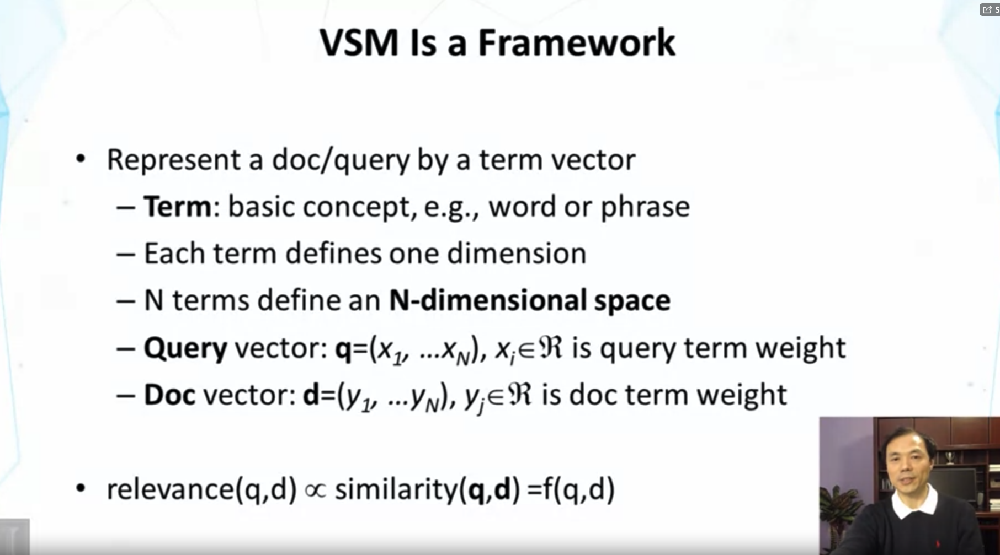
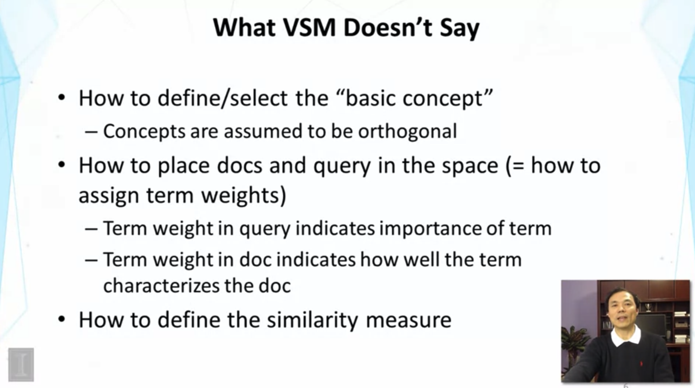

## Lesson 1.5 Vector Space Model

- ranking function을 design 하는 구체적인 방법인 vector space retrieval model을 배운다.
- Similarity-based models : f(q,d) = similiarity(q,d)
  - vector space model은 similarity-based model의 special case 이다.

- document 와 query를 term vector로 표현한다.
- term은 work / phrase / n-gram of character 가 될 수 있음.

- orthogonal 하지 않으면, redundancy (synonyms를 서로 다른 2개의 concepts로 잘못 이해할 수 있음..)
- Term weight in query vector : term의 중요성을 가리킴
- Term weight in doc vector : term이 doc을 얼마나 잘 characterize 하느냐를 가리킴

