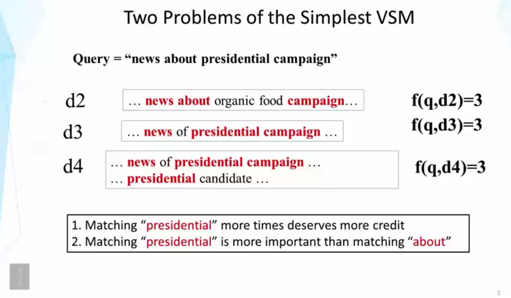
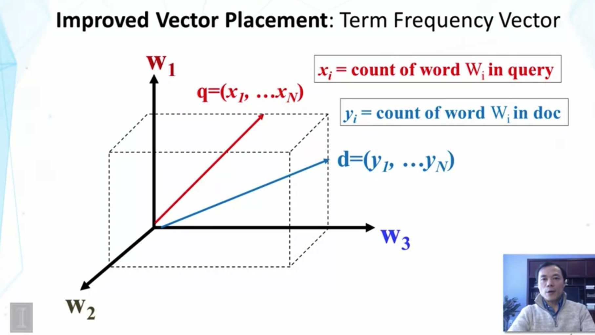
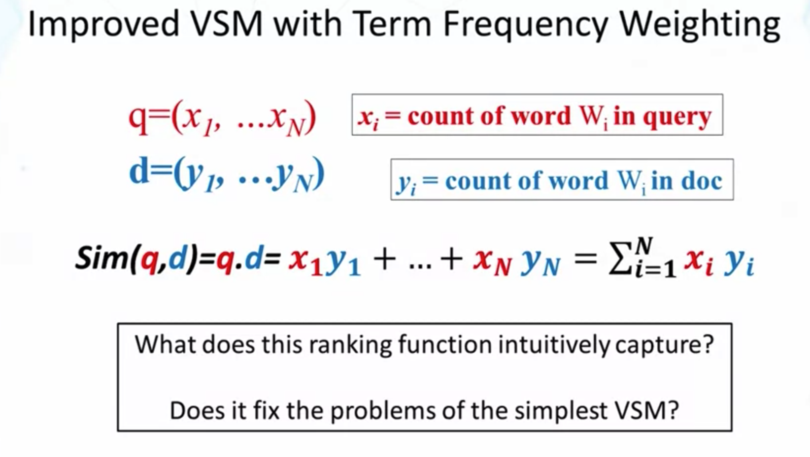
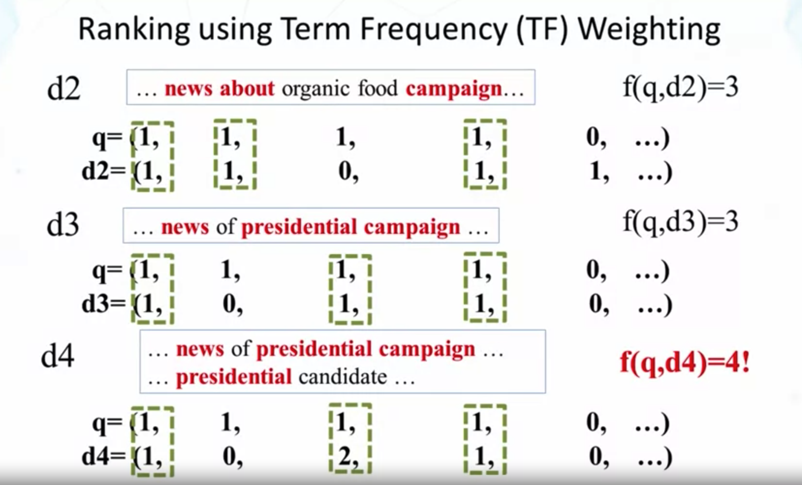
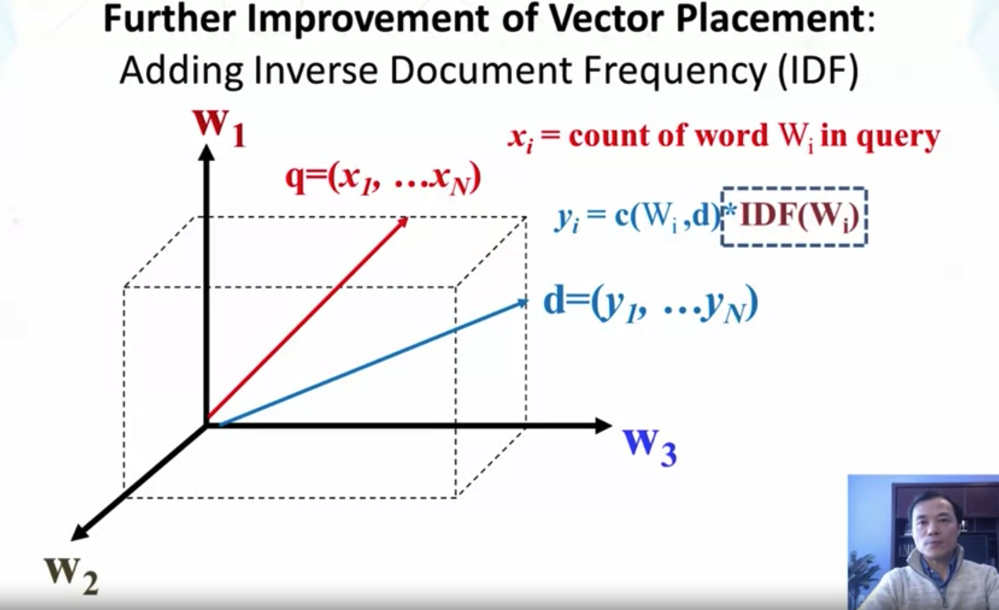
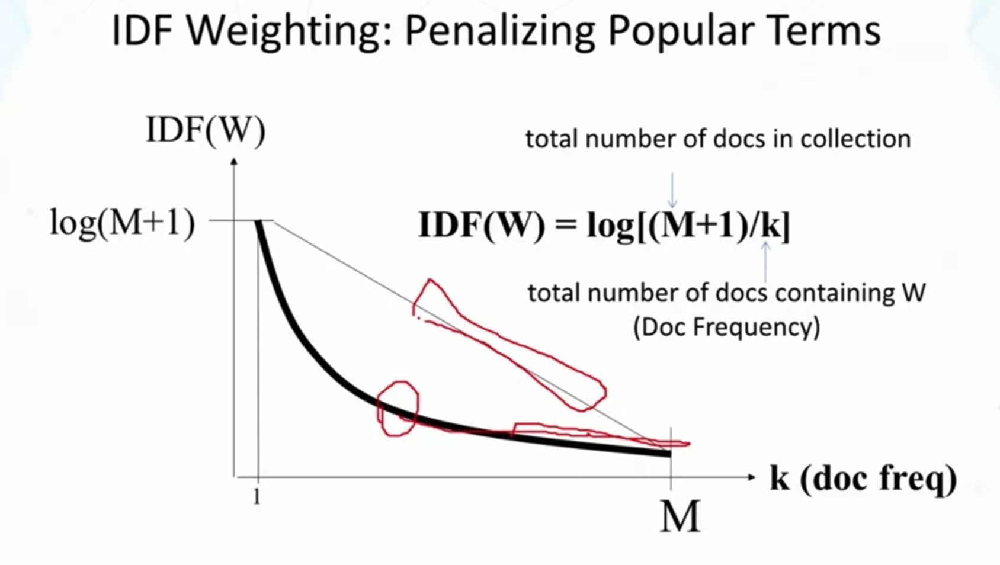
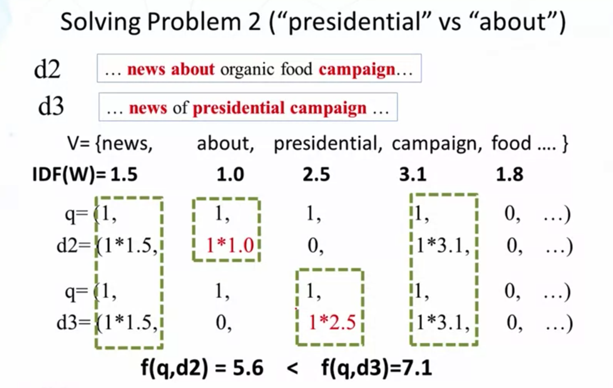
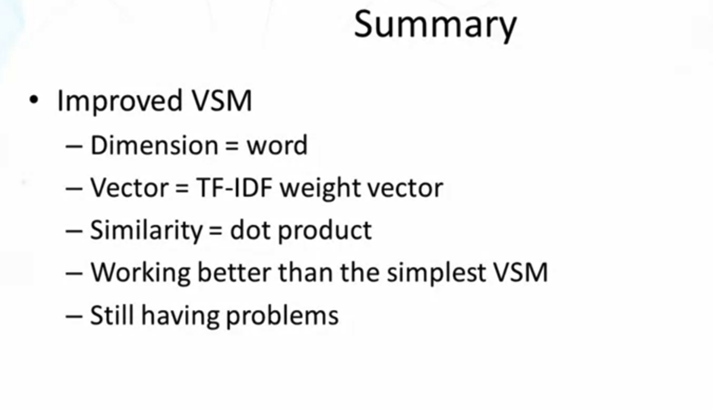

## Lesson 2.1: Vector Space Model - Improved Instantiation

1.6에서 다룬 것 --> Simplest VSM

- 이 문제들을 해결하려면,, vector space에 vector를 어떻게 place 하는지를 바꿔야 한다.

#### Solution  1. Term frequency를 같이 고려 (단순 presence/ absence만 고려 X)

- multiple occurence를 고려하게 되었다. 

- 앞 슬라이드에 나온 problem 1은 해결됨, but problem 2는 그대로!
- d4는 더 많은 score를 획득하게 되었지만, 여전히 d2와 d3은 같다. 왜? about이 presidential과 동일한 중요도라고 간주되기 때문에.
  - How? stop word? 이런 걸 어떻게 아는가?
  - about은 전체 collection of documents 에서 훨씬 자주 나오는 단어일 것. (아무데나 쓰이는 단어일 것임)
  - about의 가중치를 줄이고, presidential의 가중치를 높이기 위해,,, Use global statistic of terms (전체 문제에서 얼마나 나오는지)
    - 이게 된다면, d2 < d3가 될 수 있는 것!

- To reward a word, that doen't occur in many other documents <=> penalize common words
  - rare words는 high idf를 갖게 되고, common words는 low idf를 갖게 됨. 이걸 TF에 곱해줌

- Linear 하게 측정하는 것에 비해 장점 : 표시해 놓은 지점을 기준으로, 더 많이 쓰이는 단어는 거의 useless 하다고 판단할 수 있음
  - Linear penalization을 쓰면, 특정 구간(예를들어, 전체 doc의 절반정도 넘어가면 거의 useless한 것인데,,) 을 넘어가도, 여전히 difference가 존재하게 됨.
  - Low df 단어들에 대해 더 discriminate를 하고 싶지, high df인 애들은 무시하고 싶다! --> log를 씌운 형태가 더 합리적임

- 그러나, 이렇게 하면 d5가 오히려 스코어가 가장 높아지는 문제가 발생했음.
- common phenomenon, in designing retrieval functions
  - 하나의 문제를 해결하려고 하니, 다른 문제가 생기는 것

