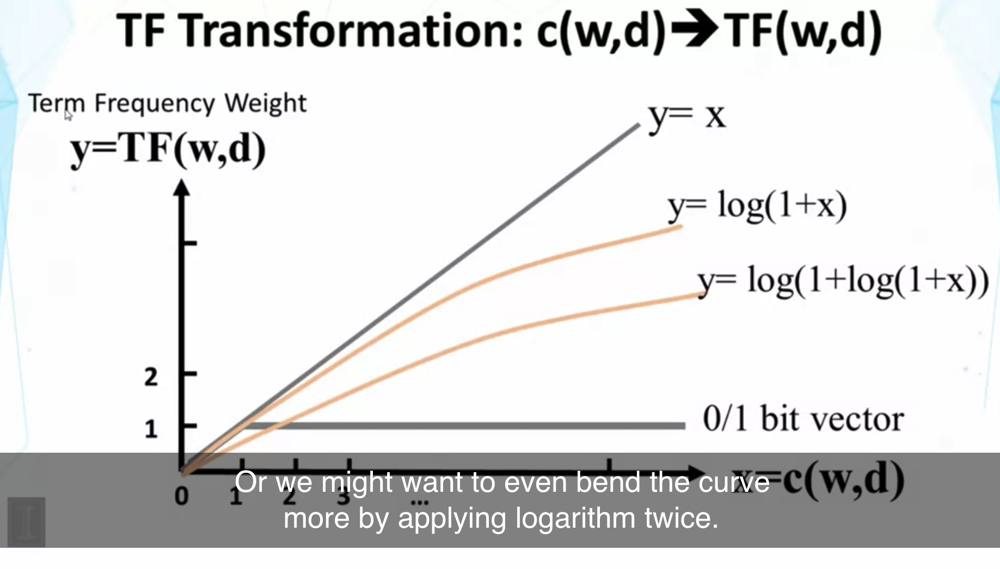

## Lesson 2.2 : TF Transformation

- occuerence가 0 이냐 1이냐는 차이가 커서, 많은 정보를 제공한다고 볼 수 있지만,, 횟수에 대해 linear 하게 가중치를 주는 것은 지나침.

- k+1이 upper bound 임.
- y = x 선은 count수를 그대로 가중치로 쓸 경우 (linear)이고, k가 매우 커지면, linear과 유사한 형태가 됨.
- k = 0 이면 0 /1 bit vector를 사용하는 것과 유사하게 됨.

