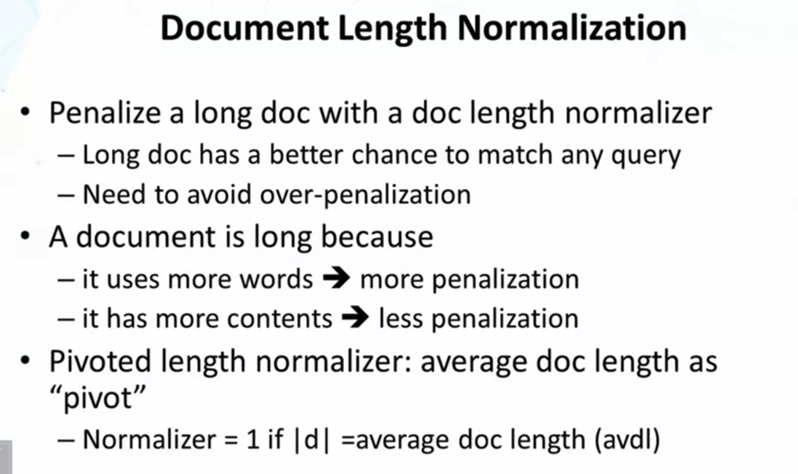
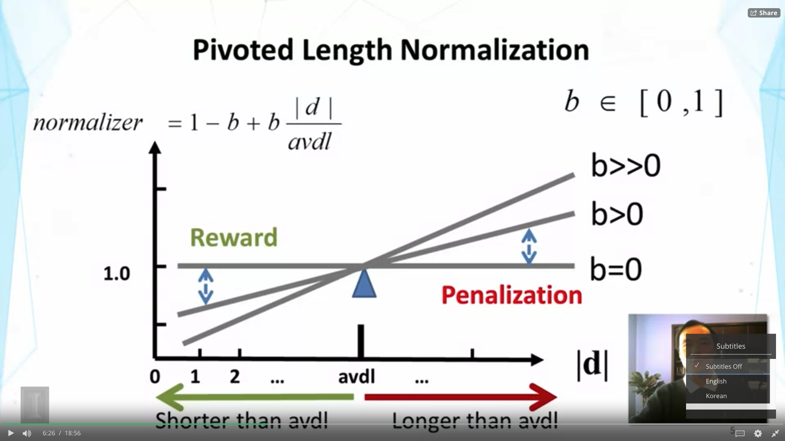
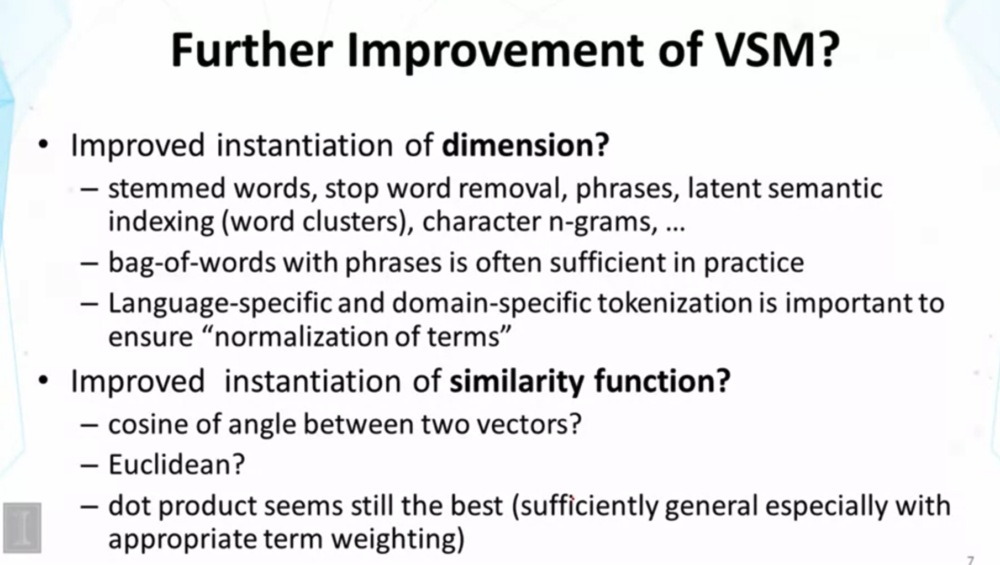
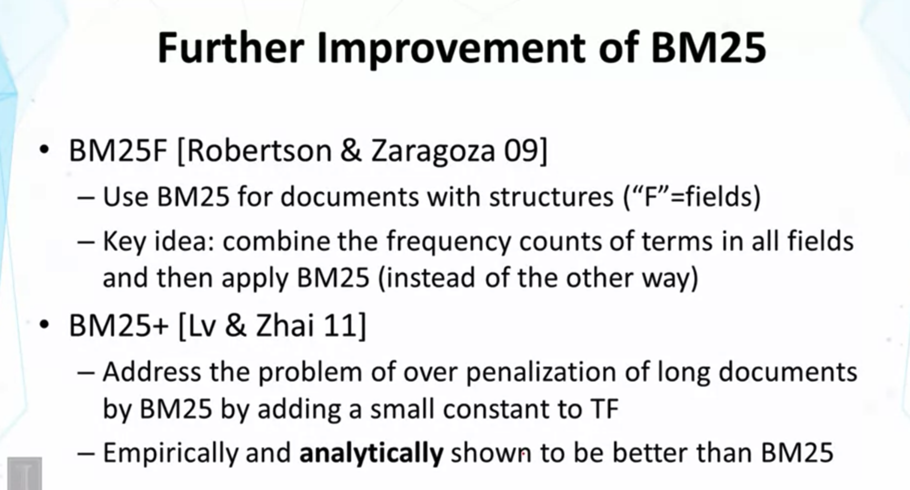
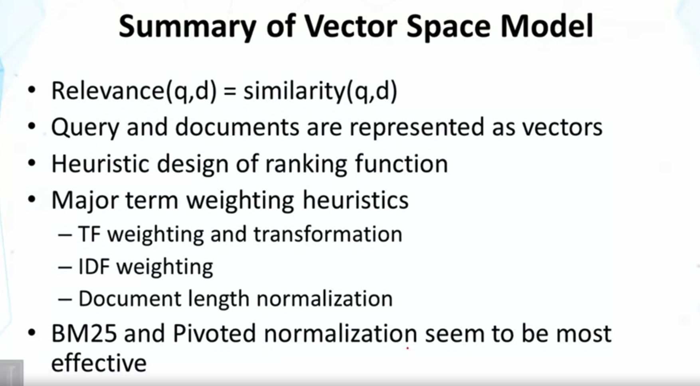

## Lecture 2.3 : Doc Length Normalization

- document가 길어질수록 특정 단어가 속할 확률이 높아지기 때문에, 단순히 막 길어지는 것에 대한 penalize를 해줘야 함.

- abstract와, 그것을 풀어 쓴 journal 을 비교하면, 후자가 당연히 길 것이고, 이는 penalize를 더 해줘야 함.
- 그러나, 여러 abstract 들을 합쳐 놓은 journal이 있다면, 이는 정보량이 많은 것이고, penalize 를 덜 해줘야함.
- Pivoted length normalizer
  - average length 를 갖는 doc 들은, score가 적절하다는 가정

- State of the art, VSM formula 임.

- Dimension이 굳이 word가 아니어도 된다.
  - stemmed word 
  - stop word removal : 뜻이 없는 매우 흔한 단어들은 제외한다. ex> of, the, a, ... 
  - latent semantic indexing : latent concept를 의미하는, cluster들을 dimension으로
  - n-grams : n개의 character sequence를 dimension으로
- 여전히 bag-of-words (dimonsion = words)가 가장 popular 하고, major search engine에서 다 사용된다.
- 특정 언어들의 경우, 어디까지가 단어인지 찾아 내는게 필요하기도 함. (Boundaries of words를 찾아야 함)
  - 영어는 그냥 단어마다 띄워쓰기를 해 줘서 쉽지만,,
  - ex> chinese는 그냥 문자들이 쭉 이어지는데,, 어디까지가 한 단어인지 알아야 함.
- similarity function을 개선하는 방법들
  - Cosine, Euclidean, ...
  - 그럼에도 불구하고 dot product가 sufficiently general. 
    - cosine measure도 결국은 normalized dot product 임.

- BM25F : 'F' 는 Filed, 
  - Scoring Doc with structure 할때 사용--> title / abstract / body 등,,
  - 각 field 마다 BM25를 적용한 뒤 score를 합친다면, 반복되어서 나오는 단어들이 매번 first occurence 에 대한 가중치를 부여받게 됨.
    - 이걸 피하고자, 다 합쳐 버린 다음에 BM25를 적용 --> advantage of avoiding over-counting of first occurrence of the term

- BN25는 VSM 으로 분류하여 설명 하였지만, BM25는 사실 probabilistic model으로부터 도출된 모형이다.
  - VSM으로 분류한 이유는?
    - ranking function has a nice interpretation in the VSM
    - original BM25 has somewhat different form of IDF --> 이건 Work를 잘 하지 않았음. Heuristics를 써서 IDF 형태를 바꾸니까 잘 돌아가게 됨. --> VSM 형태와 더 유사해짐.

<Additional Readings>

- A. Singhal, C.Buckley, and M. Mitra. Pivoted document length normalization. In P{roceedings of ACM SIGIR 1996.
- S. E. Robertson, S.Walker, Some simple effective approximations to the 2-Poisson model for probabilistic weighted retrieval, Proceedings of ACM SIGIR 1994.