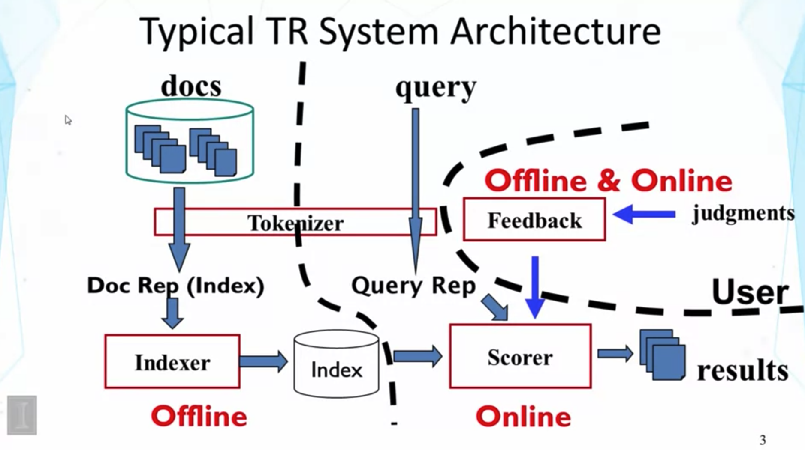
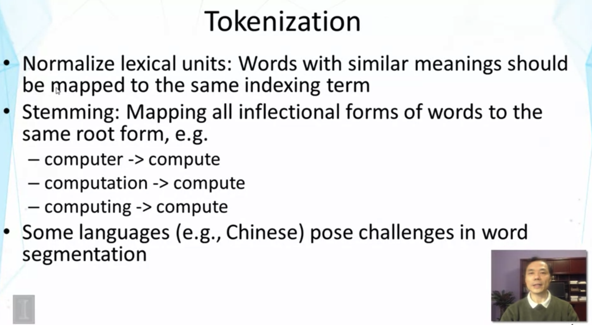
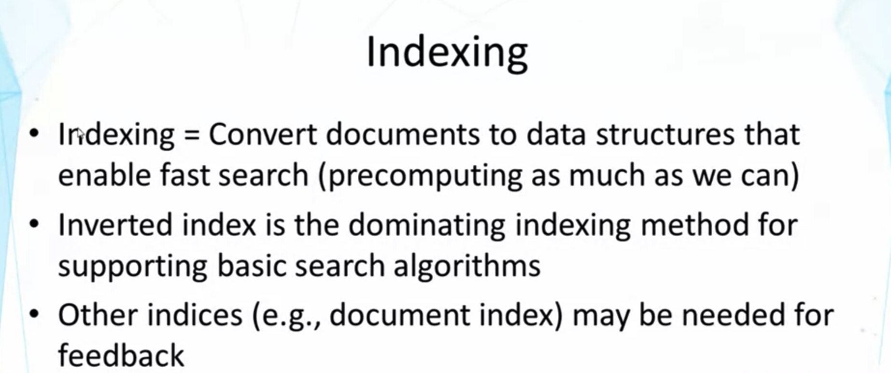
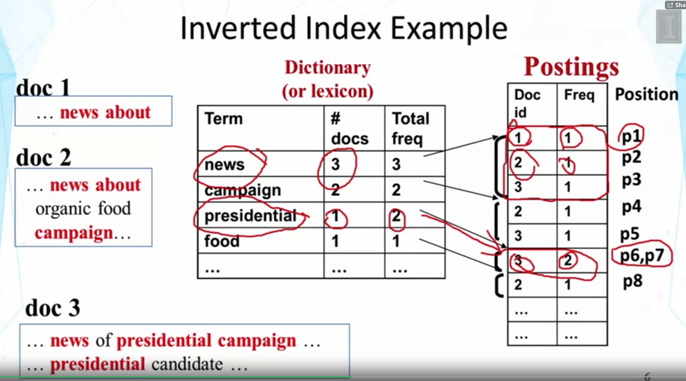
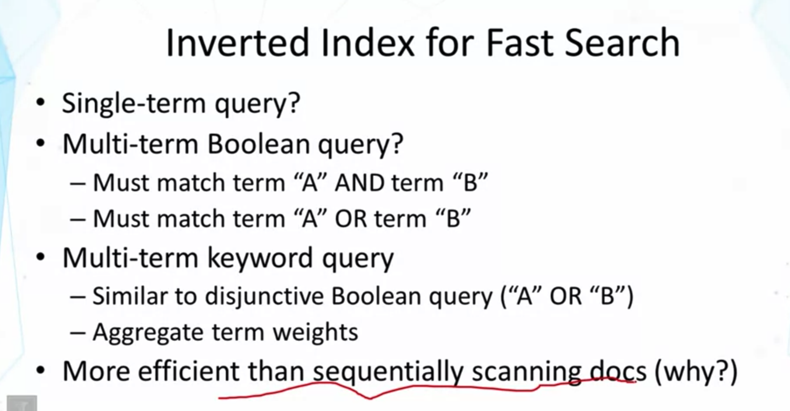
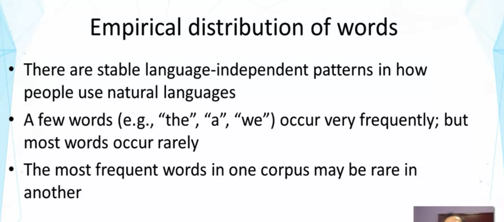
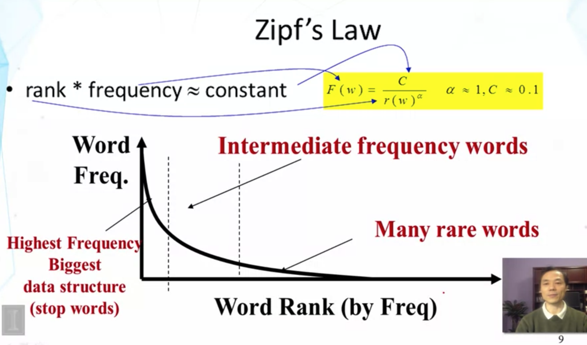

## Lecture 2.4 Implementation of TR systems

1. docs는 tokenizer를 거치면서 tokenized units (ex> words)로 분해된다.
2. Token(ex>words)는 Indexer에서 처리되고, index가 만들어진다. Index는 search engine이 query에 빠르게 답하기 위해 만드는 data structure이다.
3. query도 tokenizer를 거쳐서 token들로 분해된다.
4. query는 tokenize된 후에 scorer로 가게되고, scorer는 doc들의 index를 사용해서 user의 query에 답한다.
   1. how? scoring docs and ranking the docs
5. user은 result를 보고 판단하게되고, 피드백을 다시 주게 된다.
   1. Skip / click 등,, : viewed docs are better than skipped ones

- Search Engine은 3 part로 나누어 짐 : Indexer, Scorer, User Feedback Mechanism
  - Indexer : pre-process the collected data, build the inventory index,, 등은 미리 해 놓을 수 있음 (Offline)
  - Scorer : process user's query dynamically and quickly generate search results (Online)

- stemming : 보통은 좋은 idea, 'coverage of docs, that are matched up with query' 를 늘려줌
  - but, 항상 좋은 것은 X : compute와 computing의 subtle difference가 might still suggest the difference in the contents
  - 대부분은 좋긴 함
- 중국어 같은건 language-specific tokenization technic이 필요함.

- Indexing method에서는 Inverted index가 짱임
- Feedback method는 매우 다양하고, standard가 아직 없음.

- pre-constructed index를 만든다. 이 index는 particular term에 match 되는 모든 doc. 들을 빠르게 찾을 수 있게 도와줌.
- Dictionary : IDF component를 계산하는 데 필요한 숫자들 (# docs, Total freq)을 저장
- Postings : 각 단어 별로 특정 doc에서의 occurence 횟수가 어떻게 되는지 저장 
- Postiion : doc 내에서 해당 단어가 어디에 있는지
  - query term에 대한 matching이 small window (ex> 5 words, 10 words,...) 안에서 이루어 졌는지, 혹은 두 query terms에 대한 matching이 하나의 phrase of two words에서 이루어 졌는지, ... 등을 파악하는데 유용함

- Single-term query에 대해서는 Inverted index가 좋다.
- Multiple-term Boolean query는? 마찬가지로 쉽다.
  - A AND B : A에 matching 되는 docs 다 가져오고, B에 매칭되는 docs 다 가져와서 intersect
  - A OR B : Union
- Multi-term keyword query
  - doc과 match 시키고, generate score.
  - score들은 aggregated term weights 에 기반하고 있음.
  - Boolean query는 아니지만,, scoring이 유사한 방식으로 이루어질 수 있음.
  - A OR B 처럼 한 단어라도 매칭되는 모든 doc를 union한 뒤, aggregate the term weights.
- 왜 순차적인 scanning보다 더 efficient?
  - doc이 매우 많기 때문에,, 엄청 오래 걸릴 것.
  - 왜 더 빠른가?

- 지프의 법칙 : 사용 빈도가 높은 순서대로 단어들을 나열했을 때, 말뭉치(Corpus) 내에서 모든 단어의 사용 빈도는 해당 단어의 순위에 반비례한다. 
  - 빈도 1위인 단어는 빈도 2위인 단어보다 약 2배 높은 빈도
  - 빈도 1위인 단어는 빈도 3위인 단어보다 약 3배 높은 빈도
- stop words를 가지고 index를 만들면, posting 같은게 어마어마하게 길어지기도 하고, 아무데나 나오는 단어들은 query와의 relevance를 판단하기에 적절하지 않음 --> stop words는 제외하는 것을 지향

- Compression : disk 용량을 절약하는것 뿐만 아니라, speed 개선(loading of the index)에도 도움이 된다.
  - why? I/O costs a lot, CPU가 I/O보다 훨씬 빠름
  - compression을 통해 file이 작아지면, I/O에 걸리는 시간이 줄어듦
  - uncompress 를 할때 연산을 더 많이 해야겠지만,, CPU는 빨라서 overall time은 줄어드는 것임