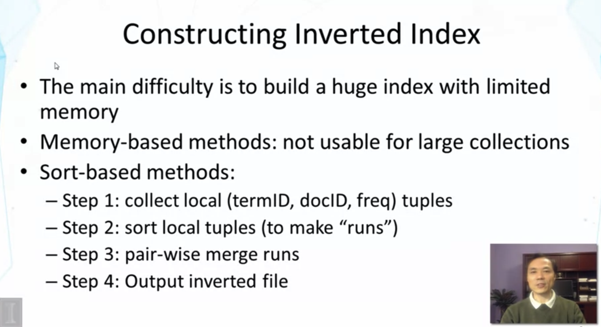
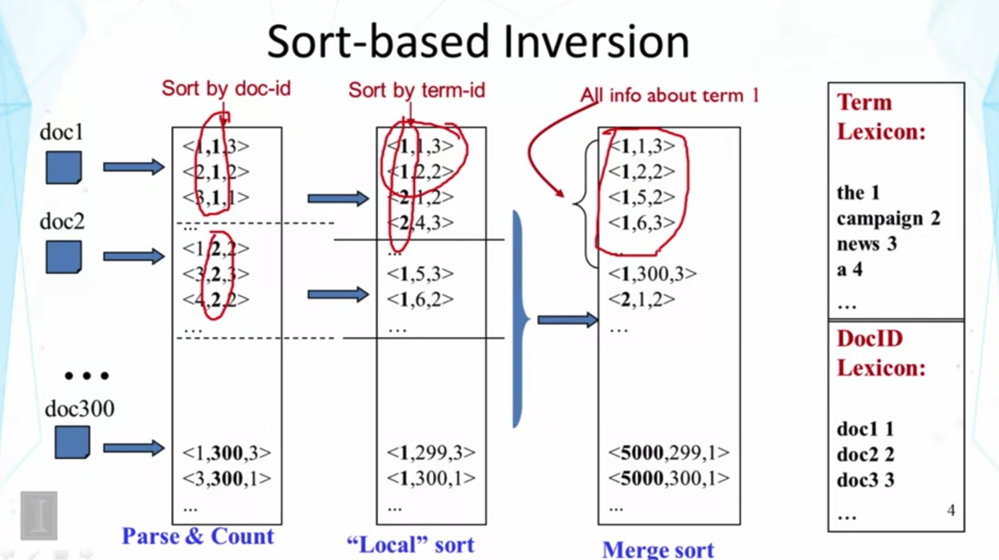
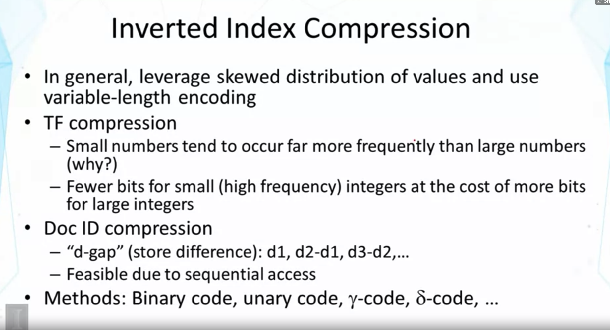
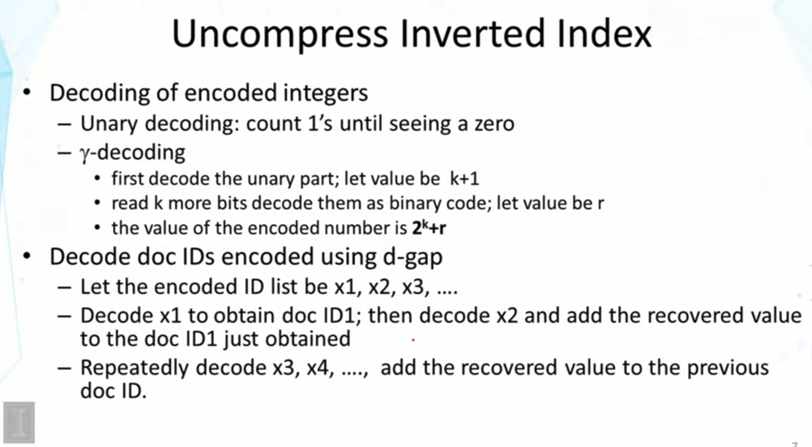

## Lesson 2.5 : System Implementation - Inverted Index Construction

- Step 1 : Small set of docs 에 대해서 terms들을 locate 시킨다.
- Step 2 : 얘네들을 가지고 partial inverted index를 만든다. (runs)
- memory에는 한계가ㅣ 있기 때문에, step 2를 disk에 차례로 기록하면서 runs를 계속 만들고, 합치게 됨

- term Lexicon을 가지고, doc들을 integer로 표현할 수 있다 
  - 왜 이렇게 하는지? integer는 easy to handle (ex. array의 index로 쓰일 수도 있고, easy to compress이기도 하고,,)
- 왼쪽의 doc들을 차례로 scan하고, parse하여서 term 들의 frequency를 센다.
- 각 벡터에서 두 번째 item이 doc-id, 처음에는 doc-id 순으로 sort
- 이걸 term-id 순으로 sort하고,, 하다보면 메모리가 꽉 차기 때문에 disk에 temp 파일을 저장하면서 진행한다
  - 따라서 데이터 전체가 memory에 들어가지 않아도, inverted index를 만들 수 있게 됨.

- 일반적으로, 자주 나오는 단어들을 encode 할때 더 적은 bit를 사용하고, 대신에 rare value를 encode할 때 더 긴 bit를 사용한다.
  - skwed distiribution 을 이용하기 위함임
- small numbers tend to occur far more frequently than large numbers
  - 왜? 지프의 법칙 때문
- Doc ID compression
  - doc-id들을 skewed way로 distributed 되어 있지 않음
  - d-gap : term ID간 차이를 저장
    - 만약 특정 term이 많은 doc과 match 되었다면, Long list of Doc ids 가 나올 것.
      - 1번 doc에서 나오고 또 2번 doc에도 나오고,,, 이러면 자주 나오는 term의 경우 gap이 짧게짧게 나오게 됨.
      - gap만 저장하면? a lot of small numbers 로 가능
    - 만약 특정 term이 적은 수의 doc과 match 되었다면, gap would be large (doc 1에 나오고 나서 doc 1000에 나오는,,)
  - d-gap을 이용하면, skewed distribution을 만들 수 있음.

- Binary coding : equal-length coding, property for randomly distributed values
- Unary : 100을 얻으려면 100bits를 써야 함. same number of bits, as the value of this number
  - 큰 숫자들이 나온다면, very inefficient
  - 큰 숫자들이 절대 안나온다! 하면 쓸 수 있는 방법
  - 숫자 간 boundary는 어떻게 찾나? '0'
  - Too aggresive for rewording small numbers
- gamma code : Less aggressive한 방법
  - uniform code = binary code
  - 아래 수식에서 logx 는 밑이 2인 로그를 의미하는 듯함.
  - 1 + floor(logx) 만큼만 unary code를 쓰고, 그 뒤쪽은 binary code를 사용 (floor(logx)개의 bit에 대해서 x-2^(floor(logx)) 숫자를 표현
  - 예제 : 3 => 101, 10은 unary code / 5 => 11001, 110은 unary code
  - 5, 6, 7은 동일하게 뒤쪽 부분이 2 bit일 것 --> 6 => 11010 / 7 => 11011
  - 첫 번째 0을 중심으로 unary code와 binary code가 갈라진다. 첫 번째 0이 나오기 전까지 왼쪽 숫자는 모두 1임.
  - 큰 숫자가 나와도 ok.
  - sorting distribution에 적합 --> gamma code가 integer compression에는 가장 잘 되는것으로 밝혀짐
- delta code : gamma code와 동일하지만, unqry prefix를 감마 코드로 대체한 것임.
  - less conservative than gamma code
  - 큰 숫자가 나와도 ok.

