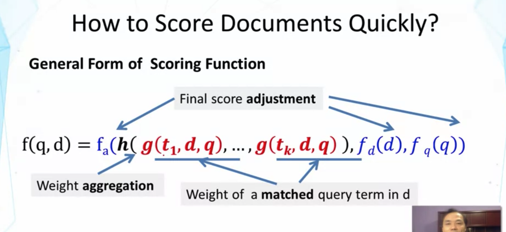
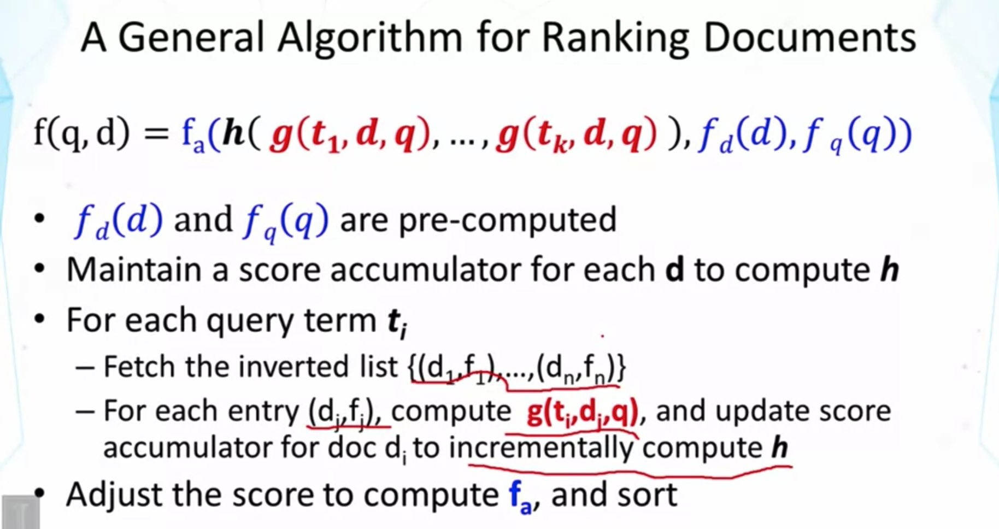
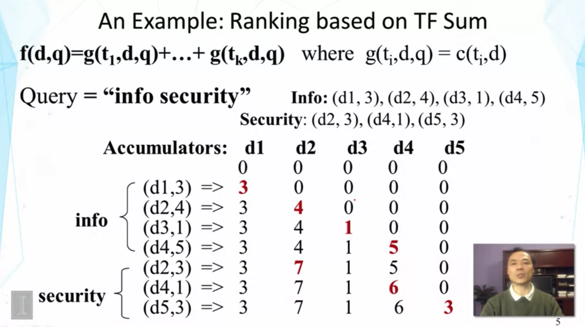
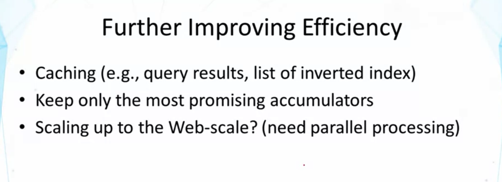
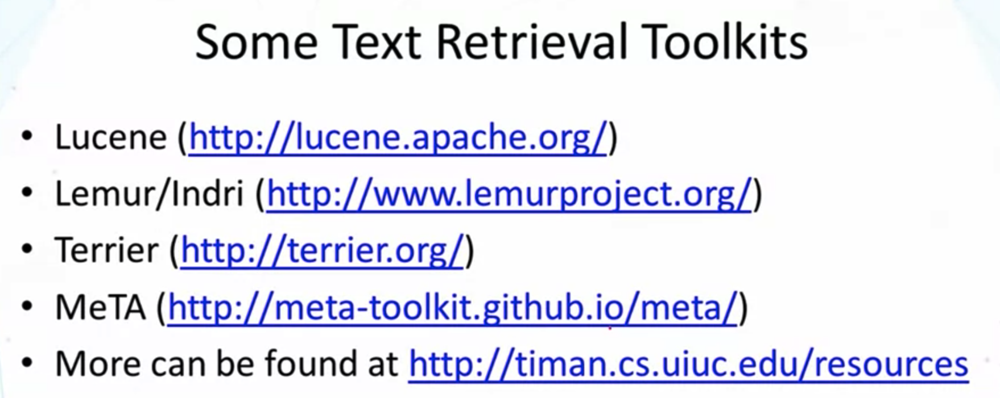
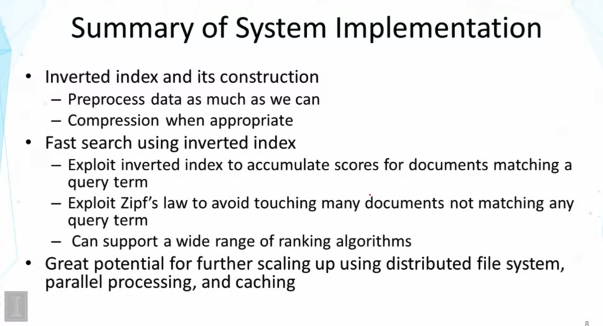

## Lesson 2.6 : System Implementation - Fast Search

- VSM도 주어진 수식의 specific한 형태임
- f_a : adjustment function, f_a에서의 adjustment factors는 f_d(d), f_q(q)
  - f_d(d) : adjustment factor of doc.
  - f_q(q) : adjustment factor of query
  - 얘네들은 scoring factors, at level of whole document and query
    - ex> doc length
- h : main part of the scoring function
  - h 안에서 weights 가 계산된다.
  - h는 aggregate all the weights
  - g : t_1 는 term, d 는 document
    - Weight of a matched query term in d를 구함

- f_d(d) 의 doc. length 같은 것들은 pre-computed
- (d_1, f_1) : 1번 doc에서의 frequeny of the term in the doc.이 f_1이다.
- g(t_i, d_j, q)는 TF-IDF weights 같은 걸 계산한다.
- 빠른 이유?  we don't have to attach any of the doc. that didn't match any query term
  - 최소한 1개 이상의 query term과 match 되는 doc.들만 process하면 되어서 빠름

- 예제 : scoring function f(d,q) 을 단순하개 가정 (sum of the tf)
  - g(t_i, d, q) 도 단순하게 query term t_i 가 특정 doc에서 몇 번 나오는지로 단순하게 가정
- Accumulators는 0값들로 Initialize
- Score Accumulator를 전부 가지고 있고 싶지 않다면?
  - 가장 promising한 score accumulator들만 가지고 있고 싶다면
  - rare term을 먼저 process 하는 전략 --> score contribution이 높은(match few words 이므로) rare term부터 process 한다면, most promosing words를 먼저 다루게 된다.
    - pruning에 도움이 됨 (promising words vs non-promising words)
- IDF는 어떻게 결합할 수 있겠는가?
  - when we fetch the inverted index, we can fetch the doc frequency and then we can compute IDF
  - 혹은 IDF 값은 pre-compute 해 놓을 수 있음, when we index docs.

- 캐싱 : store query results, popular queries
  - popular queries 에 대한 results를 memory에 넣어 놓을 수도 있다.
- keep the only the most promising accumulators : User은 너무 많은 docs. 를 다 보고 싶어 하지 않기 때문에, high quality subset of docs만 return해도 된다.
  - accumulators를 prune 하는게 가능
- 병렬처리

- Lucene : most popular toolkit, nice support for a lot of web apps
  - search engine을 구현하기가 쉽다.
  - Not easy to extend, 그리고 구현된 알고리즘들이 가장 발전된 형태가 아님 (not the most advanced)
- Lemur/Indri
  - Lucene만큼 web apps에 대한 support가 좋지는 않음
  - many advanced search algorithms를 가지고 있고, easy to extend하다
- Terrior 
  - between Lemur or Lucene
  - web app에 대한 support도 좋고, advanced algs. 도 가지고 있다
- MeTA
  - 과제에 사용될 툴킷
  - combination of both text retrieval algs. and text mining algs.
  - basic search algs.도 많지만
  - text minig -> text analysis algs.도 많다

- Inverted Index : primary data structure for supporting a search engine
  - key to enable faster response to a user's query
  - basic idea : pre-process 할 수 있는만큼 많이 해 놓기, compression 하기 (disk space를 아끼고, speed up I/O)
  - 이전 강의에서 data가 memory에 can't fit in 할 때 어떻게 하는지도 배웠다.

<Additional Readings>

- Ian H. WItten, Alistar Moffat, Timothy C. Bell:
  Managing Gigabytes: Compressing and Indexing Documents and Images, Second Edition. Morgan Kaufmann, 1999.
  - inverted index와 compression 테크닉의 efficiency에 대한 classic textbook
- Stefan Buttcher, Charles L.A. Clarke, Gordon V. Cormack: Information Retrieval - Implementing and Evaluating Search Engines. MIT Press, 2010.
  - implementing and evaluating search engines 에 대한 nice new textbook

