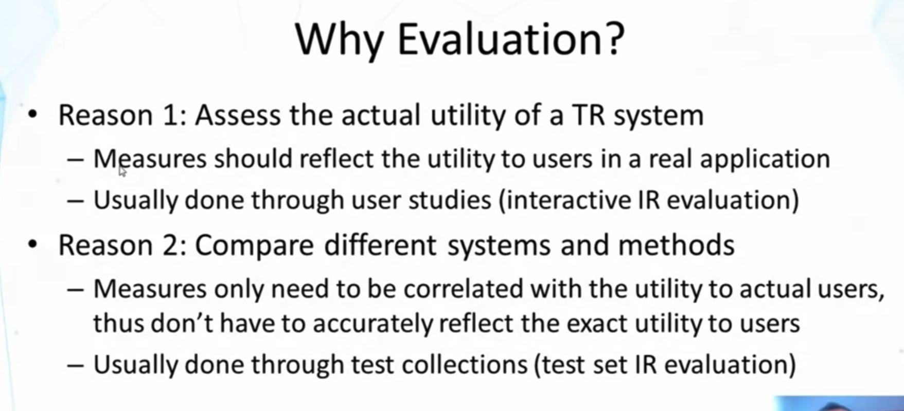
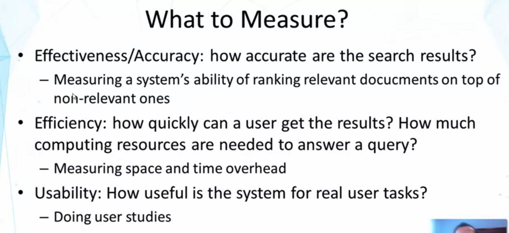
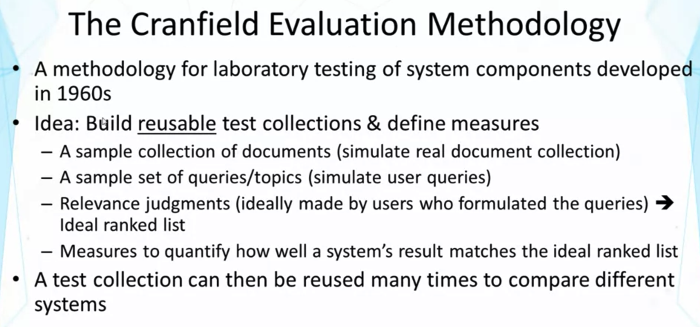
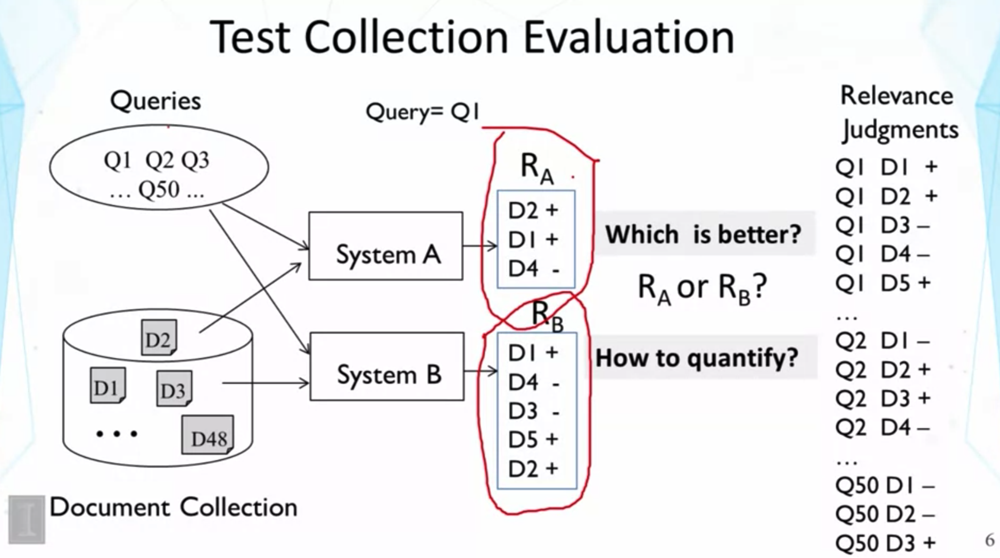

## Lesson 3.1 : Evaluation of TR Systems

- 어떤 방법이 Works better 하는지 알기 위해서
- Text retrieval은 empirically defined problem 이다!
  - evaluation must rely on users
  - very challanging problem -> 공정하게 비교를 어떻게 할 수 있나?
- (Reason2) 여러 방법들을 비교하기 위함이라면, actual user 사용 시의 exact utility를 reflect할 필요는 없다.
  - measure only needs to be good enough to tell which method works better
    - test collection

- Usability에는 interface 등이 중요
- 이 course에서는 effectiveness/accuracy measure에 대해서 주로 다루겠다.
  - 왜? efficiency와 usability는 not really unique to search engines 이기 때문에. 

- 어떤 Q(query)에 어떤 D(doc) 이 relevant 한가? 는 user들이 판단하여 작성, ideal-rank-list가 만들어짐
- A is better : doc이 많지 않을 때 better, 3개 return한 것 중 2개가 relevant, precise
- B is better : more relevant docs (+인 것 3개를 return)
- How do we quantify?
  - It depends users' tasks
  - 만약 모든 relevant doc을 판별하는 데 user가 관심 없다면,, A is better일 것
  - user might need as many relevant docs as possible (ex.literature survey) ,, B is better일 것
  - 따라서, multiple measures를 고안해야 함