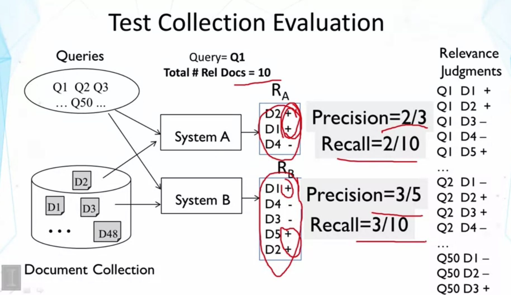
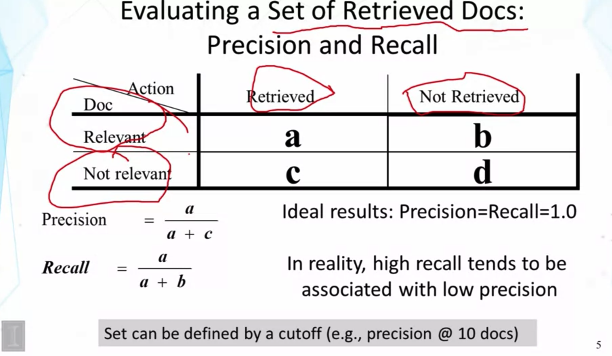
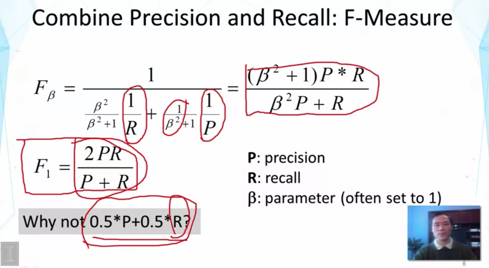
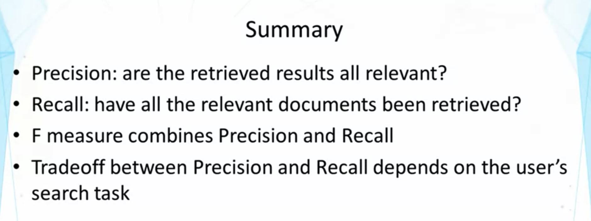

## Lesson 3.2 : Evaluation of TR Systems - Basic Measures

- lesson 3.1 끝에서 했던 예제,, 실제로 어떻게 performance를 quantify 할 수 있는지 알아보자
- (가정) Query와 relevant 한 doc이 10개가 있다고 하자.
- System A
  - noise가 적다
  - 3개 중 2개가 relevant
- System B
  - 최대한 많은 relevant doc. 들을 얻고자 하는 사용자들에게는 B가 더 적절하다 (Recall)
- Precision 상으로는 A가 더 좋아 보인다
- Recall 상으로는 B가 더 좋아 보인다 (completeness of coverage of relevant docs)
- Precision / Recall이 Basic 이다!

- Precision 과 Recall은 일반적으로 반비례하는 경향이 있다
  - 왜? relevant doc. 들을 많이 찾아내려고 할수록(Recall을 높이려고 할수록), non-relevant doc. 들도 많이 들어오게 됨..(Precision이 낮아짐)
- Web search engine에서, 10개 doc 중에서 몇 개가 relevant 한지는 매우 meaningful measure 이다.
  - 왜? 첫 페이지에서 user가 몇 개의 relevant doc. 을 보게 되느냐 이므로,,

- precision과 recall의 조화평균인 F-score
- Beta는 Recall 과 Precision에 emphasis를 가하는 역할 (어떤 metric이 더 중요한지..)
- Why not 0.5*P + 0.5*R ??
  - 위 식은 산술평균,,
  - total value tends to be dominated by the large values
    - 매우 큰 P나 매우 큰 R이 있으면 Dominated -> 하나라도 매우 큰 애가 있으면 sum은 커진다.
      - not desirable
      - perfect Recall을 갖기는 쉽다! 그냥 모든 doc을 retrieve 하면 됨..
      - Easy-way to combine이지만,, 조금만 더 깊게 생각해보면 안 좋은 metric임을 알 수 있음 --> 평소에도 이런 경우 주의! / Try to think about the best solution! / Try to understand the problem very well / Know why I need certain metrics
- 산술평균에 비해 F1-score은 recall과 precision을 유사하게 reward 한다.
  - 하나의 값만 extremly high인 경우를 penalize

