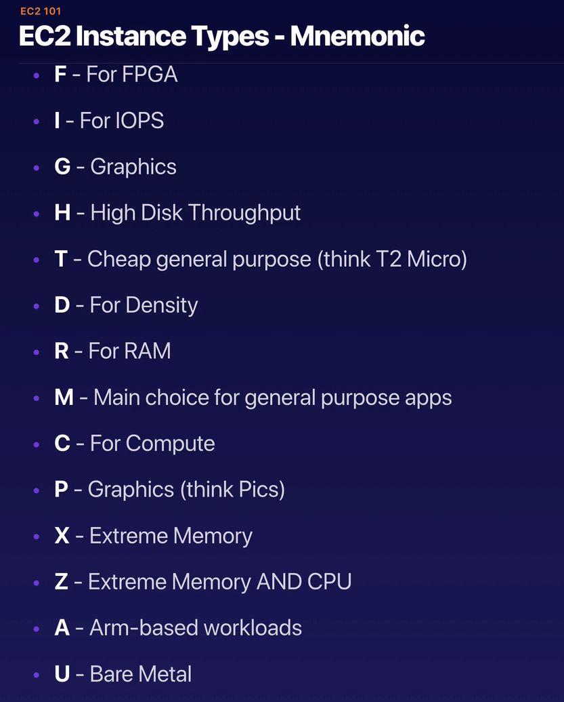

### Services

- The AWS Amplify CLI, to rapidly provision and configure our cloud services
- The AWS Amplify JavaScript library, to connect our front end to cloud resources
  - "As we saw above, AWS Amplify is an open source JavaScript library that makes it very easy to integrate a number of cloud services into your web or React Native apps."
  - our src/aws-exports.js file contains all of the configuration we’ll need to pass to the Amplify JS library in order to talk to the AppSync API.
- Amazon Cognito, to handle user sign up authorization
- Amazon Simple Storage Service (S3), to store and serve as many photos as our users care to upload, and to host the static assets for our app
- Amazon DynamoDB, to provide millisecond response times to API queries for album and photo data
- AWS AppSync, to host a GraphQL API for our front end
- AWS Lambda, to create photo thumbnails asynchronously in the cloud
- Amazon Rekognition, to detect relevant labels for uploaded photos
- Amazon Elasticsearch Service, to index and search our photos by their labels

## Udemy Lecture

1. Region 안에는 2개 이상의 AZ가 있음. AZ는 1개 이상의 data center으로 구성.
2. Edge Location : 컨텐츠 caching을 위해 사용되는 endpoints. CloudFront와 CDN이 있음.
   1. 이건 Region에 포함되는 더 작은 개념.

#### IAM이 제공하는 features

- centralized control of AWS account
- Shared Access to AWS account
- Granular Permissions
- Identity Federation (Active Directory, Facebook, Linkdin etc... ) : ID 통합
- Multifactor Authentication
- provide temporary access for users/devices and services
- allows you to set up your own password rotation policy

#### IAM terms

- Users / Groups / Policies (JSON 형태) / Roles
- Roles : AWS resource에 부여하는 권한
- IAM is universal ('글로벌' 개념임. 개별 region에 따로 적용X)
- New Users have No permissions, when first created
- New Users are assigned Access Key ID & Secret Access Keys, when first created
- Group에 부여된 Policy는 Group에 속하는 User들이 상속받음
- Multifactor Authentication : 2차 인증

### S3

- Object-based (0 Bytes to 5TB)
  - Key : name of the object
  - value : data, made up of sequence of bytes
  - Version ID
  - Metadata
  - Subresources : Access control lists, torrents
- unlimited storage
- Files are stored in Buckets (=Folders)
- S3 is a universal namespace (must be unique globally)
  - 성공적으로 업로드되면, HTTP 200 code를 받게 됨!
- Not suitable to install an OS on.
- (중요) How does data consistency work for S3??
  - Read after Write consistency for PUTS of new objects
  - 'Eventual' Consistency for overwrite PUTS and DELETES (can take some time to propagate)
- (중요) Tiered Storage Available
  - S3 Standard : 99.99% availability, 99.99999..% durability, stored redundantly accross multiple devices in multiple facilities, and designed to sustain the loss of 2 facilities concurrently.
  - S3 - IA (Infrequently Accessed) : rapid access는 필요하고 잘 access 하지 않는 데이터, lower fee, but retrieval fee를 내야 함
  - S3 One Zone - IA : do not require the multiple availability Zone data resilience, retrieval fee
  - S3 Intelligent Tiering : Designed to optimize costs by automatically moving data to the most cost-effective access tier, without performance impact
  - S3 Glacier : data archiving 목적, retrieval times는 조정 가능 (minutes to hours), retrieval fee
  - S3 Glacier Deep Archive : lowest-cost storage, retrieval time of 12 hours is acceptable, retrieval fee
- Lifecycle Management
  - 30일 지나면 이 파일을 다른 storage로 올려! 가능
- Encryption
- MFA Delete 가능
  - 지우려면 2 factor authentication 필요하도록
- Secure your data using Access Control Lists (individual objects에 적용 가능) and Bucket Policies (버킷 전체에 적용)
- Cross Region Replication
  - Storage를 region에서 region으로 복제 가능.
  - S3 Transfer Acceleration : CloudFront 의 edge location 이용
- (시험 전) S3 FAQs 읽어 보기 --------------------------------------------- It comes up A LOT!!
- versioning
  - Once enabled, versioning cannot be disabled, only suspended
- S3 Object Lock : to store objects, using WORM (write once, read many)
  - object locks can be on individual objects or applied across the bucket
  - governance mode & compliance mode 가능
    - governance mode : users can overwrite or delete object version or alter its lock settings, if they have special permissions
    - compliance mode : a protected object version can't be overwritten or deleted, 보호 기간 내에는 root user도 불가능함
- S3 Glacier Valut Lock : WORM policy 같은 것 적용 가능
  - 한 번 Lock 되면, change 불가능

#### S3 - Encrpytion

1. Encrpytion In Trainsit is achieved by (HTTPS 를 사용하면서 얻어지는 것)
   1. SSL / TLS
2. Encrpytion At Rest (Server Side)
   1. Server Side : Amazon이 도와줌
      1. S3 Managed keys (= SSE - S3; Serversie Encrpytion)
      2. AWS와 User이 함께 : Aws Key management Service, Managed Keys (= SSE - KMS)
      3. Server Side Encrpytion with customer provided keys (= SSE-C)
   2. Client Side Encryption

#### S3 - Performance

1. 여러 개의 prefix (bucketname과 file 사이의 folders) 사용하면 속도 up
   1. per prefix, 3,500 PUT/COPY/POST/DELETE and 5,500 GET/HEAD requests per second
2. SSE -KMS 사용하는 경우, 제약이 있음
   1. Uploading/downloading will count toward the KMS quota
   2. Region에 따라 quota는 다름. 5,500 / 10,000 / 30,000 requests per second
   3. quota increase는 요청할 수 없음. --> 바뀐 듯? https://docs.aws.amazon.com/kms/latest/developerguide/increase-quota.html 요청할 수 있음!
3. Multipart Uploads : 100MB 이상부터 사용가능, 5GB 이상은 의무
4. S3 byte-range fetches : 분할 다운로드 가능, 일부분만 다운로드 가능
5. S3 Select & Glacier select
   1. SQL query를 써서 일부만 다운로드 가능. --> performance 개선 / data transfer 에서 비용 절약 가능
      1.S3, Glacier 둘 다 사용 가능

#### AWS Organizations

- account management service, that enables consolidating multiple AWS accounts into an organization that you create and centrally manage.
- ROOT 아래에 여러 개의 OU (Organization Units)를 두고, 그 아래에 AWS accounts를 둠
  - OU는 일종의 팀, accounts는 users
  - Policy를 OU에 적용할 수도 있고, 개별 accounts에 적용할 수도 있음
  - OU 아래에 OU를 둘 수도 있음
  - OU에 적용되는 Policy는 하부 account나 OU에 inherit 됨
- Paying account (Usually Root account) should be used for billing purpose only. 다른 resources를 deploy하는 것은 권고되지 않음.
- Enable/Disable AWS services, using Service Control Policies (SCP) either on OU or on individual accounts

#### Sharing S3 buckets, between accounts

- 3 가지 방법
  - 1. Using Bucket Policies & IAM (entire bucket), programmatic access only.
  - 2. Using Bucket ACLs & IAM (individual objects), programmatic access only.
  - 3. Cross-account IAM Roles, Programmatic and Console access

#### Cross Region Replication

- Versioning must be enabled, on both the source and destination buckets
- Files in an existing bucket are not replicated automatically
- All subsequent updated files will be replicated automatically
- Delete Markers are not replicated
- Deleting individual versions or delete markers will not be replicated

#### Transfer Acceleration

- Utilize CloudFront Edge Network, to accelerate your uploads to S3
- S3 bucket에 직접 업로드 하는 것 대신에, distinct URL을 사용하여 edge location에 direct upload 한다. Edge Location에서 해당 파일을 타겟 S3로 transfer 한다.

#### Aws DataSync

- Used to move large amounts of data from on-premises to AWS
- Used with NFS- (Network File System) and SMB- (Server Message Block) cmpatible file systems
- Replication can be done hourly, daily, or weekly
- Install the 'Datasync agent' to start the replication
- Can be used to replicate EFS to EFS

#### CloudFront

- A CDN is a system of distributed servers (network) that deliver webpages and other web content to a user, based on the geographical locations of the user, the origion of the webpage, and a content delivery server
- Edge Location : This is the location where content will be cached
  - seperate to an AWS Region / AZ
  - not just READ only, you can write to them too.
  - Objects are chached for the life of the TTL (Time to Live)
  - You can clear cahced objects, but you will be charged
- Origin : S3 bucket or EC2 Instance, Elastic Load Balancer, Route53 등이 될 수 있음.
- Distribution : CDN에 부여되는 이름. CDN which consists of a collection of Edge Locations
  - Web distribution : Used for websites
  - RTMP : Used for media streaming
- CloudFront Signed URLS & Cookies
  - A signed URL is for individual files (1file = 1 URL)
  - A signed cookie is for multiple files (1 cookie = multiple files)
  - Signed URL이나 COOKIE를 만들 때, policy를 붙이게 됨. Policy는 아래 항목들을 가질 수 있음.
    - URL expiration
    - IP ranges
    - Trusted signers (어떤 Aws accounts가 singed URLs를 만들 수 있는지 지정)
  - signed URL/cookies 는 content를 보호하고 싶을 때, 권한을 부여받은 사람에게만 접근 권한을 주고 싶을 때 사용 (ex. 넷플릭스)
  - Origin이 EC2라면? use CloudFront (signed URLs/Cookies)
  - cf> S3 signed URL
    - signed URL을 만든 user과 동일한 IAM 권한을 가지게 됨.
    - 따라서, S3 signed URL을 사용할 경우, S3 bucket에 접근 가능함.

#### AWS Snowball (Snow Family)

- Snowball : 대용량 데이터 Migration에 쓰이는 storage (Hardware)
  - Very Big Disk, petabyte-scale data transport solution
  - Storage 뿐만 아니라 Compute capability도 보유
  - 가능 : Import to S3, Export from S3
- Snowmobile
  - Exabyte-scale data transfer service
  - data center migration 같은데도 쓰임

#### Storage Gateway (Virtual | Physical device 둘 다 가능)

- service that connects an on-premises software appliance with cloud-based storage to provide seamless and secure integration between an organization's on-premises IT environment and AWS's storage infra.
- AWS Storage Gateway's software appliance는 VM image 형태로 다운로드가 가능하다. 이 VM image를 datacenter의 host에 설치할 수 있음.
- Gateway 설치 후, AWS account와 연동 (activation process)하면, 콘솔을 사용하여 storage gateway option을 만들어 낼 수 있음.
- Gateway 3종
  - File Gateway (NFS & SMB) : file들을 S3에 저장하기 위한 목적
  - Volume Gateway (isCSI) : Virtual 하드디스크 드라이브의 복사본을 S3에 저장하기 위한 목적
    - Stored Volumes : provide on-premise applications with low-latency access to their 'entire' datasets
      - data는 EBS snapshot 형태로 asynchronously backup 됨
      - Entire Dataset is stored 'on site', and is asynchronously backed up to S3
    - Cached Volumes
      - Entire Dataset is store 'on S3' and the most frequently accessed data is cached on site
  - Tape Gateway (VTL, Virtual Tape Library)
    - data 저장 방식으로 Tape 쓰고 있는 경우에 쓰는 것

#### Athena vs Macie

- Athena : interactive query service, that enables you to analyze query data located in S3, using standard SQL
  - pay per query / per TB scanned
  - No need to set up complex ETL processes
  - Works directly with data stored in S3
  - 어디에 쓰이나?
    - query log files, stored in S3 (e.g. ELB logs, S3 access logs, ... etc)
    - generate biz reports, on data stored in S3
    - Analyze AWS cost and usage reports
    - Run queries on click-stream data
- PII (Personally Identifiable Information) : 개인 식별 정보
- Macie : Security service (ML and NLP를 사용하는) to discover, classify, and protect sensitive data stored in S3
  - S3에 저장된 object가 PII인지 판별하기 위해 AI 사용
  - Dashboards, reporting and alerts
  - Works directly with data stored in S3
  - Can also analyze CloudTrail logs
  - Great for PCI-DSS (신용카드 결제) and preventing ID theft

### EC2

- RECIZABLE COMPUTE CAPACITY IN THE CLOUD
- On demand : Allows you to pay a fixed rate by the hour (or by the second) with no commitment
  - app with short term, spiky, or 예측 불가능한 workloads that cannot be interrupted
  - Apps being developed, or tested on Amazon EC2 for the first time
- Reserved : Provides you with a capacity reservation, and offer a significant discount on the hourly charge for an instance. 1년 or 3년 계약
  - Standard Reserved Instances : On demand에 비해 최대 75% off, 미리 많이 돈 낼수록 / 계약이 길수록 싸짐
  - Convertible Reserved Instaces : On demand에 비해 최대 54% off, CPU나 memory 등을 중간에 늘릴 수 있음.
  - Scheduled Reserved Instacnes : 특정 time window에 예약 가능.
  - Apps with steady state or predictable usage
  - Apps that require reserved capacity
- Spot
  - apps that have flexible start and end times
  - apps that are only feasible at very low compute prices
  - users with urgent computing needs for large amounts of additional capacity
  - 특징 : Amazon EC2에 의해 종료될 경우, partial hour of usage에 대해서는 청구되지 않음. 그러나, 사용자가 직접 종료시킨 경우 사용 시간만큼 charge 됨.
- Dedicated Hosts : Physical EC2 server didicated for your use. License 비용을 아낄 수 있음.
  - Regulatory requirements (ex. no multi-tenant virtualization이 요구되는 경우)
  - Great for licensing, which does not support multi-tenancy or cloud deployments
  - Can be purchased On-Demand (hourly)
  - Can be purchased as a Reservation for up to 70% off the On-demand price

#### 아래는 참고 사항 (시험 X)

- 'Fight DR. MC PXZ (in) AU (strailia) 로 외울 수 있음.

#### EC2 이어서

- Termination Protection is turned off by default, you must turn it on.
- On an EBS-backed instance, the default action is for the root EBS volume to be deleted when the instance is terminated
  - 추가된 EBS volume들은 'Delete on Termination'이 체크되어 있지 않음.
- EBS Root Volumnes of your DEFAULT AMI's CAN be encrypted. 서드파티 툴 (ex> bit locker)을 사용하여 encrpyt할 수도 있음.
- Additional Volumne 들도 encrpyt 가능.
- (네트워크) Security Group에서 Rule change할 경우, 해당 변동사항은 '즉각' 반영된다.
  - Security group으로는 특정 IP주소나 특정 PORT를 block할 수 없다 --> network access control list로 가능함.
  - 대신 Default option으로 모든 IP나 PORT가 blocked 되어 있다. 여기서 하나씩 열어 주는 것.
    - All Inbound traffic is blocked by default
    - All Outbound traffic is allowed
    - 하나의 security group에 무제한으로 많은 EC2 instances를 배정할 수 있고, EC2 instance에도 여러 개의 서로 른 security groups를 할당 가능하다.
    - Security Groups are STATEFUL
      - 만약 Inbound rule을 만들어서 특정 traffic을 들어오게 한다면, 자동으로 traffic은 back out 하는것이 허용된다.
      - 특정 IP 주소만 Security Group으로 막을 수 없음.
        - Allow rule은 지정 가능하다, 그러나 deny rule은 불가능함.

### EBS

- EBS : Elastic Block Store. Virtual Hardisk in Cloud
  - provides persistent block storage volumnes for use with EC2 instances
  - AZ 안에서 각 EBS는 자동으로 replicate 된다.
  - Volumnes exist on EBS. EBS는 virtual HDD라고 생각하면 됨.
  - EBS volume size는 on the fly로 바꿀 수 있음, storage type도 바꿀 수 있음.
- Snapshot
  - Snapshots exist on S3. Snapshot은 disk에 대한 photograph임.
  - Snapshots are point in time copies of Volumnes
    - Snapshots are incremental.
    - last snapshot이 S3로 옮겨지고 나서 바뀐 block들만 복사됨.
  - Root device 기능을 하는 EBS volume의 스냅샷을 만들기 위해서는, 그 전에 instance를 중지 시키는 것이 좋다.
    - 그러나, instance가 작동 중일때도 스냅샷을 찍는 것이 가능함
  - Snapshot을 가지고 AMI를 만들 수도 있음
- 5종류
  - General Purpose (SSD)
    - 대부분의 Work Load에 활용, API Name : gp2
  - Provisioned IOPS (SSD)
    - Database에 활용, API Name : io1
    - performance가 가장 좋은 디스크
  - Throughput Optimized HDD
    - Big Data Warehouse에 활용, API Name : st1
  - Cold HDD
    - File Servers, API Name : sc1
  - Magnetic
    - Previous generation HDD, infrequently accessed data, API Name : Standard
- (중요) Volumne은 그것과 연결된 EC2 Instance와 동일한 AZ에 생성된다!
- 만약 연결된 EC2 인스턴스가 지워지면? ROOT 볼륨도 지워진다.
  - 그러나, additional 볼륨은 안 지워짐.
  - EC2 인스턴스를 중지시키면? ROOT volume은 남아 있다.
- (시험문제) 만약 Root device volumne 을 다른 AZ로 옮기고 싶다면??
  - Create Snapshot > Create Image > 만든 이미지로 다른 AZ에 New instance 시작 
  - AMI 이미지의 경우, 'Copy AMI' 를 통해 다른 Region으로 복사할 수 있다. --> 이걸로 해당 Region에서 동일한 인스턴스를 시작할 수 있음.
- AMI를 선택할 수 있는 기준들
  - Region 
  - OS
  - Architecture (32-bit or 64-bit)
  - Launch Permissions
  - Storage for the Root Device (Root Device Volume)
    - (참고) 모든 AMI는 backed by Amazon EBS 이거나, backed by instance store 이다! (Root device type에 의해 분류됨.)
    - EBS backed volumes
      - Root device for instance launched from the AMI is an Amazon EBS volume, created from an Amazon EBS snapshot
      - can be stopped, 만약 stop 되어도 데이터를 잃지 X
    - Instance Store Volumes (EPHEMERAL STORAGE)
      - Root device for an instance launched from the AMI is an instance store volume created from a template stored in Amazon S3.
      - (참고) EBS backed volume이 아니라, Instance store인 경우, 중지 시킬 수가 없음. 바로 terminate 시켜야,,
      - 만약 OS에 문제가 생겼다? 그럼 데이터도 다 날아가는 것임. = Ephemeral
        (Instance store volumes cannot be stopped. If the underlying host fails, you will lose your data)
    - Reboot는 두 타입 모두 가능. 두 경우에 data lost는 둘 다 X
    - By defualt, 두 타입 모두 ROOT volume이 인스턴스 termination 시에 삭제된다. 그러나, EBS volume이면 root device volume을 지삭제하지 않도록 설정할 수 있음.
- Root Device Volume 암호화
  - 처음에 EC2 instance provision할 때 encrpyt 할 수 있음
  - unencrpyted 로 EC2 instance를 provision 했다면? snapshot을 찍고, snapshot을 copy하면서, encrypt시킬 수 있다!
    - 마지막 snapshot으로부터 AMI를 만들고, 이걸 기반으로 launch encrpyted root device volume 할 수 있음.
    - Snapshots of encrypted volumes are encrypted automatically.
    - Volumes restored from encrypted snapshots are encrypted automatically
    - You can share snapshots, but only if they are unencrypted
    - Snapshots can be shared with other AWS accounts or made public
- Spot Instances
  - Use cases : Big data & analytics, Containerized workloads, CI/CD and testing, Web services, Image and media rendering, High-performance computing
  - Not good fot : persistent workloads, critical jobs, databases
  - spot instance는 on-demand에 비해 90%까지 비용을 절약할 수 있게 해준다.
  - persistent storage가 필요하지 않은 종류의 computing에 유용하다
  - Spot block을 이용해서 spot instance가 terminate 되지 않도록 할 수 있다
- Spot Fleets : collection of spot instances, and (optionally) on-demand instances
  - maximum price를 정하면, 그것을 넘지 않게 Spot instance와 on-demand instance를 조합하여 target capacity 를 맞추는 것.
  - spot fleets will stop launching instances, once you reach your price threshold or capacity desire
- EC2 Hibernate
  - EC2 instance를 hibernate 시키면, OS는 hibernation (suspend-to-disk)을 수행하게 된다.
  - Hibernation saves the contents from the instance memory (RAM) to your Amazon EBS root volume
    - RAM에서 데이터를 빼서 EBS root volume에 저장하게 하는 것
    - Reboot 할때, 매우 빨라진다.
      - How? hibernation 후에 다시 instance를 start 하면, EBS root volume이 previous state로 restore 된다.
      - RAM content도 reload 된다.
      - OS, app 등을 다시켜고 할 필요가 없이 기존 상태로 돌려 놓으므로, boot up이 매우 빠르다
      - Previously attached data volumes are reattached and the instance retains its instance ID (같은 Instance 임을 인식)
      - Instance RAM must be less than 150 GB
      - 60일 이상 hibernate 할 수는 없다
      - Available for On-demand instances and Reserved instances
  - Instance의 EBS root volume과 다른 attached Ebs data volumes 들은 persist 한다.
  - Use cases : Long-running processes, Services that take time to initialize

### ENI vs ENA vs EFA

- ENI : Elastic Network Interface, 가상 네트워크 카드 for EC2 instance 이다.
  - For basic networking / when you need a separate management network or a separate logging network and you need to do this at low cost --> multiple ENIs for each network
- EN : Enhanced Networking, ENA는 EN의 subset, reliable & high throughput이 필요한 경우 사용
  - Uses single root I/O virtualization (SR-IOV) to provide high-performance networking capabilities
    - SR-IOV : device 가상화 방법론으로, higher I/O 퍼포먼스와 lower CPU utilization 을 제공한다. (전통적 네트워크 가상화 인터페이스에 비해)
  - no addtional charge for using EN, 그러나 user가 사용하고 있는 EC2 type이 EN을 지원해야 함.
  - 고성능 network가 필요한 경우 사용
  - ENA (Elastic Network Adaptor) : 100Gbps 까지 속도를 높임
  - Intel 82599 Virtual Function (VF) : 10 Gbps까지.. 이건 older instance 들에 사용됨.
- EFA : Elastic Fabric Adaptor
  - network device, that you can attach to EC2 instance, to acclerate High PErformance COmputing (HPC) and ML applications
  - Os-bypass 사용 가능. Os-bypass는 HPC와 ML app.들이 OS system kernel을 bypass하여, EFA device와 직접 communicate 할 수 있도록 함. --> lower latencty, 지금은 window에서 지원X, Linux만 됨.

### CloudWatch

- monitoring service, to monitor your AWS resources, as well as the applications that you run on AWS.
- 무엇을 monitor 하나? Performacne!

  - Compute : EC2 instances, Autoscaling Groups, Elastic Load Balancers, Route53 Health Checks
  - Storage & Content Delivery : EBS VOlumes, Storage Gageways, CloudFront
- Cloudwatch가 EC2에서 monitoring 할 때

  - Host Level Metrics consist of : CPU, Network, Disk, Status Check
- AWS CloudTrail : CCTV와 같은 service
  - Increases visibility into your user and resource activity by recording AWS Management Console actions and API calls.
  - You can identify which users and accounts called AWS, the source IP address from which the calls were made, and when the calls occurred.
- Cloudwatch는 performace를 monitor하고, CloudTrail은 API calls in the AWS Platform을 monitor 함.
- CloudWatch with EC2 will monitor events, every 5 minutes by default
- You can have 1 minute intervals by turning on detailed monitoring
- You can create CloudWatch alarms which trgiger notifications (ex. billing alarm)
- Standard Monitoring = 5 Minutes
- Detailed Monitoring = 1 Minute
- Dashboards : 내 AWS environment에서 어떤 일이 일어나고 있는지 보기 위한 대시보드를 만들 수 있음
- Alarms : particular thresholds 를 hit 했을 때, notify해 주는 alarm 설정 가능
- Events : CloudWatch Events helps you to respond to state changes in your AWS resources
- Logs : aggregate, monitor, and store log data

### Roles

- Roles are mroe secure than storing access key and secret access key on individual EC2 instances.
  - ~/.aws 폴더 안에 key 정보를 해킹당하면 낭패
- Roles are easier to manage
  - 1000개 instance에 대한 secret key 를 잃어버렸다면,, role로 처리 가능
- Roles can be assigned to an EC2 instance after it is created, using both the console & command line
- Roles are universal

### 참고 : Boot Strap Scripts

- EC2 생성할 때 '고급 세부정보' 항목에서,, user data 항목
  - #! (shebang) 으로 시작
  - #!/bin/bash : path to our interpreter, and our interpreter basically just takes the commands and runs them at the root level
  - yum update -y
  - yum install httpd -y
  - service httpd start
  - chkconfig httpd on
  - cd /var/www/html
  - echo "<html><h1>재으니는 열일중! 곧 본담~</h1></html>" > index.html
  - aws s3 mb s3://randombucketredstone
  - aws s3 cp index.html s3://randombucketredstone. : index.html을 bucket에 backup
- boot up 할때 실행되는 스크립트를 보려면, EC2 에 ssh로 연결한 뒤에
  - curl http://169.254.169.254/latest/user-data > bootstrap.txt
- Instance에 대한 information (meta-data)를 얻으려면,, 
  - curl http://169.254.169.254/latest/meta-data
  - 하위 카테고리 ipv4를 보려면,,, : curl http://169.254.169.254/latest/meta-data/local-ipv4

### EFS (Elastic File System)

- file storage service for Amazon EC2 instances
  - storage capacity is elastic, growing and shrinking automatically as you add and remove files
- EBS와의 차이점
  - EBS는 virtual disk를 하나의 EC2 instance에만 mount할 수 있음 (두 개 이상의 EC2 instances가 EBS volume 하나를 share X)
  - EFS는 여러개의 EC2 nstances들이 share할 수 있음
- EFS Supports Network File System version 4 (NFSv4) protocol
- only pay for the storage you use (no pre-provisioning required)
- Can scale up to the terabytes
- Can support thousands of concurrent NFS connections
- Data is stored across multiple AZ's within a region
- Read After Write Consistency

### EC2 Placement Groups

- Clustered

  - group of instances within a single AZ
  - low network latency, high network throughput이 필요한 경우에 추천
  - only certain instances can be launched in to a Clustered Placement Group
    - Compute Optimized, GPU, memory Optimized, Storage Optimized...
    - AWS recommend homogeneous instances within clustered placement groups
  - can't span multiple AZ

- Spread

  - group of instances that are each placed on distinct underlying hardware
  - 적은 수의 중요한 instances (that should be kept separate from each other) 로 이루어진 app들에 추천

- Partitioned

  - spread와 유사하지만,, partition 안에는 multiple EC2 들이 있음. (spread는 single instance들이 각각 나뉘어 있음)
  - 각각의 partition은 its own set of racks를 가진다.
  - Each rack has its own network and power source
  - HDFS, HBase, Cassandra

- Spread/Partitioned can span multiple AZs, but region을 다양하게는 X

- placement group 에 대한 Name은 AWS account 내에서 unique해야 한다.

- You can't merge placement groups

- existing instance를 placement group으로 옮길 수 있다.

  - instance를 옮기기 위해, instance는 stopped state여야 한다.
  - AWS CLI / SDK를 사용하여 옮길 수 있으나 console에서는 아직 불가능하다

  

