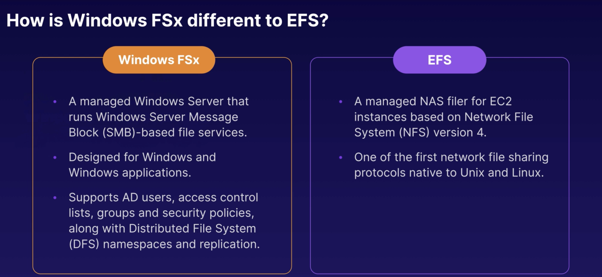

### Amazon FSx

- Amazon FSx for Windows File server provides a fully managed native MS window file system so you cna easily move your Windows-based apps that require file storage to AWS. 
- Amazon FSx is built on Windows Server
- EFS와의 차이점

- SMB based 를 쓰고 있다면? -> Windows FSx를 storage로 쓰면 좋음
- EC2 instance OS가 Windows면 EFS 사용 불가임 (Linux만 가능)
  - NFS나 Storage sharing이 필요하면 EFS 쓰면 됨
- Amazon FSx for Lustre : fully managed file system that is optimized for compute-intensive workloads, such as high-performance computing, machine learning, media data processing workflows, and electronic design automation.
  - 데이터 크고, high-performance 필요한 경우에 선택
  - FSx for Lustre can store data directly on S3.

### HPC on AWS

- AWS 위에서 HPC 를 achieve 하기 위해 어떤 서비스를 이용할 수 있을까?
  - Data transfer
    - Snowball, Snowmobile (terabytes/petabytes)
    - AWS DataSync to store on S3, EFS, FSx for Windows , ... etc
    - Direct connect : AWS Direct Connect 는 on-premise 와 AWS와의 dedicated network connection을 만들 수 있게 하는 서비스이다. 
  - Compute and networking
    - EC2 instances (GPU or CPU optimized)
    - EC2 Fleets (Spot instances or Spot Fleets)
    - Placement groups (Cluster placement groups)
    - Enhanced networking : uses single root I/O virtualization (SR-IOV), to provide high-performance networking capabilities on supported instance types. / Good network performance를 필요로 할 때 사용
      - SR-IOV : method of device virtualization that provides higher I/O performance and lower CPU utilization
      - provides higher bandwidth, higher packer per second (PPS) performance, and consistently lower inter-instance latencies.
      - Enhanced networking 사용에 대한 additional charge는 없음
      - Elastic Network Adapters : 100 Gbps까지 가능, for supported instance types
        - intel 82599 VF interface (LEGACY) : 10 Gbps까지,, 옛날 instances
      - Elastic Fabric Adapters
        - for HPC and machine-learning apps
        - provides lower, more consistent latency and higher throughput than the TCP transport (traditionally used in cloud-based HPC systems)
        - OS-bypass 사용 가능
          - ML app들이 OS kernel을 bypass해서 EFA와 통신 가능! 훨씬 빨라짐 (lower latency)
          - windows에 지원x, Linux만 가능
  - Storage
    - Instance-attached storage
      - EBS
      - Instance Store : ephemeral
    - Network storage
      - S3 : distributed object-based storage, not a file system
      - EFS : file system, scale IOPS based on total szie, or use provisioned IOPS
      - FSx for Lustre : HPC-optimized distributed file system, backed by S3
  - Orchestration and automation
    - AWS Batch :  supports multi-node parallel jobs, multiple EC2 instances를 가동하도록 single job을 구성할 수 있음
      - Scheduling 가능
    - AWS ParallelCluster
      - Open-source cluster management tool, AWS에 HPC Cluster를 deploy하고, manage하는 tool이다.
      - uses a simple text file to model and provision all the resources needed
      - Automate creation of VPC, subnet, cluster type, and instance types

### AWS WAF

- AWS WAF is a web application firewall, 목적은 monitor HTTP and HTTPS requests that are forwarded to Amazon CloudFront, an Application Load Balancer or API Gateway
  - Application level (Layer 7) aware firewall 이다!
- also lets you control control access to your content
- AWS WAF allows 3 different behaviors
  - Allow all requests except the ones you specify
  - Block all requests except the ones you specify
  - Count the requests that match the properties you specify
- Define conditions by using characteristics of web requests such as :
  - IP addresses that requests originate from.
  - Country that requests originate from
  - Values in request headers
  - Strings that appear in requests, either specific strings or string that match regular expression (regex) patterns
  - Length of requests
  - Presence of SQL code that is likely to be malicious (known as SQL injection)
  - Presense of a script that is likely to be malicious (knwon as cross-site scripting)
- CF > Network ACLs 을 이용할 수도 있음.

## Databases On Aws

- Relational databases on AWS (cf. RDS = OLTP)

  - SQL Server, Oracle, MySQL Server, PostGreSQL, Aurora, MariaDB
  - Two Key features
    - Multi-AZ : For Disaster Recovery
      - fail over is automatic, using Multi-AZ
    - Read Replicas : For performance
      - primary database 에 대한 read replica가 존재(백업디비)
      - primary db 손상시에 EC2가 read replica 를 읽도록 수동으로 조치해줘야함
  - cf> RDS Reserved instances are available for multi-AZ deployments
  - cf2> If I wanted to run a database on an EC2 instance, which of the following stroage options would Amazon recommend?
    - answer : EBS
  - What data transfer charge is incurred when replicating data from your primary RDS instance to your secondary RDS instance?
    - There is no charge associated with this action

- non relational db

  - collection = table
  - document = row
  - key value pairs = fields = colums
  - 장점 : 특정 doc에 대해서만 field 추가가 자유롭다, field 안에 sub-field 만드는 것이 자유롭다
    - 그만큼 consistency를 유지하는데 신경 써야함
  - Data warehousing : used for business intelligence
    - used to pull in very large and complex datasets
    - usually used by management, to do queries on data
    - Tools like cognos, Jaspersoft, SQL Server Reporting Services, Oracle Hyperion, SAP NetWeaver
    - OLTP : Online Transaction Processing
      - ex> 특정 Order number 에 대해서 Name, Date, 배송지, 배송 현황 등을 가지고 있는 row를 pull up하는데 쓰임
    - OLAP : Online Analytics Processing
      - Pulls in large numbers of records
      - ex> EMEA, Pacific 에서의 Digital Radio Product의 Net Profit을 계산하려고 하는 경우
        - Sum of Radios Sold in EMEA
        - Sum of Radios Sold in Pacific
        - Unit Cost of Radio in each region
        - Sales price of each radio
        - Sales price - unit cost

- Redshift : Amazon's Data Warehouse Soultion

  - used for business intelligence or Data Warehousing
  - Redshift = OLAP

- ElasticCache : web service that makes it easy to deploy, operate, and scale an in-memory cache in the cloud

  - speed up performance of existing databases (frequent identical queries)
  - imporve the performance of web apps
    - caching the most common web-queries
    - supports two open-source in-memory caching engines
      - memcached
      - Redis

- AWS Services 정리

  - RDS (OLTP) : SQL, MySQL, PostgreSQL, Oracle, Aurora, MariaDB
  - DynamoDB (No SQL)
  - Red Shift OLAP
  - Elasticache : memcached, Redis

- MySQL Lab Bootstrap code

  - \#!/bin/bash

    yum install httpd php php-mysql -y

    cd /var/www/html

    wget https://wordpress.org/wordpress-5.1.1.tar.gz

    tar -xzf wordpress-5.1.1.tar.gz

    cp -r wordpress/* /var/www/html/

    rm -rf wordpress

    rm -rf wordpress-5.1.1.tar.gz

    chmod -R 755 wp-content

    chown -R apache:apache wp-content

    service httpd start

    chkconfig httpd on
  
- RDS runs on virtual machines

  - However, you cannot log in to these operating systems (SSH 등을 통한 접근 불가)

  - Patching of the RDS OS and DB is amazon's responsibility

- RDS is not serverless

  - cf> 예외 :   Aurora serverless is serverless

- RDS back-up types

  - Automated Backups
    - 'retention period' 내의 어떤 point로도 DB를 recover 할 수 있음
      - second 단위로 가능
    - 'retention period' 는 1-35 days
    - Full daily snapshot & store transaction logs throughout the day
      -  Recovery를 실행하면, AWS는 the most recent daily backup을 고른 뒤, 그 날과 관련된 transaction log를 적용한다.
    - enabled by default, S3에 backupdata가 저장됨, DB사이즈와 동일한 S3 free storage를 받게 됨
    - backups are taken within a defined window
      - During the backup windows, storage I/O may be suspended while your data is backed up -> elevated latency를 경험할 수 있음 (느려짐)
  - Database snapshots
    - user initiated (= done manually)
    - orginal RDS instance를 지워도 남아 있는다. (automated backup 과의 차이점)
  - 두 방법 중 무엇을 쓰던, restored version of the DB would be a new instance, with a new DNS endpoint

- Encryption at rest : MySQL, Oracle, SQL server, PostGreSQL, MariaDB, Aurora 에 대해서 지원됨

  - AWS KMS service를 사용하게 됨
  - RDS instance가 encrypted 되면 관련된 것들도 also encrypted : storage 안의 data, read replicas, snapshots, and automated backups

- Multi-AZ : DB의 exact copy를 다른 AZ에 가지고 있을 수 있도록 함

  - AWS가 이러한 replication을 관리하고, automatically synchronize 시킨다.
  - planned database maintenance, DB instance failure, AZ failure 의 경우 : Amazon RDS will automatically failover to stanby DB
  - Disaster recovery only!
    - not primarily used for improving performance(이걸 위해서는 Read Replica를 써야함)
  - MySQL server, SQL server, Oracle, PostgreSQL, mariaDB
  - You can force a failover from one AZ to another by rebooting the RDS instance

- Read Replica : read-only copy of DBs

  - asynchronous replication from the primary RDS instance to the read replica
  - read-heavy databse workload에 주로 사용 (Used to increase performance)
  - MySQL Server, Oracle, PostgreSQL, mariaDB, Aurora
  - used for scaling! (performance) not for disaster recovery!
  - 'automatic backups' 가 켜져 있어야 read replicas를 deploy할 수 있음
  - 각 DB당 read replica를 5개까지 만들 수 있음
  - read replica에 대해서도 read replica를 만들 수 있음
  - Things to know
    - each replica는 각각의 DNS endpoint를 갖는다
    - read replica에 대해서도 Multi-AZ를 사용할 수 있음 
    - Multi-AZ source database에 대해서도 read replica를 만들 수 있음 (=> will break Read Replica)
    - Read replicas can be promoted to their own databases, and this breaks replication
    - You can have a read replica in a second region
    - can be in different regions

### DynamoDB

- NoSQL database solution
  - supports both document and key-value data models
- Stored on SSD storage --> fast!
- Spread across 3 geographically distinct data centers
- Eventual Consistent Reads (Default)
  - 1 second rule : App이 table에 write 하고 나서, 1초정도 지나면 read할때 반영됨
  - Consistency across all copies of data is usually reached within a second. Repeating a read after a short time should return the updated data (Best Read Performance)
- Strongly Consistent Reads 선택 가능
  - A strongly consistent read returns a result that reflects all writes that received a successful response prior to the read
  - 1초 이내의 차이도 중요하다면,, strongly consistent reads를 사용함
- DAX (DynamoDB Accelerator) : Fully managed, highly available, in-memory cache
  - 10x performance improvement
  - reduces request time form milliseconds to microseconds (even under load)
  - no need for developers to manage caching logic
  - Compatible with DynamoDB API calls

- 전통적인 Cache : cache를 이용하도록, App code를 짜야한다.
  - redis, memcacheD
  - 관리할 것도 많고, 비싸다
  - Read만 support
  - too many reads인 경우, 에러 발생 가능
- DAX
  - no code change needed
  - Write-through cache (Write performance improvement도 가능!)
  - high availability (하나의 AZ에서 failure이 일어난다면, 다른 AZ에 있는 replica에서 자동으로 failover)
- Transactions
  - Multiple "all-or-nothig" operations을 구현해야 하는 경우가 있다 : 예> Financial transactions(은행 거래 등,,), Fulfilling orders (이커머스)
  - DynamoDB performs two underlying reads or writes of every item in the transaction
    - one to prepare / one to commit
- On-Demand Capacity (Provisioned Capacity와 반대)
  - Pay-per-request pricing
  - Balance cost and performance
  - No minimum capacity for purchase
  - No charge for read/writes -- only storage and backups에 대해서만 charge
  - Pay more per request than with provisioned capacity
  - new product launch에 사용 (traffic을 예상하기 어려운 경우)
- On-Demand Backup and Restore
  - Full backups at any time
  - Zero impact on table performance or availability
  - Consistent within seconds and retrained until deleted
  - Operates within same region as the source table (backup은 cross-region 불가)
- Point-in-Time Recovery (PITR)
  - Protects against accidental wrties or deletes
  - Restore to any point in the last 35 days
  - Incremental backups
  - Not enabled by default
  - Lastest restorable : five minutes in the past
- Streams : Time-ordered sequence of item-level changes in a table
  - stream records는 item이 변경됨에 따라 sequence를 만들게 된다
  - data 의 queue (FIFO) 라고 생각해도 됨
  - Info : stroed for 24 hours
  - provides a stream of inserts, updates, and deletes
  - Stream의 구조
    - stream record : represents a single data modification in the DynamoDB table
    - Each stream record is assigned to sequence number, reflecting the order in which the record was published
      - stream records are organized into groups (Shard)
      - Shard : a container for multiple stream records / Shard contains info required for accessing and iterating through records
      - The stream records within a shard are removed automatically after 24 hours
    - Usecases : cross-region replication (=global tables) / establish relationships across tables (messaging or notification Apps, any kind of aggregation or filtering)
  - Lambda와 결합하여 사용할 수 있다!
- Global Tables : Managed Multi-Master, Multi-Region Replication
  - Globally distributed applications
  - Based on DynamoDB streams (stream을 enable해야 사용 가능)
  - Use cases : Multi-region redundancy for disaster recovery or high availability
  - app을 통해 rewrite할 필요 없음, 알아서 써줌
  - Replication latency under one second
- Database Migration Service (DMS)
  - source database remains completely operational during the migration
  - DynamoDB는 source database로는 못 쓰지만, target database로 지정 가능.
- Security of DynamoDZB
  - All user data in Dynamo DB are fully encrypted at rest, using KMS
  - Site-to-site VPN
  - Direct Connect (DX)
  - IAM policies and roles
  - Fine-grained access
    - IAM policy that allow users access to only certain attributes within DynamoDB table items
  - CloudWatch and CloudTrail 
  - VPC endpoints, to enable EC2 instance in your VPC to use their private IP addresses to access DynamoDBZ

### RedShift

- petabyte-sacle data warehouse service
- Data Warehousing databases use different type of architecture both from a database perspective and infrastructure layer
- Single Node (160Gb)
- Multi-Node
  - Leader Node (manages client connections and receives queries) 
  - Computer Node (store data and perform queries and computations) : Up to 128 Compute Nodes
- advanced compression : Columnar data stoes (can be compressed much more than row-based data stoes, because similar data is stored sequentially on disk)
  - 높은 효율의 compression, less space usage (index, materialized views가 필요x 때문에)
- Massively Parallel Processing (MPP)
- Backups : Enabled by default with a 1 day retention period
  - Maximum retention period is 35 days
  - maintains at least 3 copies of data (원본, replica on compute nodes, backup in S3)
  - can also asynchronously replicate your snapshots to S3, in another region for DR
- pricing 정책
  - Compute Node Hours
    - ex> 3-node data warehouse cluster, 1달 사용한 경우 : 24(시간)* 30 * 3 = 2160 시간에 대한 비용 지불
    - leader node hours 에 대해서는 지불 X
  - Backup
  - Data transfer (only within a VPC, not outside it)
- Security Considerations
  - Encrypted in transit using SSL
  - Encrpyted at rest using AES-256 encrpytion
  - By default , RedShift take care of key management
- Availiability
  - currently only available in 1 AZ
  - Can restore snapshots to new AZs in the event of an outage

### Aurora

- MySQL and PostgreSQL-compatible relational database engine
- Storage Autoscaling : Start with 10GZB, Scales in 10GB increments to 64TB
- Compute resources can scale up to 32vCPUs and 244GB of Memory
- 2 Copies of data is contained in each AZ, with minimum of 3 AZ. ==> 6 copies
  - 2 copies of data, without affecting DB write availability
  - 3 copies without affecting read availability
- Aurora storage : self-healing (data blocks and disks are continuously scanned for errors and 자동 repair됨)
- Read Replicas
  - Aurora Replica (15까지 ok)
    - In-region
    - automated failover is only available with Aurora Replicas
  - MySQL Read Replicas (5)
    - Cross-region
  - PostgreSQL (1)
- Backups
  - Automated backups are always enabled on Amazon Aurora DB instances. Backups do not impact database performance
  - snapshot을 찍을 수 있음. Does not impact performance
  - aurora snapshot을 다른 aws account와도 공유할 수 있음
- Amazon Aurora Serverless : on-demand, autoscaling configuration for the MySQL-compatible and PostgreSQL-compatible edtiions of Amazon Aurora
  - DB cluster automatically starts up, shut down, scales capacity up&down
  - infrequent, intermittent, or unpredictable workloads에 적합함
  - serverlss : only pay for invocations (pay by minute이 아님)

### Elasticache

- web service, that makes it easy to deploy, operate, and scale an in-memory cache in the cloud
- supports two open-source in-memory caching engines
  - memcached, reds
- use elasticache to increase database and web app performance
- Redis is Multi-AZ
- back ups and restores of Redis

### DMS (Data Migration Service)

- 언제 쓰나? migrate your data into the AWS Cloud, between on-premises instances (through an AWS Cloud setup), or between combinations of cloud and on-premises setups
- AWS DMS creates the tables and associated primary keys if they don't exist on the target
- You can pre-create the target tables manually, or you can use AWS Schema Conversion Tool (SCT) to create some or all of the target tables, indexes, view, triggers
  - SCT는 heterogeneous migration에서만 필요! (homogenous migration에서는 필요X)
- Types of DMS Migration
  - homogenous migration : ex> Oracle (On-prem) -> Oracle(AWS)
  - heterogeneous migration : ex> MySQL (On-prem) -> Aurora(AWS)
- 참고
  - Source DB 가능 : On-premises and EC2 instances databases (Oracle, Microsoft SQL Server, MySQL, MariaDB, PostgreSQL, MongoDB, Db2) 
    - Azure SQL dabatabse, Amazon RDS, S3도 가능
  - Target 가능 :  On-premises and EC2 instances databases (Oracle, Microsoft SQL Server, MySQL, MariaDB, PostgreSQL, SAP)
    - RDS, Redshift, DynamoDB, S3, Elasticsearch service, Kinesis data streams, DocumentDB

### Caching Strategies

- caching capabilities를 갖고 있는 services
  - CloudFront
  - API gateway
  - ElastiCache - Memcached and Redis
  - DynamoDB Accelerator (DAX)

### EMR

- Elastic Map Reduce : cloud big data P/F for processing vast amounts of data using open-source tools such as Apache Spark, Apache Hive, Apache HBase, Apache Flink, Apache Hudi and Presto
  - Apach Spark에 비해 3배 빠르고, traditional on-prem solution에 비해 절반 이하로 싸다!
- EMR의 central component : cluster
  - cluster = collection of EC2 instances
  - Node type : 각각의 node(EC2 instance)가 부여받는 role
    - Master node : tracks the status of tasks, every cluster has a master node
      - By default, log data is stored on the master node
      - log file을 S3에 backup시킬 수 있음 (5분 interval)
    - Core node : A node w/ S/W components that runs tasks and stores data in the HDFS on your cluster. multi-node cluster have at least one core node
    - Task node : runs tasks and does not store data in HDFS. Task nodes are optional
  - EMR installs different software components on each node type 

### Advanced IAM

- AWS Directory Service
  - Family of managed services
  - Connect AWS resources with on-premises AD (Microsoft Active Directory)
    - Active Directory : On-prem directory service
      - (위키) 액티브 디렉터리는 마이크로소프트가 윈도우용 환경에서 사용하기 위해 개발한 LDAP 디렉터리 서비스의 기능이다. 주 목적은 윈도우 기반의 컴퓨터들을 위한 인증 서비스를 제공하는 것이다.
      - Hierarchical database of users, groups, computers (organized in trees and forests)
      - group policies : user, device 들을 network 안에서 manage 할 수 있도록 돕는다
      - based on two protocols : LDAP, DNS
      - supports Kerberos, LDAP, and NTLM authentication protocols
      - 단점 : typically lots of management overhead
    - AWS Managed Microsoft AD
      - 무엇을 제공하나? AD domain controllers (DCs) running window Server 
        - DCs are reachable by apps in your VPC
        - able to add addtional DCs for HA and performance
        - Exclusive access to DCs (다른 aws user은 접근 불가)
        - Extend existing AD to on-premises, using AD Trust
      - AWS가 해주는 것 : Multi-AZ deployment / Patch, monitor, recover / Instance rotation / Snapshot and restore
      - Customer가 해야하는 것 : Users, groups, GPOs 관리 / 익숙한 Standard AD tools 사용 / Scale out DCs / Trusts (resource forest) / Certificate authorities (LDAPS) / AD Federation
    - Simple AD
      - 언제 쓰나 ? Standalone managed directory in the cloud, the support windows workloads that need basic AD features
      - Size : Small (<= 500 users), Large (<= 5,000 users)
      - Easier to manage EC2 (corporate credential을 사용하여 log-in to EC2 가능, 모든 instances에 대해 username/password 지정할 필요가 없음)
      - Linux workloads that need LDAP
      - does not support trusts (can't join on-premises AD)
    - AD Connector
      - Directory gateway (proxy) for on-prem AD
  - Standalone direcotry in the cloud
    - AWS Cloud Directory : Directory-based store for developers
      - Multiple hierarchies with hundereds of millions of objects
      - Use cases : org charts, course catalogs, device registries
      - Fully managed service (no infra to manage)
  - Amazon Cognito User Pools : Managed user directory for SaaS apps
    - intended to enable Sign-up and sign-in for web or mobile
    - Works with social media identities (Facebook, Google 을 통해 SaaS app에 로그인)
  - Use existing corporate credentials
  - enables SSO to any domain-joined EC2 instance
  - AD Compatible services : Logging into workspace / quick site with AD credentials
    - Managed Microsoft AD  (= Directory Service for Microsoft Active Directory)
    - AD Connector
    - Simple AD
  - Not AD Compatible services
    - Cloud Directory 
    - Cognito user pools

### IAM Policies

- ARN (Amazon Resource Name) : uniquely identify any resource in AWS

  - Arn:partition:service:region:accound_id: 로 시작함
    - partition : aws has different partitions를 갖고 있음 (ex> aws(북미), aws-cn (중국))
    - service : s3, ec2, rds, ...
  - End with :
    - resource
    - resource_type/resource
    - resource_type/resource/qualifier
    - resource_type/resource:qualifer
    - resource_type:resource
    - resource_type:resource:qulifier
    - 예제
      - arn:aws:iam::123456789012:user/mark
        - iam 은 'global' 이기 때문에 region 부분을 skip --> 콜론이 2개
        - resource_type = user, resource name = mark
        - mark 라는 IAM user를 uniquely identify
      - arn:aws:s3:::my_awesome_bucket/image.png
        - no specific region, no specific account ID (왜냐하면 all bucket names in S3 are globally unique)
      - Arn:aws:dynamodb:us-east-1:123456789012:table/orders
        - resource_type = table, resource(name) = order (=table name)
      - Arn:aws:ecs:us-east-1:123456789012:instance/*
        - 해당 account에 해당하는 EC2 instance 전체를 가리킴 (* : wildcard)

- IAM Policies : Json doc. that defines permissions

  - 2 Types
    - Identity policy (User/Group/Role에 attach) : permissions
    - Resource policy (S3 buckets / KMS encrpytion keys, ...) : 누가 resource에 접근할 수 있고, 어떤 action을 할 수 있는지 specify
  - No effect until attached
  - A policy doc. is a list of statements
    - 각각의 statement 들은 중괄호 안에 있음
    - each statement matches an AWS API request 
      - API request : any action that you can perform against AWS
    - statement 는 SID (statement가 무엇을 의미하는지 human-readable form으로 써준 것)로 시작
    - Effect : Allow | Deny
    - Resource : resource ARN, that the Action is against
  - Not explicitly allowed = implicitly denied
  - Explicit deny > everything else
  - Only attached policies have effect
  - AWS joins all applicable policies
  - cf> Permission Boundaries : Control maximum permissions an IAM policy can grant
    - Prevent privilege escalation or unnecessarily broad permissions
    - Use case : Developers creating roles for Lmabda functions

  

### RAM (Resource Access Manager)

- multi-account strategy 
  - 사용 목적 : 권한 분리, security, billing, mistake 이슈 등,,
  - challange : create & share resources across accounts
- AWS Organization을 사용하면, AWS RAM을 사용하여 accounts 끼리 resource를 공유할 수 있음
- 공유 가능 : App mesh, Aurora, CodeBuild, EC2, EC2 Image Builder, Licence manager, Resource Groups, Route 53

### AWS Single Sign-on

- Managing user permissions for all individual accounts --> 너무 어렵다!
  - 이를 해결하기 위한 service
- Single sign-on (SSO) service helps centrally manage access to AWS accounts and business apps
  - github, salesforce, office365 등도 관리 가능
  - aws organization을 이용해서 각 account들이 어떤 app들에 접근 가능한지 모두 관리가 가능하다
- cf> SAML : Security Assertion Markup Language 
  - sessions in another context 기반으로 app에 login 할 수 있도록 하는 언어
  - 시험에 SAML 2.0이 나온다? SSO 가 정답일 확률이 높음

### Advanced IAM Summary

1. Directory Services
   1. Directory Services의 목적 : To connect AWS resources with on-premises AD
   2. SSO to any domian-joined EC2 instance
   3. AWS Managed Microsoft AD
      1. AD Trust
      2. Simple AD : Does not support trusts
   4. AD Connector
   5. AWS vs. customer responsibility
   6. Cloud Directory
   7. Cognito user pools
   8. AD vs Non-AD compatible services
2. IAM Policies
   1. ARN
   2. IAM policy structure (json, statements로 구성)
   3. Statement : Effect/Action/Resource로 구성
      1. Effect : Allow/Deny , 2. Action : API Call (ex>get object on S3, create table on DynamoDB)
   4. Identity vs, resource policies
   5. Policy evaluation logic : Deny > Allow
   6. AWS managed policies vs customer managed policies
   7. Permission boundaries
3. RAM
   1. Resource sharing between accounts
   2. Individual accounts and AWS Organizations
   3. Types of resources you can share
4. SSO
   1. Centrally manage access
   2. ex> G Suite, Office 365, Salesforce
   3. Using existing identities
   4. Account-level permissions
   5. SAML

------------------------------------

0815 시작~ 얼마나 들었나?

0919 : 69강까지 완료

- Advanced IAM 까지 들으면 --> 573분
- 총 강의시간 : 1074분
- 결론 : 부지런히 들어야 한다. 
  - 비율은 거의 동일함
  - 뒤쪽에 더 짧은 강의들이 많다는 것은 착각이었음 ㅠ

