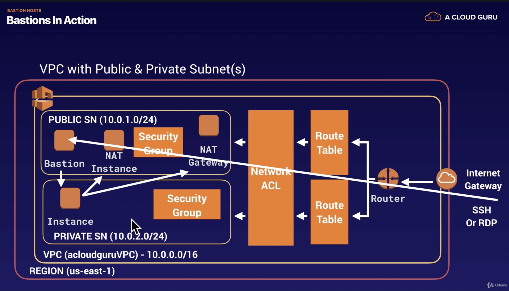
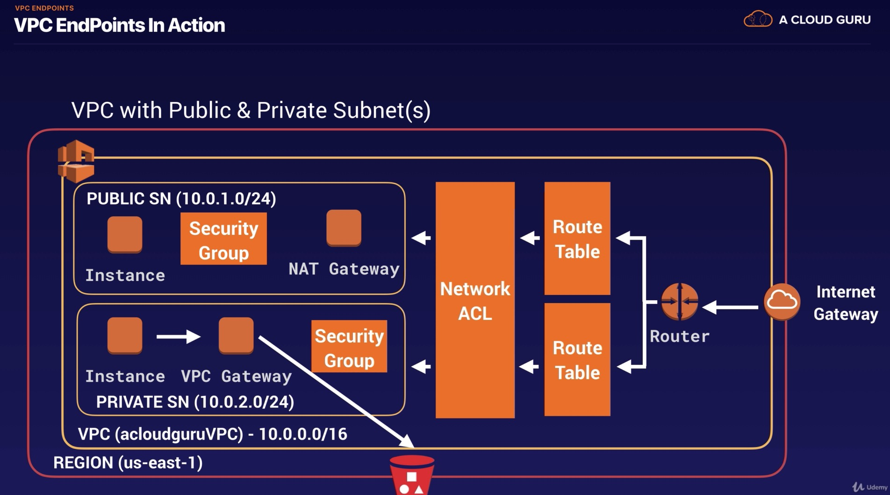

### Route 53

- (참고) 미국의 최초 가로지르는 횡단 road : Route 66
- Route 53 이름은 포트 53에서 나옴 (DNS Port is on Port 53 이기 때문에)

- What is DNS ? 전화번호부와 유사, human-friendly domain names를 IP address로 바꾸는데 사용됨
- Top Level domains

  - last word in a domain name represents the top level domain 
  - the second word in a domain name is known as a second level domain name (optional이고, domain name에 depend)
  - .com / .edu / .gov / .co.uk / .gov.uk / .com.au / .co.kr
  - Top level domain names는 controlled by IANA (Internet Assigned Numbers Authority) in a root zone database 
    - db of all available top level domains
    - www.iana.org/domains/root/db
- Domain name은 unique해야 하기 때문에, 중복이 없도록 'registrar' 이 관리함

  - a registrar is an authority that can assign domain names directly under one or more top-level domains
  - These domains ar eregistered with InterNIC (a service of ICANN)
  - each domain name becomes registered in a central database known as the WholS database
  - cf> domain name 살 수 있는곳 : Amazon, GoDaddy.com, 123-reg-co.uk, ...
- 모든 DNS address는 SOA (Start of Authority Record) 로 시작함

  - SOA stores : The name of the server that supplied the data for the zone, The admistrator of the zone, The current version of the data file, The default number of seconds for the time-to-live (TTL) file on resource records
- NS Records (NS : Name Server)

  - They are used by Top Level Domain servers to direct traffic to the Content DNS server which contains the authoritative DNS records
  - 예제
    - 유저가 hellocloudgurus2019.com 을 주소창에 입력하면, browser는 IP address를 모른다.
      - browser는 top level domain server에 query한다. (query for the authoritative DNS records)
      - top level domain server은 실제 IP address는 가지고 있지 않고, NS (Name server) record를 가지고 있다.
        - NS record에 query하면, SOA를 얻을 수 있음
      - SOA 안에 DNS records가 있음
  - 'A' record? : the fundamental type of DNS record. A record에서 'A'는 Address를 의미함
    - computer가 name of the domain을 IP address로 translate하는 데 사용된다.
  - TTL ? (Time To Live) : The length that a DNS record is cached 
    - the lower the time to live, the faster changed to DNS records take to propagate throught the internet
    - 참고 : 만약 DNS를 바꾼다면, 사용자들의 local PC나 resolving server 등에 저장된 캐시가 사라질 때까지 보통 48시간이 걸림, 즉 48시간 후에나 사용자가 내가 바꾼 dns로 들어오게 됨
  - CName ? : Canonical Name can be used to resolve one domain name to another
    - ex> mobile.acloud.guru로 검색하면 m.acloud.guru 와 동일한 페이지로 랜딩 시키고 싶은 경우
  - **Alias Records ? : used to map resource record sets in your hosted zone to ELB, CloudFront distributions, or S3 buckets that are configured as websites**
    - map one DNS name to another target DNS name 이라는 점에서, CName과 동일
    - **CName과의 차이 : CName can't be used for naked domain names**
      - **A record나 Alias Record는 가능**
  - **ELBs do not have pre-defined IPv4 addresses; you resolve to them using a DNS name.**
  - Understand the difference between an Alias Record and a CNAME
    - **Given the choice, always choose an Alias Record over a CNAME**
  - **Common DNS Types : SOA Records / NS Records / A Records / CNames / MX Records (Mail) / PTR Records (A Record의 반대, IP address를 가지고 DNS name을 찾는 데 쓰임)**
- Domain Name은 AWS를 통해서 direct 구매가 가능함
    - It can take up to 3 days to register depending on the circumstances (보통 1-2시간 정도면 되긴 함)
  - Routing Policies
    - Simple Routing : only have **one record with multiple IP addresses**
      - If you specify multiple values in a record, Route 53 returns all values to the user in a random order
      - Health check 불가
    - Weighted Routing : allows you to split your traffic based on different weights assigned
      - ex> 10% 는 US-EAST-1으로 가게 하고, 90%는 EU-WEST-1 으로 가게 할 수 있음
      - (Lab) Record를 여러 개 만들어야 함 (20%-30%-50% 라면 A record 3개를 만들어야 함), Health Check(EC2 down 일 때 다른 애로 routing)와 연동 가능
        - You can set health checks on individual record sets
        - **If a record set fails a health check, it will be removed from Route53 until it passes the health check**
        - **You can set SNS notifications to alert you if a health check is failed**
    - Latency-based Routing : allows you to route your traffic based on the lowest network latency for your end user 
      - 즉, 어떤 region이 user에게 가장 빠른 response를 할 수 있느냐에 기반하여 routing
      - Latency-based Routing을 사용하기 위해, latency resource record set for EC2 (or ELB) instances (in each region, hosting your website) 을 만들어 줘야 한다. 
    - Failover Routing : used when you want to create an active/passive set up.
      - 예를 들어, primary site를 EU-WEST-2에 있도록 지정하고 DR-site를 AP-SOUTHEAST-2에 있도록 지정할 수 있음
        (Active : EU-WEST-2, Passive : AP-SOUTHEAST-2)
      - Route 53 will monitor the health of primary site using a health check
      - a health check monitors the health of end points
    - Geolocation Routing : lets you choose where your traffic will be sent based on the geographic location of your users
      - 예를 들어, queries from Europe은 모두 European customer에 맞게 customized 된 website에 방문하게 할 수 있는것임
      - continent 뿐만 아니라 country로 지정도 가능하다
    - Geoproximity Routing (Traffic Flow only) : route traffic to your resources based on the geographic location of your users and your resources. 특정 resource로 traffic을 더 보내거나 덜 보낼 수도 있음 (using a value, 'bias')
      - A bias expands or shrinks the size of the geographic region from which traffic is routed to a resource
      - Geoproximity Routing을 사용하기 위해서는, Route 53 traffic flow를 반드시 사용해야 한다.
    - Multivalue Anser Routing : lets you configure Amazon Route 53 to return multiple values, such as IP addresses for your web servers, in response to DNS queries.
      - you can specify multiple values for almost any record, but multivalue answer routing also lets you check the health of each resource, so Route 53 returns only values for healthy resources.
      - **Similar to simple routing! However, each record set에 대한 health check를 할 수 있다는 점이 다름**
        (Simple routing with health checks)
    - Quiz :
      - **You have created a new subdomain for your popular website, and you need this subdomain to point to an Elastic Load Balancer using Route53. Which DNS record set should you create?** --> CNAME
      - With Route 53, there is a default limit of 50 domain names. However, this limit can be increased by contacting AWS support.
  

### VPC

- 시험 전날에 memory 로부터 VPC를 만들 줄 알아야 함
- VPC (Virtual Private Cloud) : **Virtual (logical) data center in the cloud** 라고 생각하면 됨. 
  - **Consist of : IGWs (Internet Gateways = Virtual Private Gateways), Route Tables, Network Access Control Lists, Subnets, and Security Groups**
  - **1 Subnet = 1 Availabilty Zone**
    - subnet 하나가 multiple AZ에 걸쳐 있을 수 없음
    - 그러나 하나의 AZ에 multiple subnet은 가능!
  - VPC 당 IGW도 1개씩만 붙일 수 있음
  - VPC를 생성하면 default로 Route Table, Network ACL, default security group이 생성된다.
    - subnet, IGW는 수동으로 만들어 줘야 함
    - (참고) account 별로 AZ 이름이 뜻하는 바가 다를 수 있음 (예를 들어, redstone 계정에서의 us-east-1A와 bluestone 계정에서의 us-east-1A는 서로 다른 AZ일 수 있다는 것)
  - **Security groups can't span VPCs (VPC마다 Security group을 따로 만들어 줘야 함.)**
  - Amazon VPC lets you provision a logically isolated section of the AWS Cloud where you can launch AWS resources in a virtual network that you define.
  - complete control over : selection of your own IP address range, creation of subnets, and configuration of route tables and network gateways
- Hardware Virtual Private Network (VPN) connection을 회사 datacenter과 VPC 사이에 만들 수 있다.

- Network ACL : 방화벽과 같은 기능을 함, first line of defence
  - network ACL : **stateless**, **allow rules와 deny rules 둘 다 가능**, block specific IP address 가능
    - **inbound port를 열면, outbound port는 따로 여는 것을 명시해 주어야 열림 (자동으로 열리지X), 반면 security group은 자동으로 열림**
  - **cf> security group은 stateful 임.**
- Public subnet : internect traffic is accessible
- Private subnet 안에 있는 EC2 instance에 접근하려면, internet으로 public subnet 안의 ec2 instance에 ssh를 통해 접속하여, private subnet 안의 ec2에 접속해야 한다.
  - Bastion Host : EC2 instance in a public subnet, that is used for connecting to EC2 instance in a private subnet
- 3 different sets of IP addresses, which are reserved for private IP addresses
  - CIDR.xyz 접속 시 볼 수 있음.
  - 10.0.0.0 - 10.255.255.255 (10/8 prefix)
    - (참고) Amazon은 10/8 prefix는 허용하지 않고, VPC 내에서 쓸 수 있는 가장 큰 subnet으로 10/16 prefix를 허용한다.
    - smallest 는 10/28 임. 
  - 172.16.0.0 - 172.31.255.255 (172.16/12 prefix)
  - 192.168.0.0 - 192.168.255.255 (192.168/16 prefix)
  - **certified advanced networking specialty exam 에서는 subnetting, calculate 할 수 있어야 함** 
    - one of the hardest to get

- What can we do with a VPC?

  - Launch instances into a subnet of your choosing
  - Assign custom IP address ranges in each subnet
  - Configure route tables between subnets
  - Create internet gateway and attach it to our VPC
  - Much bette security controls over AWS resources
  - Assign security groups to indivitual instances
  - Subnet network access control lists (ACLS)
- Default VPC vs Custom VPC

  - Default : user friendly, allowing you to immediately deploy instances
  - **All subnets in default VPC have a route out to the internet**
  - Each EC2 instance has both a public and private IP address
- VPC Peering

  - one VPC를 direct network route (using private IP addresses) 를 통해 다른 VPC에 연결할 수 있다.
  - Instances behave as if they were on the same private network
  - peering은 서로 다른 aws accounts 및 동일 account 내 다른 VPC 간에도 가능하다. 
  - Peering is in a star configuration 
    - 즉, 1 central VPC peers with 4 others
    - **NO TRANSITIVE PEERING**
      - 예를 들어 가운데 VPC A가 있고, VPC B, C, E, D가 각각 A와 peering을 맺은 형태라면, B가 C와 connect 하기 위해 A를 거치는 방법을 이용할 수 없다는 것. B와 C가 connect 하기 위해서는 B와 C 간에 new peering relationship을 맺어야 한다.
  - can peer across regions
- (참고) 10.0.0.0/24 subnet에서 사용 가능한 ip address는 이론 상으로 256개가 되어야 하는데 (32-24 =8, 2의 8승 = 256), 실제는 251개이다, 왜? AWS에서 reserve시켜 사용하는 address가 5개가 있음

  - 10.0.0.0 : Network address
  - 10.0.0.1 : Reserved by AWS for the VPC router
  - 10.0.0.2 : Reserved by AWS, IP address for DNS server (for VPC)
  - 10.0.0.3 : Reserved by AWS for future use
  - 10.0.0.255 : Network broadcast address (VPC 에서 broadcast를 지원하지 않기 때문에, 해당 address 사용 불가)
- Nat Instances & Nat Gateways
  - Nat Gateway : private subnet이 public이 되지 않으면서 internet을 통해 외부와 communicate 할 수 있도록 하는 gateway
    - Redundant inside the AZ (= nat gateway는 cannot span AZ)
    - preferred by the enterprise
    - Starts at 5Gbps and scales currently to 45Gbps
    - No need to patch (cf> Nat Instances에 대해서는 해줘야 함)
    - **Not associated with security groups**
    - automatically assigned public IP address
    - Remember to update your route tables (private subnet to NAT gateway로 향하는 route가 있어야)
    - No need to disable Source/Destination Checks
  - (Outdated) Nat Instances
    - **Nat instance를 만들 때, Source/Destination Check on the Instance를 Disable 해 주어야 함**
    - **Nat instances must be in a public subnet**
    - **There must be a route out of the private subnet to the NAT instance, in order for this to work**
    - The amount of traffic that Nat instances can support depends on the instance size. Bottleneck이 발생 가능 한데, 이 경우에 instance size를 늘려주면 됨
    - You can create high availability using Autoscaling Groups, multiple subnets in different AZs, and a script ot automate failover
    - **Behind a Security Group (= Security group 정책에 영향을 받음, Security Group을 통과해야 Nat instance에 도달할 수 있음)**
- NACL (Network Access Control List)
  - VPC automatically comes with a default network ACL. By default, it allows all outbound and inbound traffic
  - custom NACL을 만들 수 있음. By default, each custom NACL denies all inbound and outbound traffic
  - Each subnet in your VPC must be associated with a NACL. If you don't explicitly associate a subnet with a NACL, the subnet is automatically associated with the default NACL.
  - NACL을 이용해 특정 IP 주소를 block할 수 있음 (security group으로는 불가)
  - NACL을 여러 개의 subnet과 associate 가능. 그러나 subnet은 하나의 NACL과만 연결시킬 수 있음. NACL과 연결시키면, 기존 연결은 삭제됨
  - NACL 내의 rule들은 lowest numbered rule 부터 하나씩 실행됨
  - NACL은 inbound와 outbound 규칙을 따로 관리함
  - NACL are stateless
- cf> ephemeral ports
- VpcFlowLog
  - 
  - 
- Bastion Host : special purpose computer on a network, specifically designed and designed to withstand attacks. Bastion Host는 주로 single application을 host한다. (예> 프록시 서버) 그 외의 다른 서비스들은 removed or limited to reduce the threat to the computer (Bastion Host)
  - 주로 fireware 바깥이나, demilitarized zone (DMZ, public subnet을 의미함)에 위치하며, usually involves access from untrusted networks or computers
  - private subnet 안의 instance의 S/w install/update에는 nat instance나 nat gateway를 사용할 수 있음.
    (**NAT gateway or NAT Instance is used to provide internet traffic to EC2 instances in a private subnet**)
  - 그러나, 환경설정 등을 administer 하고 싶다면, Bastion Host를 사용한다. **Bastion Host란, private subnet 안에 있는 instance에 SSH(or RDP) 하는 방법이다!**
    **(Bastion is used to securely administer EC2 instances (Using SSH or RDP). Bastions are called jump boxes in Australia)**
    - SSH(Linux)나 RDP(Windows) 사용 -> Internet gateway -> Router -> Route Table -> NACL -> Security Group -> Bastion
    - 
    - Bastion만 잘 강화(harden)하면, private subnet 안의 Instance 에 대해서는 보안을 신경쓸 필요가 없음
    - NAT Gateway를 Bastion Host로 사용할 수 없음
  - Direct Connect : on-prem database와 AWS 간의 dedicated network connection을 쉽게 만들 수 있도록 지원하는 서비스
    - On-prem datacenter, office, or colocation environment 와 AWS 간에 private network connectivity를 만들 수 있음
    - Useful for high throughput workloads (ie. lots of network traffic)
    - Or if you need a stable and reliable secure connection
    - **Steps to set-up Direct Connect (시험에 나옴)**
      - **Create a virtual interface** in the Direct Connect console. **(Public Virtual Interface)**
      - VPC console의 VPN Connection 항목으로 이동, **Create a Customer Gateway**
      - **Create a Virtual Private Gateway** (Internet Gateway 만드는것과 유사함.)
      - **Attach the Virtual Private Gateway to the desired VPC** (Internet gateway를 VPC에 붙이는 것과 유사함)
      - Select VPN connections and **create new VPN connection**
      - Select the Virtual Private Gatway and the Customer Gateway
      - Once VPN is available,  set up the VPN on the Customer Gateway or firewall
  - Global Acclerator : accelerator을 만들어서 App의 availability와 performance를 높일 수 있는 서비스

    - Global Acclerator directs traffic to optimal endpoints over the AWS global network --> internet을 쓰는 app들의 퍼포먼스 향상
    - **Default로, accelerator에 붙일 수 있는 2개의 static IP address가 제공됨 (혹은 자체 IP address를 할당할 수도 있음)**
    - Components : Static IP addresses, Accelerator, DNS Name, Network Zone, Listenr, Endpoint Group, Endpoint
      - Global Acclerator은 각 accelerator을 DNS name에 assign시킴, 해당 DNS Name은 부여받은 static IP address를 가리키게 됨.
      - Network zone은 unique IP subnet으로부터 accelerator을 위한 static IP address를 제공하게 됨.
        - isolated unit with its own set of physical infra (similar to AZ)
      - Listner : processes inbound connections from clients to Global Accelerator, based on the port and protocol you configure. 
      - Endpoint Group : 하나 혹은 그 이상의 endpoint in the region으로 구성됨 
        - each endpoint group is associated with a specific AWS region
        - **traffic dial** 이라는 설정을 사용하여, enpoint group에 할당되는 traffic의 비율을 조정할 수 있음
      - Endpoint : Network Load Balancer, Application Load Balancer, EC2 instance, Elastic IP addresses 등이 될 수 있음
      - **you can control weighting to individual end points using weights**
  - **VPC Endpoint** : Virtual devices이며, VPC component 이다; **enables you to privately connect your VPC to supported AWS services** and VPC endpoint services (powered by PrivateLink without requiring an internet gateway, NAT device, VPN connection, or AWS Direct Connect connection)
    - VPC 안에 있는 instances들에 public IP address 할당할 필요가 X
    - Amazon network 안에서 traffic 교환이 일어나는 것임.
    - Two types : Interface Endpoints / Gateway Endpoints

      - Interface Endpoint : an ENI with a private IP address that serves as an entry point for traffic destined to a supported service.
        (API Gateway, CloudFormation, CloudWatch, EC2 API, ELB APi, Kinesis, SageMaker 등을 다수 서비스를 지원함)
      - Gateway Endpoint : NAT Gateway와 유사, **S3와 DynamoDB를 지원함**
        
      - (참고) VPC Endpoint 만들었는데도 timeout이 일어난다면? region 을 specify 해줘야 함. (aws s3 ls --region us-east-2)
    - Sharing Apps Across VPCs (open our Apps up to other VPCs)

      - 방법 1 : Open the VPC up to the Internet

        - 보안 이슈 : public subnet에 있는 모든 것들이 public이 됨
        - a lot more to manage (security group, NACL 등을 잘 만들어야 하고, Web app의 방화벽도 추가해야 하고,,)

      - 방법 2 : Use VPC Peering

        - VPC 수가 적으면 괜찮음. 그러나 연결해야 하는 VPC 수가 많다면, 일일이 peering relationship을 만들어 주기가 어려움
        - the whole network will be accessible -> not good, if you have multiple apps within your VPC

      - **방법 3.  Private Link**
    - **service VPC를 수천 개의 다른 VPC에 expose 하는 가장 좋은 방법 (VPC peering, Route table, NAT, IGW 등이 필요X)**
        - **service VPC에는 Network Load Balancer가 필요하고, customer VPC에는 ENI가 필요함**
    - **Transit Gateway : simplifing network topology**
    - 복잡한 network architectures 를 simplify 할 수 있게 함
      - allows you to have transitive peering between thousands of VPCs and on-premises data centers
      - Works on a **hub-and-spoke model**
      - Works on a regional basis, 그러나 across multiple region 도 가능하다.
      - You can use it across multiple AWS accounts using RAM (Resource Access Manager)
      - You can use route tables to limit how VPCs talk to one another
      - Works with Direct Connect as well as VPN connections
      - supports **IP multicast** (not supported by any other AWS service)
    - VPN CloudHub
      - **If you have multiple sites, each with its own VPN connection, you can use AWS VPN CloudHub to connect those sirtes together.**
      - Hub-and-spoke-model
      - Low cost; easy to manage
      - It operates over the public internet, but all traffic between the customer gateway and the AWS VPN CLoudHub is encrypted
    - Networking Costs on AWS
      - Use Private IP addresses over public IP addresses to save on costs. This then utilizes the AWS backbone network
      - If you want to cut all network costs, group your EC2 instances in teh same AZ and use private IP addresses. This will be cost-free, but make sure to keep in mind single point of failure issues.
  - Summary
    - Overview
      - Thik of a VPC as a logical datacenter in AWS
      - Consists of IGWs (OR virtual private gateways), route tables, network access control lists, subnets, and security groups
      - 1 Subnet = 1 AZ
      - Security Groups are stateful, network access control lists are stateless
      - no transitive peering
      - When you create a VPC, a default Route table, NACL and a default Security group
      - It won't create any subnets, not will it create a default internet gateway.
      - US-EAST-1A in your AWS account can be a completely different availability zone to US-EAST-1A in another AWS account. Ths AZ's are randomized.
      - Amazon always reserve 5 IP addresses within your subnets
      - You can only have 1 IGW per VPC.
  - NAT Instances
    - Nat instance를 만들 때는, Source/Destination Check 기능을 disable 해야 함.
    - NAT instances must be in a public subnet
    - private subnet에서 NAT instance로 가는 route가 있어야 nat instance가 작동한다.
    - nat instance가 지원하는 traffic량은 size와 관련이 있음. 만약 bottleneck이 발생하면, instance size를 늘리면 됨.
    - you can create high availabiltiy using Autoscaling Groups, multiple subnets in different AZs, and a script to automate failover
    - Behind a Security Group
  - NAT Gateways
    - Redundant inside the AZ
    - preferred by the enterprise
    - starts at 5Gbps and scales currently up 45Gbps
    - No need to patch
    - **Not associated with Secutiy groups**
    - automatically assigned a public IP address
    - remember to update your route tables
    - no need to disable source/destionation checks
  - NACL
    - 
    - 
  - Flow Logs
    - You cannot enable flow logs for VPCs that are ppered with your VPC unless the peer VPC is in your account
    - you can tag flow logs
    - After you've created a flow log, you cannot change its configuration; for example, you can't associate a different IAM role with the flow log
    - not all IP traffic is monitored : 
      - Traffic generated by instances, when they contact the Amazon DNS server
      - 그러나, If you use your own DNS server, then all traffic to that DNS server is logged
      - traffic generated by a windows instance for Amazon windows license activation
      - ...
  - Bastions vs NAT gateways/Instances
    - NAT gateway나 NAT instance는 private subnet 안에 있는 EC2 instances 에 internet traffic을 제공하는 데 사용된다.
    - A Bastion is used to securely administer EC2 instances (Using SSH or RDP). 
    - Nat gateway를 Bastion host로 사용할 수는 없음.

-  오답
  - **Having just created a new VPC and launching an instance into its public subnet, you realise that you have forgotten to assign a public IP to the instance during creation. What is the simplest way to make your instance reachable from the outside world?**
    - 정답 : Create an Elastic IP address and associate it with your instance
    - 해설 : Although creating a new NIC & associating an EIP also results in your instance being accessible from the internet, it leaves your instance with 2 NICs & 2 private IPs as well as the public address and is therefore not the simplest solution. **By default, any user-created VPC subnet WILL NOT automatically assign public IPv4 addresses to instances** – the only subnet that does this is the “default” VPC subnets automatically created by AWS in your account.
  - **By default, instances in new subnets in a custom VPC can communicate with each other across Availability Zones.**
    - 정답 : True
    - 해설 : In a custom VPC with new subnets in each AZ, **there is a route that supports communication across all subnets/AZs. Plus a default SG with an allow rule 'All traffic, all protocols, all ports, from anything using this default SG'.**
  - Security groups act like a firewall at the instance level, whereas Network ACLs are an additional layer of security that act at the subnet level.
  - **When I create a new security group, all outbound traffic is allowed by default.**
    - 정답 : True
  - **By default, how many VPCs am I allowed in each AWS region?**
    - 정답 : 5

