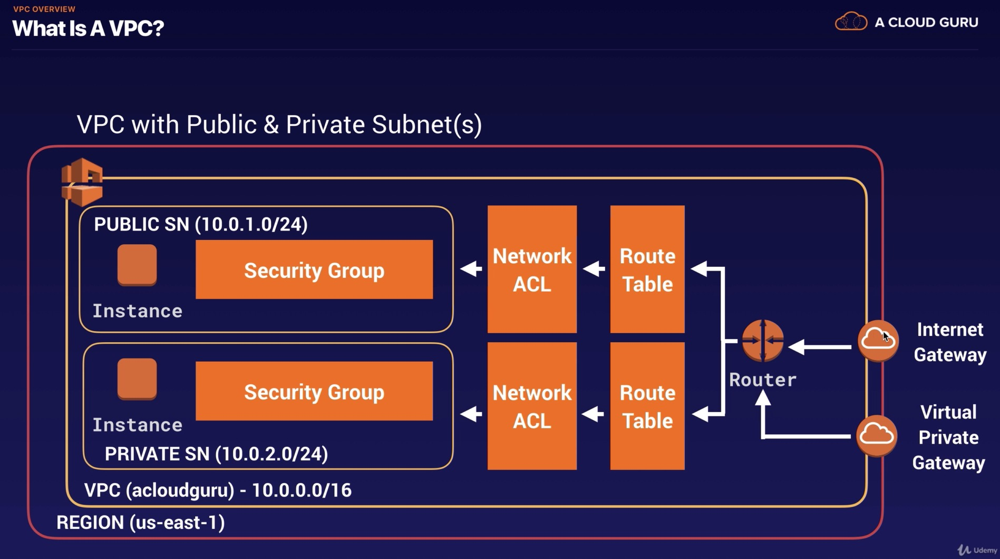
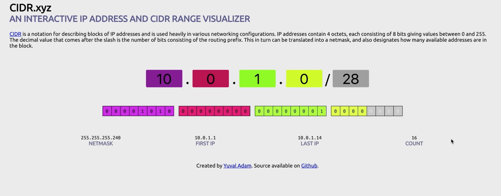

### Route 53

- (참고) 미국의 최초 가로지르는 횡단 road : Route 66
- Route 53 이름은 포트 53에서 나옴 (DNS Port is on Port 53 이기 때문에)

- What is DNS ? 전화번호부와 유사, human-friendly domain names를 IP address로 바꾸는데 사용됨
- Top Level domains

  - last word in a domain name represents the top level domain 
  - the second word in a domain name is known as a second level domain name (optional이고, domain name에 depend)
  - .com / .edu / .gov / .co.uk / .gov.uk / .com.au / .co.kr
  - Top level domain names는 controlled by IANA (Internet Assigned Numbers Authority) in a root zone database 
    - db of all available top level domains
    - www.iana.org/domains/root/db
- Domain name은 unique해야 하기 때문에, 중복이 없도록 'registrar' 이 관리함

  - a registrar is an authority that can assign domain names directly under one or more top-level domains
  - These domains ar eregistered with InterNIC (a service of ICANN)
  - each domain name becomes registered in a central database known as the WholS database
  - cf> domain name 살 수 있는곳 : Amazon, GoDaddy.com, 123-reg-co.uk, ...
- 모든 DNS address는 SOA (Start of Authority Record) 로 시작함

  - SOA stores : The name of the server that supplied the data for the zone, The admistrator of the zone, The current version of the data file, The default number of seconds for the time-to-live (TTL) file on resource records
- NS Records (NS : Name Server)

  - They are used by Top Level Domain servers to direct traffic to the Content DNS server which contains the authoritative DNS records
  - 예제
    - 유저가 hellocloudgurus2019.com 을 주소창에 입력하면, browser는 IP address를 모른다.
      - browser는 top level domain server에 query한다. (query for the authoritative DNS records)
      - top level domain server은 실제 IP address는 가지고 있지 않고, NS (Name server) record를 가지고 있다.
        - NS record에 query하면, SOA를 얻을 수 있음
      - SOA 안에 DNS records가 있음
  - 'A' record? : the fundamental type of DNS record. A record에서 'A'는 Address를 의미함
    - computer가 name of the domain을 IP address로 translate하는 데 사용된다.
  - TTL ? (Time To Live) : The length that a DNS record is cached 
    - the lower the time to live, the faster changed to DNS records take to propagate throught the internet
    - 참고 : 만약 DNS를 바꾼다면, 사용자들의 local PC나 resolving server 등에 저장된 캐시가 사라질 때까지 보통 48시간이 걸림, 즉 48시간 후에나 사용자가 내가 바꾼 dns로 들어오게 됨
  - CName ? : Canonical Name can be used to resolve one domain name to another
    - ex> mobile.acloud.guru로 검색하면 m.acloud.guru 와 동일한 페이지로 랜딩 시키고 싶은 경우
  - **Alias Records ? : used to map resource record sets in your hosted zone to ELB, CloudFront distributions, or S3 buckets that are configured as websites**
    - map one DNS name to another target DNS name 이라는 점에서, CName과 동일
    - **CName과의 차이 : CName can't be used for naked domain names**
      - **A record나 Alias Record는 가능**
  - **ELBs do not have pre-defined IPv4 addresses; you resolve to them using a DNS name.**
  - Understand the difference between an Alias Record and a CNAME
    - **Given the choice, always choose an Alias Record over a CNAME**
  - **Common DNS Types : SOA Records / NS Records / A Records / CNames / MX Records (Mail) / PTR Records (A Record의 반대, IP address를 가지고 DNS name을 찾는 데 쓰임)**
- Domain Name은 AWS를 통해서 direct 구매가 가능함
    - It can take up to 3 days to register depending on the circumstances (보통 1-2시간 정도면 되긴 함)
  - Routing Policies
    - Simple Routing : only have **one record with multiple IP addresses**
      - If you specify multiple values in a record, Route 53 returns all values to the user in a random order
      - Health check 불가
    - Weighted Routing : allows you to split your traffic based on different weights assigned
      - ex> 10% 는 US-EAST-1으로 가게 하고, 90%는 EU-WEST-1 으로 가게 할 수 있음
      - (Lab) Record를 여러 개 만들어야 함 (20%-30%-50% 라면 A record 3개를 만들어야 함), Health Check(EC2 down 일 때 다른 애로 routing)와 연동 가능
        - You can set health checks on individual record sets
        - **If a record set fails a health check, it will be removed from Route53 until it passes the health check**
        - **You can set SNS notifications to alert you if a health check is failed**
    - Latency-based Routing : allows you to route your traffic based on the lowest network latency for your end user 
      - 즉, 어떤 region이 user에게 가장 빠른 response를 할 수 있느냐에 기반하여 routing
      - Latency-based Routing을 사용하기 위해, latency resource record set for EC2 (or ELB) instances (in each region, hosting your website) 을 만들어 줘야 한다. 
    - Failover Routing : used when you want to create an active/passive set up.
      - 예를 들어, primary site를 EU-WEST-2에 있도록 지정하고 DR-site를 AP-SOUTHEAST-2에 있도록 지정할 수 있음
        (Active : EU-WEST-2, Passive : AP-SOUTHEAST-2)
      - Route 53 will monitor the health of primary site using a health check
      - a health check monitors the health of end points
    - Geolocation Routing : lets you choose where your traffic will be sent based on the geographic location of your users
      - 예를 들어, queries from Europe은 모두 European customer에 맞게 customized 된 website에 방문하게 할 수 있는것임
      - continent 뿐만 아니라 country로 지정도 가능하다
    - Geoproximity Routing (Traffic Flow only) : route traffic to your resources based on the geographic location of your users and your resources. 특정 resource로 traffic을 더 보내거나 덜 보낼 수도 있음 (using a value, 'bias')
      - A bias expands or shrinks the size of the geographic region from which traffic is routed to a resource
      - Geoproximity Routing을 사용하기 위해서는, Route 53 traffic flow를 반드시 사용해야 한다.
    - Multivalue Anser Routing : lets you configure Amazon Route 53 to return multiple values, such as IP addresses for your web servers, in response to DNS queries.
      - you can specify multiple values for almost any record, but multivalue answer routing also lets you check the health of each resource, so Route 53 returns only values for healthy resources.
      - **Similar to simple routing! However, each record set에 대한 health check를 할 수 있다는 점이 다름**
        (Simple routing with health checks)
    - Quiz :
      - **You have created a new subdomain for your popular website, and you need this subdomain to point to an Elastic Load Balancer using Route53. Which DNS record set should you create?** --> CNAME
      - With Route 53, there is a default limit of 50 domain names. However, this limit can be increased by contacting AWS support.
  

### VPC

- 시험 전날에 memory 로부터 VPC를 만들 줄 알아야 함
- VPC (Virtual Private Cloud) : **Virtual (logical) data center in the cloud** 라고 생각하면 됨. 
  - **Consist of : IGWs (Internet Gateways = Virtual Private Gateways), Route Tables, Network Access Control Lists, Subnets, and Security Groups**
  - **1 Subnet = 1 Availabilty Zone**
    - subnet 하나가 multiple AZ에 걸쳐 있을 수 없음
    - 그러나 하나의 AZ에 multiple subnet은 가능!
  - VPC 당 IGW도 1개씩만 붙일 수 있음
  - VPC를 생성하면 default로 Route Table, Network ACL, default security group이 생성된다.
    - subnet, IGW는 수동으로 만들어 줘야 함
    - (참고) account 별로 AZ 이름이 뜻하는 바가 다를 수 있음 (예를 들어, redstone 계정에서의 us-east-1A와 bluestone 계정에서의 us-east-1A는 서로 다른 AZ일 수 있다는 것)
  - **Security groups can't span VPCs (VPC마다 Security group을 따로 만들어 줘야 함.)**
  - Amazon VPC lets you provision a logically isolated section of the AWS Cloud where you can launch AWS resources in a virtual network that you define.
  - complete control over : selection of your own IP address range, creation of subnets, and configuration of route tables and network gateways
- Hardware Virtual Private Network (VPN) connection을 회사 datacenter과 VPC 사이에 만들 수 있다.

- Network ACL : 방화벽과 같은 기능을 함, first line of defence
  - network ACL : **stateless**, **allow rules와 deny rules 둘 다 가능**, block specific IP address 가능
    - **inbound port를 열면, outbound port는 따로 여는 것을 명시해 주어야 열림 (자동으로 열리지X), 반면 security group은 자동으로 열림**
  - **cf> security group은 stateful 임.**
- Public subnet : internect traffic is accessible
- Private subnet 안에 있는 EC2 instance에 접근하려면, internet으로 public subnet 안의 ec2 instance에 ssh를 통해 접속하여, private subnet 안의 ec2에 접속해야 한다.
  - Bastion Host : EC2 instance in a public subnet, that is used for connecting to EC2 instance in a private subnet
- 3 different sets of IP addresses, which are reserved for private IP addresses
  - CIDR.xyz 접속 시 볼 수 있음.
  - 10.0.0.0 - 10.255.255.255 (10/8 prefix)
    - (참고) Amazon은 10/8 prefix는 허용하지 않고, VPC 내에서 쓸 수 있는 가장 큰 subnet으로 10/16 prefix를 허용한다.
    - smallest 는 10/28 임. 
  - 172.16.0.0 - 172.31.255.255 (172.16/12 prefix)
  - 192.168.0.0 - 192.168.255.255 (192.168/16 prefix)
  - **certified advanced networking specialty exam 에서는 subnetting, calculate 할 수 있어야 함** 
    - one of the hardest to get

- What can we do with a VPC?

  - Launch instances into a subnet of your choosing
  - Assign custom IP address ranges in each subnet
  - Configure route tables between subnets
  - Create internet gateway and attach it to our VPC
  - Much bette security controls over AWS resources
  - Assign security groups to indivitual instances
  - Subnet network access control lists (ACLS)

- Default VPC vs Custom VPC

  - Default : user friendly, allowing you to immediately deploy instances
  - **All subnets in default VPC have a route out to the internet**
  - Each EC2 instance has both a public and private IP address

- VPC Peering

  - one VPC를 direct network route (using private IP addresses) 를 통해 다른 VPC에 연결할 수 있다.
  - Instances behave as if they were on the same private network
  - peering은 서로 다른 aws accounts 및 동일 account 내 다른 VPC 간에도 가능하다. 
  - Peering is in a star configuration 
    - 즉, 1 central VPC peers with 4 others
    - **NO TRANSITIVE PEERING**
      - 예를 들어 가운데 VPC A가 있고, VPC B, C, E, D가 각각 A와 peering을 맺은 형태라면, B가 C와 connect 하기 위해 A를 거치는 방법을 이용할 수 없다는 것. B와 C가 connect 하기 위해서는 B와 C 간에 new peering relationship을 맺어야 한다.
  - can peer across regions

- (참고) 10.0.0.0/24 subnet에서 사용 가능한 ip address는 이론 상으로 256개가 되어야 하는데 (32-24 =8, 2의 8승 = 256), 실제는 251개이다, 왜? AWS에서 reserve시켜 사용하는 address가 5개가 있음

  - 10.0.0.0 : Network address
  - 10.0.0.1 : Reserved by AWS for the VPC router
  - 10.0.0.2 : Reserved by AWS, IP address for DNS server (for VPC)
  - 10.0.0.3 : Reserved by AWS for future use
  - 10.0.0.255 : Network broadcast address (VPC 에서 broadcast를 지원하지 않기 때문에, 해당 address 사용 불가)

  

