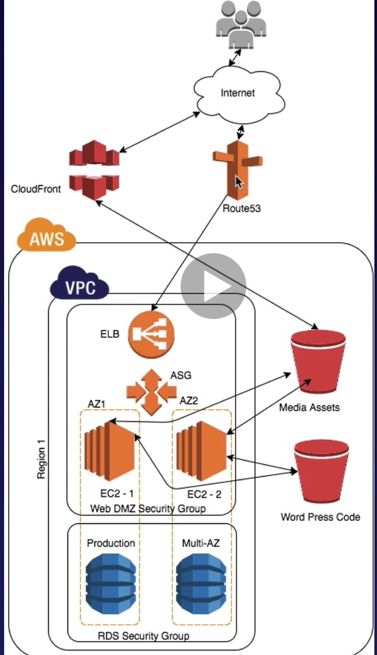

### Load Balancer

- 3 Types
  - Application Load Balancer : HTTP, HTTPS traffic을 load balancing 하는 데 최적화되어 있음. Layer 7에서 동작하며, application aware임. (=> 언어를 프랑스어로 바꾸면, 프랑스 쪽에서 오는 traffic량이 많아질 것을 예상 한다든가,, 등 intelligent 함.)
    - Advanced routing이 가능함 : 특정 request 들을 specific web server들로 보낼 수 있음
  - Network Load Balancer : TCP traffic에 최적화, **perforamnce가 매우 좋아야 하는 경우에 사용**, Layer 4 (Connection Layer)에서 동작, 수백만 건의 request를 1초 이내에 처리할 수 있음, 
  - Classic Load Balancer : Legacy Elastic Load Balancer, HTTP/HTTPS app들을 load balance할 수 있고, Layer 7의 기능들 (ex. X-Forwarded and sticky sessions) 사용 가능, TCP protocol에 의해 동작하는 App들을 load balance 하기 위해 Layer 4 load balancing도 사용 가능.
    - Layer 7 기능만 쓰는 것이지 Layer 7에서 동작하지 않기 때문에 app-aware이 아님
    - 504 에러 : **Gateway Timeout**
      - if your app stops responding, the ELB (Classic Load Balancer)은 respond with 504 error.
        (Web server과 Database server 모두에서 일어날 수 있음)
  - X-Forwarded-For Header
    - User가 ELB를 거쳐서 EC2에 접근하는 경우, ELB의 IP address만 보이게 됨.
    - 이 경우, User의 원래 IP address를 알고 싶음 --> **X-Forwarded-For Header**를 보면 됨
  
- 시험에 앞서 ELB FAQ를 읽어 보면 좋다. 

  

### Advanced Load Balancer Theory

- Classic Load balancer routes each request independently to the registered EC2 instance, with the smallest load
- **Sticky Sessions** : allow you to **bind a user's asession to a specific EC2 instance**
  - all requests from the user during the session are sent to the same instance
  - ALB에서도 sticky session을 enable할 수 있지만, 이 경우 traffic이 개별 EC2 instance가 아니라 Target Group Level로 보내진다.
  - useful if you are using information locally to that instance
- **Cross Zone Load Balancing**
- **Path Patterns** : url path에 기반하여, request들을 뿌려주는 rule을 추가하여 listener을 만들 수 있음
  - path-based routing
  - microservice에서 multiple back-end services에 routing할 수 있음

### Auto Scaling

- 3 Components
  - Groups : Logical component (Webserver group | Application group | Database group ...)
  - Configuration Templates : Each group uses a launch template as a configuration template for its EC2 instance
  - Scaling Options : dynamic scaling (CPU사용량 등,,, 특정 조건이 갖춰지면 scale을 늘리도록), on a schedule (특정 시점에,,)
    - **Maintain current instance levels at all times** : running instance의 개수를 유지하도록, periodic health check도 자동으로 진행 (unhealthy instance 찾으면, terminate 하고 새로운 instance launch)
    - **Scale manually** : maxiumum, minimum, desired capacity 지정
    - **Scale based on a schedule** : scaling actions are performed automatically as a function of time and date (언제 늘리고, 줄여야할 지 알 때 유용함)
    - **Scale based on demand** : **Using scaling policies** -> parameter 지정 가능 (ex> CPU utilization 50% 같은 것 지정할 수 있음)
    - **Use predictive scaling** : 자동으로 optimal availability and performance를 유지하도록 predict (previous performance에 기반하여)

### HA Architecture

- Netflix : Simian Army Projects (https://netflixtechblog.com/the-netflix-simian-army-16e57fbab116), AZ failure, instance failure 등을 simulate 해보고 이에 대비하는 projects
- cf> Multi-AZ는 DR을 위한 것이고, Read Replicas for RDS는 performance를 위한 것임

- Lab(109강~)에 사용된 architecture