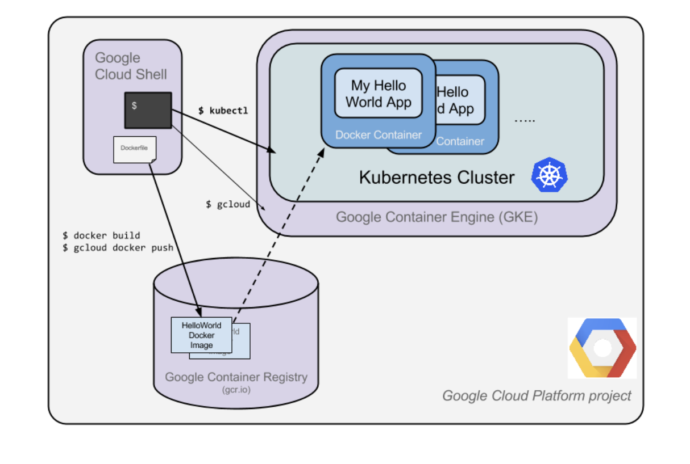

1. Google Cloud Pub/Sub : messaging service, for exchanging event data, between apps and services.
  - event 발생 시 alarm, response 가능
2. Cloud IAM (ID 및 Access 관리) : GCP 리소스에 대한 권한 제어
3. Stackdriver : monitoring, logging, diagnotics for cloud-powered apps (including VMs)
  - logging : view logs of codes (from apps) => 이걸 BigQuery, Cloud Storage, Pub/Sub으로 보내어 further analysis.
  - error monitoring : apps의 error를 monitor, alarm
  - APM : Stackdriver Trace, Stackdriver Debugger, Stackdriver Profiler
4. Google Cloud Functions : 클라우드 서비스를 빌드 및 연결하기 위한 서버리스 실행 환경. 
  - Cloud Functions를 사용하면 클라우드 인프라와 서비스에서 발생하는 이벤트에 연결되는 단일 목적의 간단한 함수를 작성할 수 있게 됨.
  - Cloud 함수는 감시 중인 이벤트가 발생할 때 트리거 되는 방식.
  - Cloud Functions는 자바스크립트로 작성되며, Google Cloud Platform의 Node.js 환경에서 실행됨.
  
  cf. [Webhook]

- 웹훅은 새 이벤트 (클라이언트 측 응용 프로그램이 관심을 가질 수있는)가 서버에서 발생한 경우 서버 측 응용 프로그램이 클라이언트 측 응용 프로그램에 알릴 수있는 메커니즘을 제공합니다.
- "역방향 API" 라고도 합니다 . 일반적인 API는 클라이언트가 서버를 호출합니다. 반면 웹훅의 경우 웹훅 (클라이언트에서 제공하는 URL)을 호출하는 서버 측에 등록하면 서버에서 특정 이벤트가 발생했을 때 클라이언트를 호출합니다.
* 특정한 Event가 발생하면 ➔ Trigger로 웹훅이 동작하고 -> 지정한 Action이 일어납니다
  
  
cf. [Hello Node Kubernetes]
- Link : https://google.qwiklabs.com/focuses/564?parent=catalog
  
 

