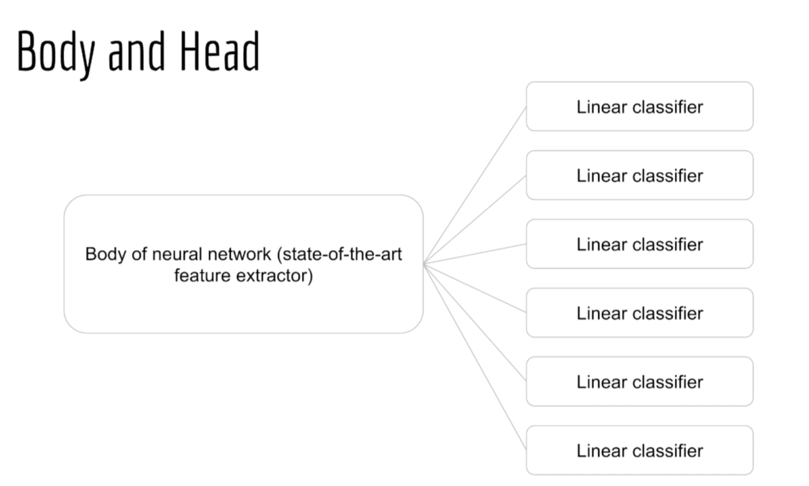
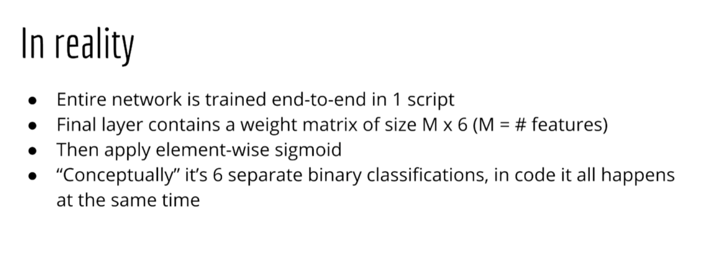
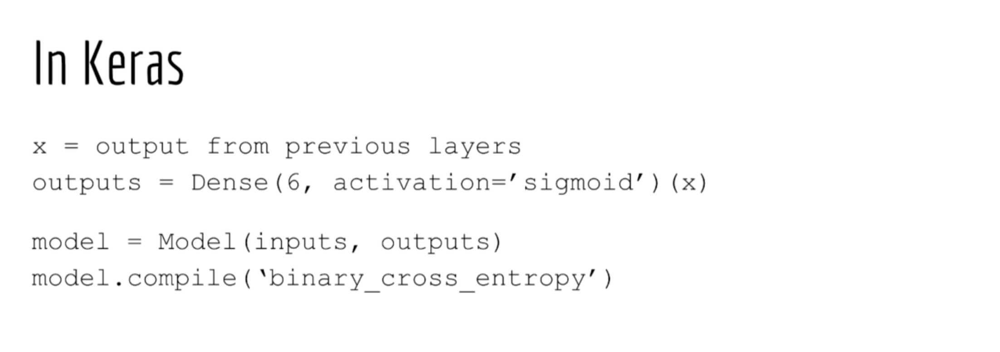

#### Toxic comment classification challange

#### Multi-Label 문제
- toxic, severe_toxic, obscene, threat, insult, identity_hate 여부를 각각 파악해야 함.
- sol#1 : 6개의 서로 다른 binary classification 문제로 풀기
    - 6개의 logistic reg.를 수행하는 하나의 NN를 만든다.
    - Total loss : average binary cross entropy

